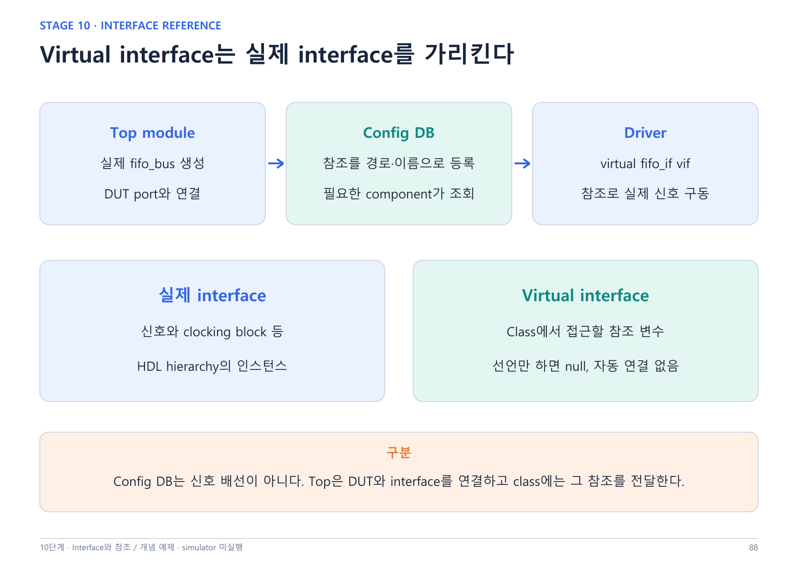

---
cssclasses:
  - uvm-study-note
updated: 2026-10-10
---

# SystemVerilog/UVM 10단계 - config DB와 virtual interface



> 기본 이론과 코드 해석을 대화로 진행했다. set/get, 경로·이름·타입, 우선순위, 객체 공유, 등록 시점과 null 검사까지 확인했다. Simulator 실행과 FIFO 환경 연결은 미실행이다.
> 연결: 회사 PDF 02.06 Configuration and Factory 중 hierarchy/configuration/resource DB/config DB, 책 190~197쪽. 파일 페이지 = 책 쪽수 + 11. API 예제는 UVM 1.2 기준이며 실제 사용할 simulator/library 버전은 실습 때 확인한다.

## 1. 왜 virtual interface와 config DB가 필요한가

실제 interface는 module 계층에 존재하고, UVM driver/monitor는 동적으로 생성되는 class 객체다. Class에서 사용할 실제 interface를 참조로 지정해야 한다. Driver가 특정 top 경로를 직접 고정해서 참조하면 다른 DUT·top에서 재사용하기 어렵다.

| 요소 | 역할 |
|---|---|
| 실제 interface | DUT와 연결된 신호를 담는 인스턴스 |
| virtual interface | class에서 실제 interface를 가리키는 참조 변수 |
| config DB | 설정값·객체 handle·interface 참조를 대상 경로에 전달 |

```text
Top: 실제 interface 생성 → DUT port 연결
  → config DB set으로 참조 등록
Driver build_phase: get → virtual interface 변수에 저장
Driver run_phase: 참조를 통해 protocol timing에 맞춰 신호 구동
```

Config DB가 DUT 신호를 배선하는 것은 아니다. Top에서 DUT와 실제 interface를 연결하고, class 쪽에는 그 interface 참조를 전달한다. Virtual interface가 별도 신호를 만들지도 않는다.

## 2. 선언만 하면 연결되지 않는다

```systemverilog
// top module 내부: 실제 interface 인스턴스
fifo_if fifo_bus(clk);

// driver class 내부: 참조 변수 선언
virtual fifo_if vif;
```

위의 두 줄은 각기 다른 위치의 예시다. vif는 선언 직후 null이며 fifo_bus와 자동 연결되지 않는다. 유효한 참조가 있어야 vif.wr_en 등으로 실제 신호에 접근할 수 있다.

신호가 아직 들어오지 않은 것과 참조가 null인 것은 다르다. 실제 interface의 신호가 0이어도 접근할 수 있지만, null 참조에는 접근할 대상이 없다. 구동은 유효한 참조를 확보하고 정해진 clocking/timing 규칙에 따라 수행한다.

## 3. Top의 set과 driver의 get

```systemverilog
// top module 내부
fifo_if fifo_bus(clk);
initial begin
  uvm_config_db#(virtual fifo_if)::set(
    null, "uvm_test_top.env.agent.drv", "vif", fifo_bus
  );
  run_test();
end
```

```systemverilog
// driver 클래스 내부
virtual fifo_if vif;
function void build_phase(uvm_phase phase);
  super.build_phase(phase);
  if (!uvm_config_db#(virtual fifo_if)::get(this, "", "vif", vif))
    `uvm_fatal("NO_VIF", "interface 설정을 찾지 못했습니다")
  if (vif == null)
    `uvm_fatal("NULL_VIF", "interface 참조가 null입니다")
endfunction
```

예제는 이미 정의된 fifo_if와 test/env/agent/driver 구조를 가정한 부분 코드다. `import uvm_pkg::*;`, include, DUT port 연결 등 전체 환경을 새로 작성한 것은 아니다.

| 인자 | set | get |
|---|---|---|
| 타입 T | 전달할 설정 타입 | 같은 타입으로 조회 |
| context | 기준 component, null이면 root 기준 | 조회 기준 component |
| inst_name | 기준에서의 상대 대상 경로 | 기준에서의 상대 조회 경로 |
| field_name | 설정을 등록할 이름 | 찾을 설정 이름 |
| 마지막 인자 | 등록할 값·참조 | 조회한 값을 저장할 변수 |

`get(this, "", ...)`는 현재 component의 전체 경로에서 조회한다. 빈 경로가 모든 component라는 뜻은 아니다. `get()`은 찾았으면 1, 못 찾았으면 0을 반환한다.

## 4. Context와 상대 경로

```systemverilog
// env의 build_phase()
uvm_config_db#(int)::set(
  this, "agent.drv", "timeout_cycles", 100
);
```

현재 env의 full name이 uvm_test_top.env라면 대상은 uvm_test_top.env.agent.drv다. driver는 자기 build_phase에서 같은 int 타입, 이름 timeout_cycles로 get한다.

대상을 agent까지만 지정하면 그 자식 drv에 자동 확장되지 않는다. 공유 설정이 필요하면 `agent.*` 같은 패턴을 사용하거나 agent가 가져온 뒤 자식에게 다시 전달한다.

## 5. 변수 이름과 component 이름

```systemverilog
// agent 내부
driver_h = fifo_driver::type_id::create("fifo_drv", this);
```

driver_h는 handle 변수 이름이고 fifo_drv는 UVM component 인스턴스 이름이다. Parent this와 인스턴스 이름으로 hierarchy가 만들어진다. 설정 경로에는 fifo_drv가 들어간다.

`get_full_name()`은 현재 component의 전체 UVM 경로를 반환한다. 예상 경로가 uvm_test_top.env.agent.fifo_drv인지 실제 이름과 부모를 확인한다. Top module의 HDL 계층 경로와 UVM component의 논리 계층 경로도 혼동하지 않는다.

## 6. 이름·타입·경로를 맞춘다

- vif로 등록하고 fifo_vif로 찾으면 매칭되지 않는다.
- int로 등록하고 string으로 찾으면 같은 설정을 가져올 수 없다.
- drv 대상으로 등록하고 mon이 자기 경로에서 찾으면 범위가 다르다.
- interface parameter와 modport가 다르면 virtual interface 타입도 다르다.

```systemverilog
uvm_config_db#(virtual fifo_if)::set(...);
uvm_config_db#(virtual fifo_if)::get(...);
// virtual fifo_if.DRV와 섞어서 조회하지 않는다.
```

Modport 타입을 사용하려면 set/get의 타입과 전달할 참조를 그 타입에 맞춰 일관되게 구성한다. 구체적 문법과 simulator 지원은 실습 때 확인한다.

## 7. Wildcard 범위와 get의 책임

```systemverilog
// env 내부
uvm_config_db#(int)::set(
  this, "agent.*", "timeout_cycles", 100
);
```

이 범위에 포함된 drv, mon, sqr가 같은 이름과 타입으로 get할 수 있다. DB에 설정했다고 component 변수에 자동 대입되는 것은 아니다.

Common flag 같은 공통 설정에는 wildcard가 편리하다. 여러 agent에 각각 다른 실제 interface를 줘야 할 때 너무 넓은 wildcard를 사용하면 모두 같은 참조를 가져갈 수 있다. 대상 경로를 구체적으로 지정하고 agent 단위 설정 객체를 사용하는 이유다.

## 8. Build 중 우선순위와 runtime 변경

```systemverilog
// test build_phase()
uvm_config_db#(int)::set(
  this, "env.agent.drv", "timeout_cycles", 200
);
// env build_phase()
uvm_config_db#(int)::set(
  this, "agent.drv", "timeout_cycles", 100
);
```

두 대상이 같아도 build 중에는 더 높은 계층의 context에서 설정한 값이 우선한다. 위 예제에서는 env의 set이 뒤에 수행돼도 test의 200을 가져온다. 계층 기준은 문자열의 구체성보다 set의 context 깊이다.

| 조건 | 기본 우선순위 규칙 |
|---|---|
| build 중 다른 context 깊이 | 상위 context 우선 |
| 같은 우선순위의 설정 | 나중 설정 우선 |
| build 이후 일반 set | 기본 우선순위를 사용, 나중 설정 우선 |

이 규칙은 일반 config DB set/get의 설명이다. Resource precedence를 별도로 조작하는 고급 사용은 범위 밖이다. 더 구체적인 문자열이 항상 이긴다고 일반화하지 않는다.

Driver가 build에서 정수 200을 가져온 뒤 DB에 300을 등록해도 driver의 정수 변수는 자동으로 바뀌지 않는다. 새 값을 사용하려면 다시 get해야 한다. Runtime 변경을 받는 wait_modified 등의 구체 구현은 후속 보충이며 이번 대화에서는 확인하지 않았다.

## 9. Configuration object로 설정을 묶는다

```systemverilog
class fifo_config extends uvm_object;
  `uvm_object_utils(fifo_config)
  int timeout_cycles = 100;
  bit checks_enable = 1;
  virtual fifo_if vif;
  function new(string name = "fifo_config");
    super.new(name);
  endfunction
endclass
```

```systemverilog
// test build_phase()
cfg = fifo_config::type_id::create("cfg");
cfg.timeout_cycles = 200;
uvm_config_db#(fifo_config)::set(this, "env.agent", "cfg", cfg);

// agent build_phase()
if (!uvm_config_db#(fifo_config)::get(this, "", "cfg", cfg))
  `uvm_fatal("NO_CFG", "설정 객체를 찾지 못했습니다")
if (cfg == null)
  `uvm_fatal("NULL_CFG", "설정 객체가 null입니다")
```

Virtual interface를 포함하는 cfg는 top/test의 적절한 경로에서 유효한 참조를 넣어야 한다. 객체 생성만으로 cfg.vif까지 자동 설정되지 않는다.

책 193·196~197쪽의 관점처럼 agent 단위 configuration object를 가져와 필요한 driver/monitor에 전달할 수 있다. Agent에만 설정한 cfg를 자식이 자동 수신하는 것은 아니다. Agent가 직접 전달하거나 자식 대상에 set하는 과정이 필요하다.

## 10. 객체 공유와 handle 교체

Config DB는 자동 clone을 하지 않는다. Object handle을 주고받으면 기본적으로 같은 객체를 공유한다.

```text
Test cfg ──> 객체 A <── Agent cfg
Config DB ─> 객체 A
```

Test가 A.timeout_cycles를 300으로 수정하면 agent가 A의 필드를 읽을 때도 300이다. Agent가 이미 별도 정수 변수에 복사했다면 그 정수는 그대로다.

Test가 새 B를 생성해 DB에 다시 등록하면 다음처럼 된다.

```text
Test cfg ──> 객체 B <── Config DB
Agent cfg ─> 객체 A
```

이전에 받은 agent의 cfg는 자동으로 B를 가리키지 않는다. 다시 get해야 새 handle을 얻는다. 기존 객체 내용 수정, 새 객체 handle 등록, 정숫값 복사를 각각 구분한다.

## 11. Set 시점과 build 순서

Top의 같은 initial 블록에서 set → run_test 순으로 진행하면 build의 get 전에 등록한다. run_test 뒤에 set하면 초기 build에 필요한 설정을 제때 제공하지 못한다.

서로 다른 initial 블록은 별도 process다. 소스의 위아래 순서만으로 상대 실행 순서를 정의하지 않는다. 두 initial만으로 실패가 반드시 발생한다고 단정하기보다 초기화 의존 관계를 같은 process에서 명확히 표현한다.

UVM build는 상위 component에서 하위로 진행된다. 부모 build에서 set을 완료하고 자식 build에서 get하는 흐름을 사용한다. 순서와 scope를 함께 확인한다.

## 12. Resource DB와 config DB

| 항목 | resource DB | config DB |
|---|---|---|
| 범위 지정 | scope 문자열 직접 지정 | component context + 상대 경로 |
| 등록·조회 | set / read_by_name 등 | set / get |
| 주 활용 | 공유 resource | component별 설정 전달 |

Config DB는 resource DB를 기반으로 component 계층을 고려한 접근과 우선순위를 제공한다. 서로 독립된 DB로 이해하지 않는다. Resource DB에도 scope가 있으므로 항상 전역이라는 뜻은 아니다.

```systemverilog
uvm_resource_db#(bit)::set(
  "uvm_test_top.env.*", "checks_enable", 1, this
);
uvm_config_db#(bit)::set(
  this, "env.*", "checks_enable", 1
);
```

위는 test 안의 범위 비교 예시이며 둘을 같은 이름으로 동시에 사용하라는 실행 코드가 아니다. Resource DB의 accessor는 진단용 호출자 정보이며 config DB의 context와 동일한 상대 경로 기능이 아니다.

## 13. 실패 디버깅

조회 실패와 null 참조는 별개다. 등록된 값이 null이면 get이 성공할 수도 있다. `get()` 반환값 검사와 값의 유효성 검사를 함께 한다.

1. 실제 component get_full_name 확인: create 이름과 parent가 예상과 같은가?
2. set/get의 field_name과 type 비교: parameter/modport도 일치하는가?
3. Context와 상대 경로를 합쳤을 때 scope가 맞는가?
4. get 전에 set이 실행됐는가? 상위 설정 우선순위는 의도대로인가?
5. 성공해서 받은 interface/cfg가 null은 아닌가?

추가 보충: 실행 시 `+UVM_CONFIG_DB_TRACE`로 set/get trace를 확인할 수 있다. `uvm_top.print_topology()`로 구조도 확인한다. 상세 report·추적 실습은 13단계에서 진행한다. 이번에는 로그를 직접 실행·확인하지 않았다.

## 14. 대화에서 확인한 이해도

기본 이론·예제 해석 수준(2)을 확인했다. 실제 독립 구현·runtime 디버깅은 미확인이다.

- 정확히 답한 내용: vif 선언만으로 자동 연결되지 않음, get이 필요함, 이름·타입·경로 불일치, wildcard 범위, test의 build 설정 우선, set을 run_test 전에 수행.
- 보충 후 확인: 공유 객체 수정과 새 객체 등록의 차이. DB에 B를 재등록해도 기존 agent handle은 A를 유지한다.
- 용어 보정: fifo_drv는 component 인스턴스 이름이고 driver_h가 변수 이름. null은 신호 미도착이 아니라 참조 대상 부재다.
- 세미나 설명 확인: 실제 interface와 virtual 참조 및 set/get의 역할은 설명했으며 신호가 들어와야 구동 가능하다는 표현은 참조 유효성과 timing으로 보정했다.

## 15. 복습 문제와 짧은 답안

1. driver_h = create("fifo_drv", this)라면 설정 경로에 들어가는 이름은?
2. Test가 새 cfg 객체를 DB에 재등록하면 agent의 기존 cfg도 바뀌는가?
3. get 성공이면 vif != null도 보장되는가?

답안: ① fifo_drv ② 자동 교체되지 않음, 다시 get 필요 ③ 등록값이 null일 수 있으므로 별도 검사 필요.

## 16. 세미나 설명과 다음 시작점

“Top에서 실제 interface를 생성하고 DUT에 연결합니다. 그 참조를 config DB의 set으로 등록하고, driver는 build_phase에서 get해 virtual interface 변수에 저장합니다. Driver는 유효한 참조를 통해 protocol timing에 맞춰 신호를 구동합니다. 조회에는 대상 경로·설정 이름·타입을 맞춰야 하며, 참조가 null인지도 확인합니다.”

다음 채팅은 11단계 TLM·analysis 기본 이론부터 시작한다. 먼저 component 간 method 기반 통신의 이유와 driver/sequencer 연결을 설명하고, port/export/imp, analysis와 write, 1:1과 1:N으로 확장한다. 회사 PDF 02.07을 함께 읽는다. 확인 질문은 한 번에 하나씩 내고, 이론·이유·짧은 예제 후 답을 기다린다. FIFO 실습은 이론 및 세미나 준비 이후 재개한다.

## 참고 자료

- 회사 자료 `_uvm_tb_240705_214257.pdf`, 02.06 Configuration and Factory. 책 예제의 빠진 문자열 따옴표·반환값 검사 등은 보완해 정리했다.
- [UVM 1.2 Configuration Database Reference](https://verificationacademy.com/verification-methodology-reference/uvm/docs_1.2/html/files/base/uvm_config_db-svh.html)
- [Accellera UVM 표준·참고 구현](https://www.accellera.org/downloads/standards/uvm)

[[SystemVerilog UVM 학습 홈|목차]] · [[SystemVerilog UVM 9단계 - Sequence와 driver handshake|9단계]]
