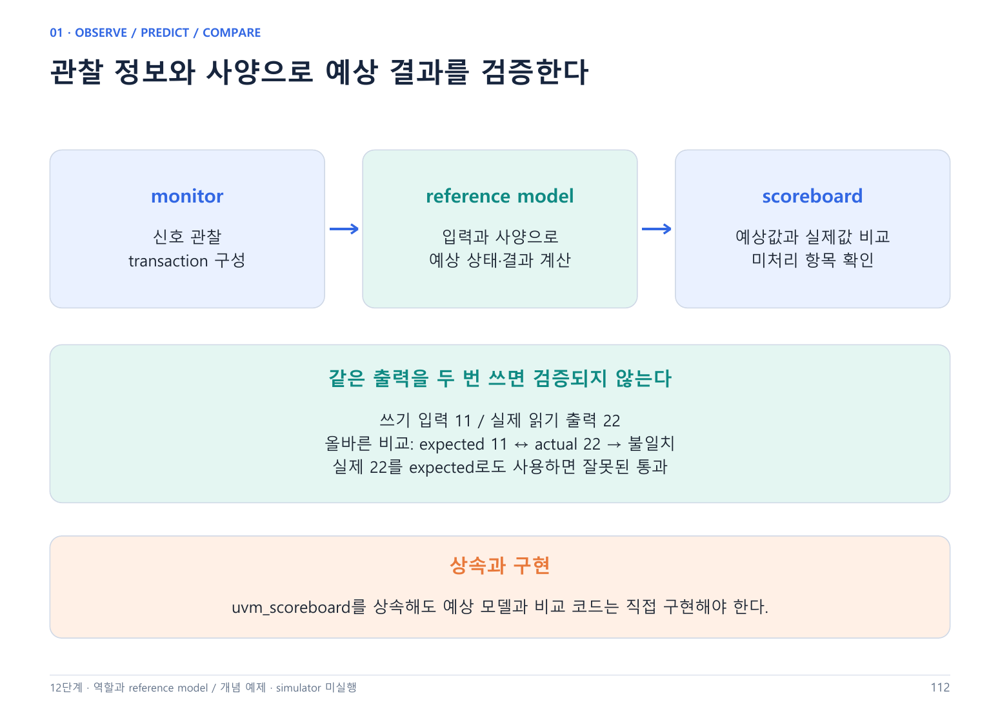

---
cssclasses:
  - uvm-study-note
updated: 2026-10-10
---

# SystemVerilog/UVM 12단계 - Monitor와 Scoreboard



> Monitor·Scoreboard의 기본 역할, FIFO 예상 모델, flag·데이터 비교, 읽기 latency, 종료·reset·동시 read/write 조건을 대화로 확인했다. 독립 구현·실제 simulator 실행은 미실행이다.
> 회사 PDF 연결: 02.08 Scoreboard and Coverage 중 scoreboard(책 222~224쪽), 02.12 UVM Testbench 작성의 monitor/scoreboard·환경 구조(책 260~266쪽). Functional coverage는 14단계로 남긴다.

## 1. Monitor와 scoreboard의 역할

| 구성 요소 | 기본 역할 | 수행 위치 |
|---|---|---|
| Driver | 요청을 DUT 신호로 구동 | virtual interface를 통한 task |
| Monitor | 실제 신호와 성립한 동작을 관찰해 transaction 구성 | 정해진 샘플링 시점 |
| Scoreboard | 사양에 따른 예상 상태·출력과 실제 관찰 결과 비교 | write 또는 FIFO 소비 task |
| Reference model | 입력과 사양으로 예상 결과 계산 | scoreboard 내부 또는 별도 component |

```text
DUT 신호 → monitor → transaction → analysis → scoreboard
                                               ├─ 예상 상태 갱신
                                               ├─ flag 비교
                                               ├─ 출력 비교
                                               └─ 미처리 항목 확인
```

Monitor는 신호를 구동하지 않고 관찰한다. Driver가 요청을 보냈다는 사실만으로 DUT가 받아들였다고 판단하지 않는다. Scoreboard는 보통 uvm_scoreboard를 상속하지만 예상 모델과 비교 코드는 사용자가 구현해야 한다. 상속만으로 자동 검증되지 않는다.

## 2. 예제의 가정과 실제 FIFO 구분

대화에서는 queue 형태의 작은 synchronous FIFO를 설명용으로 사용했다. 아래 조건은 실제 01_Sync_FIFO RTL을 읽어 확인한 사양이 아니다.

- 상승 에지에 요청을 수락한다고 가정한다.
- 일반 쓰기 수락 예시는 wr_en && !full이다.
- 일반 읽기 수락 예시는 rd_en && !empty다.
- 출력 latency 설명에서는 N에 수락된 읽기의 결과가 N+1에 유효해진다고 가정했다.
- Full/empty 동시 read/write 예제는 각 문제에서 수락 규칙을 별도로 지정했다.
- Reset 예제는 저장 데이터와 진행 중인 읽기를 모두 취소한다고 가정했다.

실습 재개 때는 기존 rtl/sync_fifo.sv와 directed TB·기록을 읽고 latency, flag timing, 동시 동작, reset 규칙을 먼저 확정한다. 지금의 부분 코드를 그대로 실제 사양으로 적용하지 않는다.

## 3. 요청과 수락을 구분한다

```text
Driver: 쓰기 요청 구동
Monitor: 실제 입력·full·수락 조건 관찰
Scoreboard: 수락된 쓰기만 예상 queue에 반영
```

```systemverilog
// 설명용 부분 코드: tr 필드는 같은 동작의 관찰 정보
if (tr.wr_en && !tr.full)
  expected_q.push_back(tr.wdata);
```

Full에서 쓰기가 거부됐다면 예상 queue에도 넣지 않는다. 동시에 읽으면 쓰기도 수락하는 설계에서는 이 단순 조건이 충분하지 않으므로 별도 규칙을 사용해야 한다. 동작 후 queue 상태를 보고 수락 여부를 뒤늦게 바꾸지 않는다.

## 4. Flag도 독립적으로 비교한다

관찰한 full/empty를 이용해 실제 수락 동작을 추적하는 것만으로는 flag 자체를 검증할 수 없다. 예상 occupancy로 기대 flag를 계산해 관찰값과 비교해야 한다.

```text
Depth = 4, 예상 저장 수 = 2
예상 full = 0, DUT full = 1 → flag mismatch
```

잘못된 full을 보고 쓰기가 실제로 거부됐다면 그 쓰기를 예상 queue에 추가하지 않으면서 full 불일치를 별도로 보고할 수 있다. 잘못된 flag 이후의 모델 진행 정책은 명시적으로 정해야 한다. 모델 자체가 범위를 벗어나거나 입력 수락을 신뢰할 수 없는 경우 이후 오류가 최초 오류의 연쇄인지도 구분한다.

Pre-edge flag와 post-edge flag를 혼동하지 않는다. 등록된 flag나 추가 pipeline이 있다면 사양의 지연을 반영한다. “예상 수 2인데 full=1”은 같은 상태 시점을 비교한다는 전제다.

## 5. 예상 데이터의 출처

예상 FIFO 데이터는 수락된 쓰기의 입력으로 만든다. 실제 읽기 출력은 비교할 actual이다.

```text
수락된 wdata → reference queue → expected
                                     ↕ 비교
유효한 DUT rdata ───────────────→ actual
```

```text
쓰기 입력 = 11, 실제 출력 = 22
올바른 비교: expected 11 / actual 22 → 불일치
잘못된 비교: actual 22를 expected로도 사용 → 잘못된 통과
```

Reference model은 필요한 외부 관찰 정보로 수락 여부를 판단할 수 있지만, 검증하려는 DUT 출력을 그대로 예상값으로 사용해서는 안 된다. Flag도 별도 기대값과 비교해 모델이 DUT 오류를 그대로 따라가지 않도록 한다.

## 6. 읽기 순서와 데이터 비교

```text
예상 FIFO [11, 22]
첫 유효 읽기 expected = 11
DUT actual = 22 → read data mismatch
```

FIFO의 읽기값은 가장 오래된 저장 데이터다. 불일치를 “읽기 데이터 오류”로 보고할 수 있지만 원인이 읽기 회로라고 단정하지 않는다. 쓰기·저장·포인터·순서·샘플링 문제도 조사해야 한다.

```systemverilog
// 유효한 읽기 응답이고 expected를 이미 확보한 경우
if (actual !== expected)
  `uvm_error("FIFO_DATA",
    $sformatf("expected=0x%0h actual=0x%0h", expected, actual))
```

정상 데이터가 기대되는 시점의 !== 비교는 X/Z도 불일치로 검출한다. 비교 시점·유효성·4-state 자료형을 맞춰야 한다. 상세 report 설정은 다음 채팅의 13단계에서 이어간다.

## 7. 수락 시점과 출력 유효 시점

| 에지 | 새로 수락한 읽기의 예상값 | 그때 유효한 출력 |
|---|---|---|
| N | A | 없음 |
| N+1 | B | A |
| N+2 | 없음 | B |

이는 1사이클 latency라는 설명용 계약이다. N에서 읽기가 수락됐다고 N의 이전 rdata와 비교하면 잘못된 mismatch가 생길 수 있다. N+1에서는 새 요청 B가 있어도 출력은 A와 비교한다.

Monitor는 clocking block 등의 샘플링 규칙에 따라 요청 수락용 신호와 출력 결과를 관찰해야 한다. NBA 갱신 전후의 값과 clocking input skew를 구분한다. 특정 #delay를 임의로 넣어 문제를 가리는 대신 DUT 계약과 sampling event를 맞춘다. 구체적인 monitor timing 코드는 후속 실습이다.

## 8. 저장 queue와 응답 대기 queue

| 상태 | 내용 |
|---|---|
| expected_q | DUT에 저장돼 있고 아직 읽기로 꺼내지 않은 예상 데이터 |
| pending_reads | 읽기는 수락됐지만 출력 비교가 끝나지 않은 예상값 |

```text
읽기 전:  expected_q [A, B] / pending_reads []
읽기 수락: expected_q [B]   / pending_reads [A]
출력 비교: expected_q [B]   / pending_reads []
```

두 queue는 의미가 다르다. Pipeline이 고정 1단이면 대기 register 하나와 valid로 구현할 수도 있다. 대화에서 queue로 표현한 것은 상태를 구분하기 위한 모델이며 모든 설계에서 queue 두 개가 필수라는 뜻은 아니다.

## 9. 종료 조건과 objection

Sequence 종료는 마지막 DUT 응답 비교까지 완료됐음을 보장하지 않는다. Test 또는 환경의 완료 정책에서 미처리 요청·응답을 확인한 후 objection을 내려야 한다.

```text
요청 전송 완료 → 남은 응답 비교 → 최종 상태 확인 → objection drop
```

응답이 끝내 오지 않는 경우를 검출하는 timeout도 필요하다. Monitor가 영구 루프를 돈다는 이유만으로 영구 objection을 유지하면 종료할 수 없다. 구체적인 완료 event와 objection 소유자는 구현 단계에서 정한다.

“3개 쓰고 1개 읽기” 시나리오라면 expected_q에 2개가 남는 것은 정상일 수 있다. 반면 받아야 할 응답 B가 pending_reads에 남았다면 비교가 끝나지 않았다. 끝에 모든 queue가 무조건 비어야 한다고 일반화하지 않는다.

## 10. Reset 처리

Reset이 저장 데이터와 진행 중인 읽기를 취소하는 계약이라면 다음 상태를 모두 초기화한다.

```text
reset 전: expected_q [B, C] / pending_reads [A]
reset 후: expected_q []     / pending_reads []
```

취소된 A를 남겨 두면 새 읽기 D를 A와 비교해 잘못된 mismatch를 보고할 수 있다. Monitor가 reset event를 전달하고 scoreboard가 사양에 따라 상태를 갱신한다. 별도의 analysis FIFO에 reset 전 transaction이 남아 있다면 그 항목의 폐기·구분도 설계해야 한다. Epoch/tag 또는 명시적 flush 정책은 후속 구현 사항이다.

Reset과 유효 응답이 같은 시점일 때의 우선순위, 비동기 reset의 관찰, reset 해제 후 flag·출력의 유효 시점도 실제 사양에서 확인한다. 진행 중인 응답을 보존하는 프로토콜이라면 무조건 비우면 안 된다.

## 11. 동시 read/write

### 중간 상태: 둘 다 수락

```text
초기 [A, B], read와 C write 모두 수락
read 먼저: [A, B] → [B] → [B, C]
write 먼저: [A, B] → [A, B, C] → [B, C]
읽힌 값 A / 최종 [B, C]
```

Scoreboard 코드의 순차 처리와 DUT의 동시 동작은 다르다. 이번 조건에서는 두 코드 순서의 결과가 같지만 full/empty 경계에서는 수락 규칙이 중요하다.

### Full 상태: 사양에 따라 다름

| 초기 [A, B, C, D], E 쓰기와 읽기 동시 요청 | 최종 예상 FIFO | 읽기 예상값 |
|---|---|---|
| Full이어도 read로 공간이 생기면 write 수락 | [B, C, D, E] | A |
| 에지 직전 full이면 write 거부 | [B, C, D] | A |

### Empty 상태: 문제에서 지정한 사양

에지 직전 empty이면 read 거부, write 수락이라는 사양에서는 E 쓰기 후 expected_q는 [E], pending_reads는 []다. 새 쓰기 데이터를 즉시 읽기로 넘기는 bypass 설계라면 다른 결과가 가능하므로 혼동하지 않는다.

모델은 pre-state와 사양으로 read_accept/write_accept를 먼저 결정하고 그 결과로 상태를 갱신한다. 먼저 pop해서 공간이 생겼다는 이유만으로 원래 거부될 쓰기를 수락시키면 안 된다.

## 12. 회사 PDF와 개인 FIFO 예제의 연결

- 02.08: uvm_scoreboard 상속, reference model, in-order/out-of-order 대응, comparator와 사용자 구현 비교를 다룬다. 이번 대화는 FIFO의 in-order 비교를 확인했다.
- uvm_in_order_class_comparator를 연결해 비교를 맡길 수 있지만 예상 결과 생성과 비교 정책이 자동 완성되는 것은 아니다. 다중 입력 imp, comparator 사용, out-of-order matching 구현은 후속 보충이다.
- 02.12: 입력 addr/data를 받고 1clock 뒤 A/B 출력 경로로 내보내는 DUT다. addr <= 0x3F는 A, addr >= 0x40는 B다. 회사 예제의 monitor가 신호를 transaction으로 구성하고 env가 scoreboard에 analysis를 연결하는 구조를 확인했다.
- 책의 A/B DUT는 FIFO와 다르다. 책 예제의 1clock latency를 실제 FIFO에 그대로 적용하지 않는다. 책 코드 전체의 독립 해석·실행도 아직 확인하지 않았다.
- 02.08의 functional coverage는 14단계에서 다룬다. Assertion은 개인 학습 보충으로 구분한다.

## 13. 대화로 확인한 내용

| 질문 | 확인된 답 |
|---|---|
| Full에서 거부된 쓰기 | 예상 FIFO에도 추가하지 않음 |
| 예상 2/4인데 full=1 | 같은 상태 시점이면 flag 오류 |
| 예상 [11,22], 실제 첫 출력 22 | 데이터 불일치 보고 |
| 읽기 수락 시 즉시 비교 | 아직 유효하지 않은 값과 비교할 수 있음 |
| N+1의 출력 A, 새 읽기 B | 출력은 A와 비교 |
| 마지막 pending B가 남음 | 완료로 종료하지 않음 |
| 3 write/1 read 뒤 2개 남음 | 의도한 최종 상태라면 정상 |
| Reset 후 취소된 A 유지 | 새 D와 잘못 비교 가능 |
| [A,B]에서 read와 C write | [B,C]; 내부 모델 순서 질문도 제기 |
| Full 동시 수락, E write | [B,C,D,E]; 답변의 F는 E로 보정 |
| Empty read 거부/E write | expected [E], pending [] |
| DUT 출력을 예상값으로 사용 | 자기 자신과 비교해 검증 불가능 |

기본 이론과 상황 해석 수준을 확인했다. 실제 RTL 사양 분석, reference model 독립 구현, sampling race 디버깅, 실행 로그 기반 검증은 아직 미확인이다. 시뮬레이션 통과로 기록하지 않는다.

## 14. 복습 문제와 다음 시작점

1. Monitor와 scoreboard는 각각 무엇을 하는가? → 관찰·transaction 구성 / 사양에 따른 예상·비교.
2. Sequence 종료만으로 끝낼 수 있는가? → 필요한 응답 비교와 최종 상태 확인이 남을 수 있다.
3. Reset이 읽기를 취소하면 어떤 상태를 버리는가? → 저장 예상과 취소된 대기 응답, 관련 stale 관찰 처리.
4. 동시 read/write는 코드 순서로 결정하는가? → pre-state와 사양으로 수락 여부를 먼저 결정한다.

13단계 도입에서 계속 검증 가능한 데이터 불일치에는 uvm_error가 적절함을 확인했다. Report 전체 학습 완료는 아니다. **다음 채팅은 13단계 Report·디버깅의 report 종류·verbosity부터 이어가며, 이후 14단계 Coverage·Assertion을 진행한다.** Callback·RAL은 후속 이론 범위이고 FIFO 구현은 이론·세미나 준비 이후 재개한다.

[[SystemVerilog UVM 학습 홈|목차]] · [[SystemVerilog UVM 11단계 - TLM과 analysis|이전 단계]]
