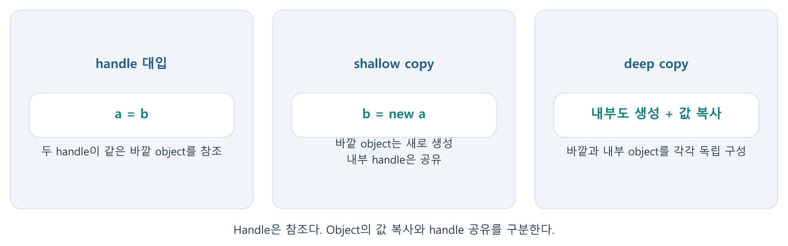

---
cssclasses:
  - uvm-study-note
updated: 2026-10-07
---

# SystemVerilog/UVM 1단계 — 객체지향 문법 복습



> 학습 범위: class/object/handle부터 `this`/`super`까지. 
> 이 노트는 대화에서 실제로 다룬 내용을 정리한 것이며, 코드는 개념 설명용입니다.
> simulator에서 실행해 검증한 결과는 아닙니다.

## 1. class, object, handle, constructor

- `class`: property와 method를 정의하는 설계도.
- `object`: `new()`로 생성된 class의 실제 instance.
- `handle`: object를 가리키는 변수. handle 선언만으로 object가 생성되지는 않는다.
- `function new(...)`: object 생성 시 실행되는 constructor. 직접 정의하지 않아도 기본 `new()`로 object를 만들 수 있지만, 초기화 동작이 필요하면 작성한다.
- `null` handle로 property나 method에 접근하면 안 된다.

```systemverilog
class Packet;
  int data;
  function new(int value = 5);
    data = value;
  endfunction
endclass

Packet p;
// 여기서 p는 null: object는 아직 없다.
p = new(10);
```

`Packet p;`의 `p`는 object가 아니라 handle이다. `p = new(10);`에서 object가 하나 생성되고 `p`가 그 object를 가리킨다.

## 2. handle assignment와 object copy

```systemverilog
Packet a, b;
a = new(10);
b = a;       // handle assignment: 새 object 없음
b.data = 20; // a.data도 20으로 관찰됨
a = new(30); // 두 번째 object 생성. b는 첫 object를 계속 가리킴
```

`b = a`는 값이 담긴 object의 복사가 아니라 handle 값의 대입이다. 여러 handle이 같은 object를 가리킬 수 있다.
반대로 `a = null`은 `a`의 연결만 끊으며, 같은 object를 가리키는 다른 handle에는 영향을 주지 않는다.

### Shallow copy와 deep copy

```systemverilog
class Header;
  int id;
endclass

class Frame;
  int data;
  Header hdr;
endclass

Frame x, y;
x = new();
x.hdr = new();
y = new x; // 바깥 Frame은 새 object, 내부 hdr handle은 공유
```

| 연산          | 바깥 `Frame`   | 내부 `Header`           |
| ----------- | ------------ | --------------------- |
| `y = x`     | 같은 object 공유 | 같은 object 공유          |
| `y = new x` | 새 object 생성  | handle만 복사되어 공유       |
| deep copy   | 새 object 생성  | `new()`로 별도 생성하고 값 복사 |

```systemverilog
y = new();
y.data = x.data;
y.hdr = new();
y.hdr.id = x.hdr.id; // int 값 복사; Header handle은 변경되지 않음
```

`y.hdr.id = x.hdr.id`는 `int` 값 복사이고, `y.hdr = x.hdr`는 handle assignment이다.
이미 `y.hdr = new()`를 했어도 뒤에서 `y.hdr = x.hdr`를 하면 다시 내부 object를 공유한다.

## 3. inheritance, overriding, polymorphism

```systemverilog
class Transaction;
  int id;
  virtual function void print();
    $display("base id=%0d", id);
  endfunction
endclass

class WriteTransaction extends Transaction;
  int data;
  function void print();
    $display("write id=%0d data=%0d", id, data);
  endfunction
endclass
```

- `extends`: 자식 class가 부모의 property와 method를 상속한다.
  `WriteTransaction`은 `id`, `data`, `print()`를 사용할 수 있지만, 부모 `Transaction`이 자식 고유의 `data`를 갖는 것은 아니다.
- overriding: 자식이 부모와 같은 method를 다시 정의한다. **부모 class의 구현 자체를 수정하지 않는다.**
- 일반적인 의미의 overloading은 같은 이름에 서로 다른 인자 구성을 두는 것이지만, SystemVerilog는 일반적인 method overloading을 지원하지 않는다.
- 부모 type의 handle은 자식 object를 가리킬 수 있다. 단, handle assignment가 object를 새로 생성하지는 않는다.

```systemverilog
Transaction t;
WriteTransaction w;
w = new();
w.id = 3;
w.data = 42;
t = w;
t.print();
```

| 부모 `print()` 선언 | method 선택 기준 | 위 코드의 `t.print()` |
|---|---|---|
| `virtual` 없음 | 호출에 사용한 handle type | 부모 `print()` |
| `virtual` 있음 | 실제 object type | 자식 `print()` |

`t`의 handle type은 `Transaction`, 실제 object type은 `WriteTransaction`이다. 
두 type을 구분하는 것이 polymorphism을 이해하는 핵심이다.

### abstract class와 pure virtual method

```systemverilog
virtual class Transaction;
  pure virtual function void print();
endclass

class WriteTransaction extends Transaction;
  function void print();
    $display("write");
  endfunction
endclass
```

`pure virtual`은 부모에 method 구현을 두지 않고 구체적인 자식 class가 구현하도록 요구한다. 
이를 선언하는 부모는 `virtual class`여야 하며 직접 `new()`로 생성할 수 없다. 
부모 type의 handle 선언은 가능하고, 자식 object를 가리키게 한 뒤 `print()`를 호출할 수도 있다. 
중간 자식도 `virtual class`로 남아 구현을 더 아래 자식에게 미룰 수 있다.

## 4. parameterized class

```systemverilog
class Box #(type T = int);
  T value;
endclass

Box#(int)    numbers;
Box#(string) words;
Box          default_box; // T의 기본값 int 사용
```

type parameter를 두면 동일한 class 구조를 여러 데이터 type에 재사용할 수 있다. 
`T = int`는 `int`만 허용한다는 뜻이 아니라 type을 생략했을 때의 기본값이다. 
`Box#(int)`와 `Box#(string)`은 서로 다른 class type이므로 두 handle을 그대로 대입할 수 없다. 
`words.value = "12"` 같은 property 대입과 `words = numbers` 같은 handle 대입은 별개다.

## 5. static property와 static method

```systemverilog
class Packet;
  static int count = 0;
  int id;

  function new();
    count++;
    this.id = count;
  endfunction

  static function int get_count();
    return count;
  endfunction
endclass
```

- `id`: 각 object마다 따로 존재하는 instance property.
- `static count`: class에서 공유하는 property. `Packet::count`로 접근할 수 있다.
- `static get_count()`: object 없이도 `Packet::get_count()`로 호출할 수 있다.
- handle 선언만으로는 constructor가 실행되지 않는다. `new()`가 실행될 때 이 예제의 `count++`와 `id = count`가 수행된다.
- 이미 저장된 `id`는 나중에 `count`를 수정해도 자동으로 바뀌지 않는다.

## 6. 접근 제한자

| property 선언 | 같은 class | 자식 class | class 밖 |
|---|---|---|---|
| `int data;` | 가능 | 가능 | 가능 |
| `protected int data;` | 가능 | 가능 | 불가능 |
| `local int data;` | 가능 | 불가능 | 불가능 |

외부에서 직접 수정하지 못하게 하려면 `local` 또는 `protected`로 제한하고 공개 method를 제공할 수 있다. 
자식이 내부 property에 직접 접근해야 하는 설계라면 `protected`가 해당된다.

## 7. `this`와 `super`

```systemverilog
class Transaction;
  int id;
  function new(int id);
    this.id = id;
  endfunction
endclass

class WriteTransaction extends Transaction;
  int data;
  function new(int id, int data);
    super.new(id);
    this.data = data;
  endfunction
endclass
```

- `this`: 현재 method가 실행 중인 object 자신. `this.data = data`에서 왼쪽은 object의 property, 오른쪽은 argument.
- `super`: “부모 object”가 아니라 부모 class에 정의된 member를 명시적으로 참조할 때 사용한다. 
  `super.new(id)`는 부모 constructor를 호출해 부모가 정한 초기화 절차를 재사용한다.
- 자식 object는 부모의 `id`를 상속받아 가지고 있다. `super.new(id)`를 쓰는 이유는 자식에게 `id`가 없어서가 아니다.

## 자주 헷갈렸던 지점

1. handle과 object는 다르다. `Packet p;`만으로 object가 생기지 않는다.
2. shallow copy는 중첩 handle을 공유한다. 단순 값 복사와 handle 대입을 구분한다.
3. overriding은 부모 구현을 변경하지 않는다. 자식 구현을 추가하는 것이다.
4. `virtual` 호출은 실제 **object type**이 기준이다. 단지 서로 다른 object라는 사실만으로 호출 method가 달라지는 것은 아니다.
5. `super`는 상위 object가 아니라 부모 class의 method/constructor를 참조한다.

## 현재 이해도와 다음 단계

>대화 중 코드 해석과 확인 문제는 대부분 정확히 해결했다.
>현재는 0~5 척도에서 대략 **2~3(예제를 해석하고 도움을 받아 설명 가능)** 수준으로 평가한다.
>직접 코드를 작성하고 simulator에서 디버깅하는 능력은 아직 평가하지 않았다.

복습 질문:

1. `a = new(); b = a;`에서 object는 몇 개이며 `b = a`는 무엇을 복사하는가?
2. `y = new x` 이후 `x.hdr`와 `y.hdr`가 같은 내부 object를 가리키는 이유는?
3. 부모 type handle이 자식 object를 가리킬 때 `virtual` 유무에 따라 method 선택 기준은 어떻게 달라지는가?

다음 학습 주제는 2단계의 packed/unpacked array와 SystemVerilog 데이터 구조다.

## PDF 보충 - 객체를 사용하는 검증 코드의 관점

> 2026-10-07 보강. 아래 추가 항목은 자료를 읽어 정리한 내용이며, 개별 문제로 이해도를 다시 확인한 것은 아니다.
> 연결: 01.03.03 Class - Encapsulation, 책 74~84쪽; 01.03.05 Class - Inheritance, 책 95~104쪽. PDF 파일의 페이지 번호는 책 쪽수 + 11이다.

### Class와 module의 생성·실행 차이

Module/interface instance는 elaboration에서 만들어진 HDL 구조이고, class object는 실행 중 constructor로 생성한다. Class 안의 task는 object를 만들었다고 자동 실행되지 않는다. 호출한 process에서 수행하며, 병렬 실행에는 fork 등 별도 process가 필요하다. Class에 module의 initial/always를 그대로 넣는 방식으로 실행을 구성하지 않는다.

### Handle 배열도 element마다 생성이 필요하다

```systemverilog
Packet packets[3]; // handle 3개: 각각 null
foreach (packets[i]) packets[i] = new();
```

Queue나 array에 class type을 담아도 저장되는 것은 handle이다. Container 대입·추가가 내부 object의 deep copy를 의미하지는 않는다. 이 규칙은 mailbox, UVM analysis 통신과 7단계의 copy/clone에도 이어진다.

### Downcast와 $cast

부모 handle로 자식 object를 참조할 수 있지만, 자식 고유 field를 사용할 때는 해당 type의 handle이 필요하다. `$cast(child, parent)`는 실제 object가 호환되는 type인지 확인하고 handle을 대입한다. 새로운 object나 복사본을 만들지 않는다. 반환값을 확인한 뒤 child에 접근한다.

### Const, forward declaration, extern

Instance constant는 constructor에서 초기화해 object마다 다른 고정값을 갖게 할 수 있다. `typedef class Header;`는 뒤에서 정의할 class type을 먼저 알리는 선언이며 object를 생성하지 않는다. `extern`은 method 선언과 구현 위치를 나누는 문법으로, factory 등록과는 별개의 역할이다. 이 세 항목은 PDF 보충으로 읽은 범위다.

### 7단계와 연결

Method overriding은 자식의 method 구현을 선택하는 문제이고, factory override는 생성할 object type을 선택하는 문제다. 두 경우 모두 handle type과 실제 object type을 구분해야 한다. `super.do_compare()`는 같은 두 객체의 부모 구현을 호출해 상속된 field를 비교하는 것이며, 별도의 부모 객체를 비교하는 것이 아니다.

보충 확인 문제: `Packet q[$]; q.push_back(p); p.data = 9;`에서 q[0].data가 함께 바뀌는 이유는 무엇인가? 새 보충 문제이며 답변·실행은 아직 확인하지 않았다.

## 갱신 상태와 탐색

원래 이해도 기록은 당시 평가를 유지한다. PDF 보충을 넣었다는 이유로 숙련도를 올리지 않았다. 현재 전체 진도는 8단계 기본 이론·해석까지이며 다음 시작점은 9단계다.

[[SystemVerilog UVM 학습 진행 기록|최신 진도]] · [[SystemVerilog UVM 학습 홈|1~8단계 목차]]

기준 PDF: `_uvm_tb_240705_214257.pdf`. 표기 쪽수는 책의 인쇄 쪽수이며 파일 페이지는 +11.
