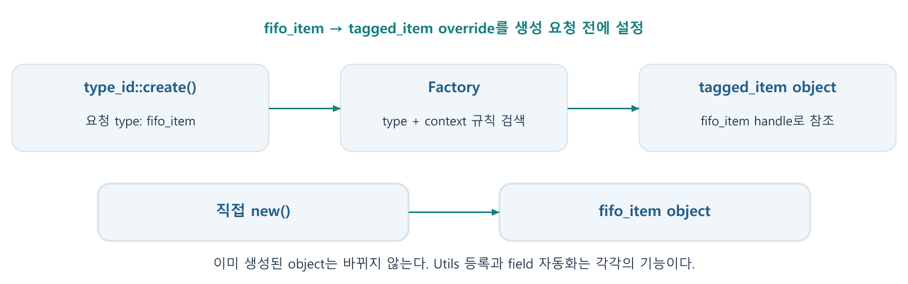

---
cssclasses:
  - uvm-study-note
updated: 2026-10-07
---

# SystemVerilog/UVM 7단계 - Factory와 utility macro



> 정리일: 2026-10-07. 대화에서 학습한 이론과 코드 예측을 정리했다. UVM simulator 실행은 미실행이며, PDF에서 새로 보충한 내용은 별도로 표시한다.
> 연결 자료: 02.06 Factory, 책 197~205쪽; 02.04 Transaction methods/override/parameterized transaction, 책 168~174쪽. PDF 파일 페이지 = 책 쪽수 + 11.

## 1. Factory의 필요성과 생성 흐름

Factory는 생성 요청을 받아 실제로 생성할 type을 선택한다. 공통 환경 안에 생성 코드가 여러 곳 있어도 test에서 설정을 바꿔 특수한 transaction이나 driver를 사용할 수 있다. Factory는 기존 object를 교체하는 기능이 아니며 다음 생성 요청에 적용한다.

```text
class 등록 → override 설정 → type_id::create() 요청
→ 경로/type 규칙 확인 → 선택한 type의 constructor → handle 반환
```

직접 new()를 호출하면 해당 handle type의 constructor를 사용하고 factory override 검색은 하지 않는다. Factory create()도 실제 객체 생성에는 결국 constructor를 사용한다.

## 2. 등록, type_id, constructor

```systemverilog
class fifo_item extends uvm_sequence_item;
  `uvm_object_utils(fifo_item)
  rand bit [7:0] data;
  function new(string name = "fifo_item");
    super.new(name);
  endfunction
endclass
```

Utils macro는 전처리 단계에서 factory 등록과 type 관련 method/boilerplate를 마련한다. 매크로를 쓴 자리에서 transaction instance를 만드는 것이 아니다. `type_id`는 등록용 registry specialization에 붙인 typedef 이름이며, 이 registry가 lightweight type proxy를 factory에 제공한다. 사용자가 만드는 fifo_item object와 proxy singleton은 다른 대상이다.

Object에는 uvm_object_utils, component에는 uvm_component_utils를 사용한다. Object constructor는 name, component constructor는 name과 parent를 받는다. UVM 1.2 object factory용 constructor에는 name 인수를 준비한다.

```systemverilog
// agent의 build_phase 안: this는 생성된 agent 객체
drv = fifo_driver::type_id::create("driver", this);
```

위 parent는 component hierarchy를 정한다. Component 등록 매크로는 적합한 component registry를 마련하며 필수 constructor를 대신 작성하지 않는다.

## 3. Type override와 적용 시점

tagged_item이 fifo_item을 상속하고 두 class가 등록돼 있다고 가정한다.

```systemverilog
fifo_item a, b, c;
a = fifo_item::type_id::create("a");
fifo_item::type_id::set_type_override(tagged_item::get_type());
b = fifo_item::type_id::create("b");
c = new("c");
```

| Handle | 실제 object type | 선택 이유 |
|---|---|---|
| a | fifo_item | override 설정 전에 생성 |
| b | tagged_item | 설정 뒤 factory로 생성 |
| c | fifo_item | 직접 new()로 생성 |

세 handle의 선언 type은 fifo_item이다. b만 실제 tagged_item object를 가리키는 것은 부모 handle이 자식 object를 참조할 수 있기 때문이다. Override 설정은 a를 소급해서 바꾸지 않는다. Method overriding은 호출할 구현을 선택하고, factory override는 생성할 type을 선택한다.

## 4. Instance override와 경로

```systemverilog
fifo_driver::type_id::set_type_override(traced_driver::get_type());
fifo_driver::type_id::set_inst_override(
  fault_driver::get_type(), "uvm_test_top.env.agent1.driver"
);
```

이 설정 후 agent0.driver와 agent1.driver가 fifo_driver로 생성 요청을 하면 agent0에는 traced_driver, agent1에는 fault_driver가 생성된다. 일치하는 instance override가 type override보다 우선한다. Instance override를 제거해도 type override는 남는다. 대체 type은 요청 type과 대입 호환되도록 설계한다.

### PDF 보충: context와 상대 경로

Registry set_inst_override()에서 parent를 생략하면 경로를 절대 경로로 해석한다. Parent를 넘기면 그 component의 전체 이름을 앞에 붙인다. Test의 component method인 set_inst_override_by_type()는 test 기준 상대 경로를 받는다. 서로 다른 API의 인수 순서와 경로 기준을 혼용하지 않는다.

Object는 구조적 component parent가 없지만 factory 생성 context를 가질 수 있다. Object create(name,parent,contxt)의 context/name과 override 경로가 맞아야 한다. Wildcard는 여러 요청에 적용될 수 있으므로 실제 경로로 먼저 확인한다. 여러 instance 규칙이 겹치면 등록 순서에도 주의한다.

## 5. Utils와 field 자동화

| 매크로 | 핵심 역할 |
|---|---|
| uvm_object_utils(T) | object의 factory/type 관련 기능 |
| uvm_component_utils(T) | component의 factory/type 관련 기능 |
| uvm_object_utils_begin/end | object 등록 + field macro 구간 |
| uvm_component_utils_begin/end | component 등록 + field macro 구간 |
| uvm_field_* | field별 copy/compare/print/pack 등 자동화 |

```systemverilog
`uvm_object_utils_begin(fifo_item)
  `uvm_field_int(data, UVM_DEFAULT)
  `uvm_field_int(debug_id, UVM_DEFAULT | UVM_NOCOMPARE)
`uvm_object_utils_end
```

uvm_field_int는 int keyword field에만 쓰는 것이 아니라 bit/logic packed integral field에도 사용한다. UVM_DEFAULT는 기본 작업들을 켠다. NOCOMPARE를 지정한 debug_id는 비교에서는 제외되지만 copy/print 등은 별도 flag가 없으면 참여한다. Field macro 구간을 단순 utils로 바꾸면 factory 등록은 유지되고 사용자 field 자동화는 빠진다.

### PDF 보충: field 종류

uvm_field_object/string/enum, uvm_field_array_*, uvm_field_queue_* 등 type에 맞는 macro를 고른다. UVM_HEX/DEC 등은 표시 radix 정책이다. UVM_NOCOPY/NOPRINT/NOPACK은 작업별 참여 여부를 조정한다. Begin/end와 component/object 계열을 맞춘다.

## 6. copy()와 do_copy()

사용자는 목적지.copy(원본)을 호출한다. UVM은 자동화와 virtual hook을 통해 field를 처리하며, 수동 구현은 do_copy()에 둔다. 목적지는 호출 전에 유효한 object여야 한다.

```systemverilog
function void do_copy(uvm_object rhs);
  fifo_item src;
  super.do_copy(rhs);
  if (!$cast(src, rhs))
    `uvm_fatal("COPY", "rhs is not a fifo_item")
  this.data = src.data;
endfunction
```

rhs의 선언 type은 uvm_object이므로 fifo_item 고유 field에 접근하려면 $cast가 필요하다. $cast는 type 호환성을 검사하고 handle을 얻으며 객체를 복제하지 않는다. a.copy(b) 후 b.data를 변경해도 a.data는 복사 당시 값으로 유지된다. a=b는 handle assignment이며 별개의 연산이다.

## 7. compare()와 do_compare()

compare()는 같으면 1, 다르면 0을 반환한다. 어떤 field를 비교할지는 field macro와 do_compare() 구현으로 정한다. 아래는 대화에서 사용한 간단한 값 비교 예다.

```systemverilog
function bit do_compare(uvm_object rhs, uvm_comparer comparer);
  fifo_item other;
  if (!$cast(other, rhs)) return 0;
  return super.do_compare(rhs, comparer)
         && (this.data == other.data);
endfunction
```

super.do_compare()는 같은 두 object의 부모 class 구현을 호출한다. 부모가 addr, 자식이 data를 비교하도록 구현돼 있다면 두 조건이 모두 참이어야 한다. 비교 함수가 같은지 확인하는 것이 아니다. Debug ID가 field macro나 수동 코드에 포함돼 있으면 값이 달라 실패할 수 있고, 제외했다면 비교 결과에 영향을 주지 않는다.

### PDF 보충: comparer를 쓰는 구현

실제 환경에서는 comparer.compare_field_int() 등으로 mismatch 정보와 정책을 함께 반영할 수 있다. 모든 필요한 비교를 수행하려면 short-circuit 때문에 뒤의 비교가 생략되지 않게 작성한다.

```systemverilog
function bit do_compare(uvm_object rhs, uvm_comparer comparer);
  fifo_item other;
  bit ok;
  if (!$cast(other, rhs)) return 0;
  ok = super.do_compare(rhs, comparer);
  ok &= comparer.compare_field_int("data", data, other.data, $bits(data));
  return ok;
endfunction
```

이 확장 구현은 자료 보충이며 직접 작성·실행을 확인한 것은 아니다. 같은 field를 field macro와 do_*에서 중복 처리하지 않도록 정책을 정한다.

## 8. do_print(), sprint(), convert2string()

```systemverilog
function void do_print(uvm_printer printer);
  super.do_print(printer);
  printer.print_field_int("data", data, $bits(data), UVM_HEX);
endfunction

function string convert2string();
  return $sformatf("data=0x%02h", data);
endfunction
```

print()는 printer를 사용해 출력하고, sprint()는 같은 형식의 문자열을 반환한다. convert2string()은 사용자 정의 한 줄 문자열을 반환하며 직접 화면에 출력하지 않는다. Utils/field macro는 convert2string()의 사용자 문자열을 자동 작성하지 않는다. 반환값을 uvm_info나 $display에 전달하면 로그로 출력된다.

## 9. clone()과 중첩 object 복사

clone()의 기본 구현은 새로운 object를 생성하고 copy()로 내용을 복사한다. 반환 type은 uvm_object이므로 구체 handle에 담을 때 $cast한다. 바깥 object가 새로 생겨도 내부 handle의 공유 여부는 복사 구현에 달려 있다.

```systemverilog
fifo_item a, b;
a = fifo_item::type_id::create("a");
a.data = 20;
if (!$cast(b, a.clone()))
  `uvm_fatal("CLONE", "Clone type mismatch")
b.data = 30; // data가 올바르게 복사됐다면 a.data는 20 유지
```

기본 clone()에서 호출하는 virtual object create()와 factory registry의 type_id::create()는 서로 다른 method다. Clone을 새로운 factory override 검색 요청으로 일반화하지 않는다.

```systemverilog
this.hdr = src.hdr; // 내부 object 공유
// this.hdr = new() 뒤 위 대입을 해도 공유로 돌아감
```

```systemverilog
if (src.hdr == null) this.hdr = null;
else begin
  this.hdr = header::type_id::create("hdr");
  this.hdr.copy(src.hdr);
end
```

두 번째 코드는 header의 복사 구현도 올바르다는 가정에서 독립적인 내부 내용을 만든다. Destination에 이미 다른 handle과 공유 중인 내부 object가 있는 경우도 고려해 정책을 선택한다.

| 정책 | object field 복사 의미 | 내부 id 수정의 영향 |
|---|---|---|
| UVM_REFERENCE | handle을 복사해 같은 object 참조 | 원본에서도 보임 |
| UVM_DEEP | 내부 object의 내용까지 복사 | 올바른 구현이면 독립 |
| UVM_SHALLOW | 중첩 내용을 얕게 처리하는 정책 | deep과 같다고 가정하지 않음 |

REFERENCE/DEEP은 대화에서 혼동한 뒤 재확인했다. SHALLOW의 구체 동작과 comparer/packer별 정책은 사용 UVM 구현에서 추가 확인할 보충 항목이다.

## 10. Field 자동화의 선택과 한계

Macro는 많은 작업을 지원하는 코드를 생성하므로 사용 범위가 넓을수록 불필요한 처리와 정책 분기가 들어갈 수 있다. 실제 성능 영향은 field 수, 내부 object 구조, 호출 빈도, simulator에 따라 측정해야 한다. 직접 구현보다 항상 느리다는 단정이나 속도 수치는 사용하지 않는다.

전처리 확장 코드 안의 오류는 원래 field 선언만 보고 찾기 어려울 수 있다. Nested object의 null/공유 정책과 비교 제외 조건이 복잡하면 do_*가 의도를 드러내기 좋다. 작은 단순 transaction에는 field macro가 편리하다. 실수로 field를 누락하면 복사·비교가 성공처럼 보일 수 있으므로 포함할 field 목록을 검증 계획과 맞춘다.

## 11. Factory debug와 PDF 설명 보정

확인 순서: 등록 여부 → 생성이 create인지 → override 설정 시점 → 실제 검색 경로 → 적용 규칙. Factory의 print()는 등록과 override 상태, debug_create_by_type()는 생성 없이 선택 규칙을 추적한다.

```systemverilog
uvm_factory f;
f = uvm_factory::get();
f.print();
f.debug_create_by_type(fifo_driver::get_type(),
  "uvm_test_top.env.agent1", "driver");
```

실제 생성 type은 get_type_name(), component 위치는 get_full_name()으로 함께 확인한다. Debug API 실습 로그는 아직 없다.

PDF 책 199쪽의 type_id는 typedef를 통해 registry type을 가리킨다. 이를 transaction singleton instance로 해석하지 않는다. 책 200쪽의 component create 예에는 실제 코드에서 parent가 필요하다. 책 169쪽의 do_pack/do_unpack signature는 UVM 1.2의 `virtual function void do_pack(uvm_packer packer)` 및 do_unpack과 구분한다. 책의 도식에 등록·생성·override가 나열돼 있어도 override가 해당 생성 요청보다 먼저 설정돼야 한다.

## 12. PDF 보충 - Parameterized transaction

```systemverilog
class bus_item #(int DW = 8) extends uvm_sequence_item;
  `uvm_object_param_utils(bus_item#(DW))
  rand bit [DW-1:0] data;
  function new(string name = "bus_item");
    super.new(name);
  endfunction
endclass
typedef bus_item#(16) bus_item16_t;
```

Parameterized class에는 object/component_param_utils 계열을 사용한다. DW=8과 DW=16 specialization은 다른 type이다. Name 기반 factory 등록·검색은 일반 class와 같다고 가정하지 않고 type 기반 API를 사용한다. 이 내용은 PDF에서 보충했으며 문제·실행으로 확인하지 않았다.

## 13. 학습 확인과 다음 시작점

현재 이해도: 기본 생성·override와 scalar field 처리 2~3/5. 직접 전체 class 작성·UVM simulator 디버깅은 미평가다.

- 확인됨: create/new의 차이, 이미 생성된 객체 불변, instance 우선순위, NOCOMPARE, copy와 handle assignment, clone의 바깥 객체 독립, 문자열 반환.
- 재확인 필요: REFERENCE/DEEP과 내부 공유, super.do_compare의 부모 field 재사용, 실제 object override 경로.
- 자료 보충: parameterized registration, comparer 정책, proxy 구조, debug API, do_pack/unpack 보정.
- 미실행: 이 노트의 모든 UVM 예제. 실제 simulator pass 로그 없음.

반드시 기억할 핵심 3개: factory 설정은 생성 전에 / utils 등록과 field 자동화는 별개 / 바깥 clone과 내부 deep copy는 별개.

복습 문제 3개:

1. Override 뒤 create와 직접 new는 어떤 type을 생성하는가?
2. super.do_compare가 0이고 data가 같으면 전체 결과는 무엇인가?
3. UVM_REFERENCE로 복사한 내부 object를 수정하면 원본에도 영향이 있는가?

답변을 가린 상태로 먼저 설명한 뒤 본문과 비교한다. 다음 관련 단계는 [[SystemVerilog UVM 8단계 - Phase와 objection]]이다.

## 참고 자료

- 회사 PDF: 02.04, 02.06의 위 쪽수. 본문을 재구성하고 필요한 API를 보정했다.
- [UVM 1.2 Factory](https://verificationacademy.com/verification-methodology-reference/uvm/docs_1.2/html/files/base/uvm_factory-svh.html)
- [UVM 1.2 Registry](https://verificationacademy.com/verification-methodology-reference/uvm/docs_1.2/html/files/base/uvm_registry-svh.html)
- [UVM Utility/Field Macros](https://verificationacademy.com/verification-methodology-reference/uvm/docs_1.2/html/files/macros/uvm_object_defines-svh.html)
- [UVM Object](https://verificationacademy.com/verification-methodology-reference/uvm/docs_1.2/html/files/base/uvm_object-svh.html)
- [UVM Comparer](https://verificationacademy.com/verification-methodology-reference/uvm/docs_1.2/html/files/base/uvm_comparer-svh.html)
