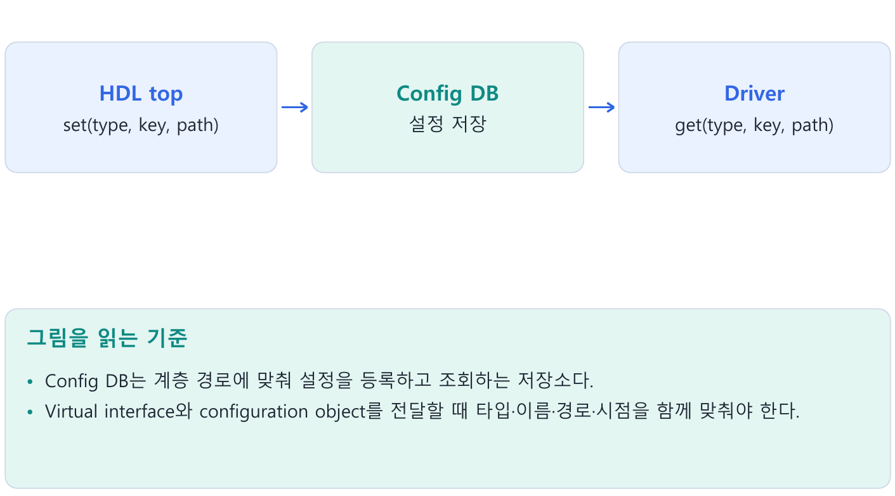
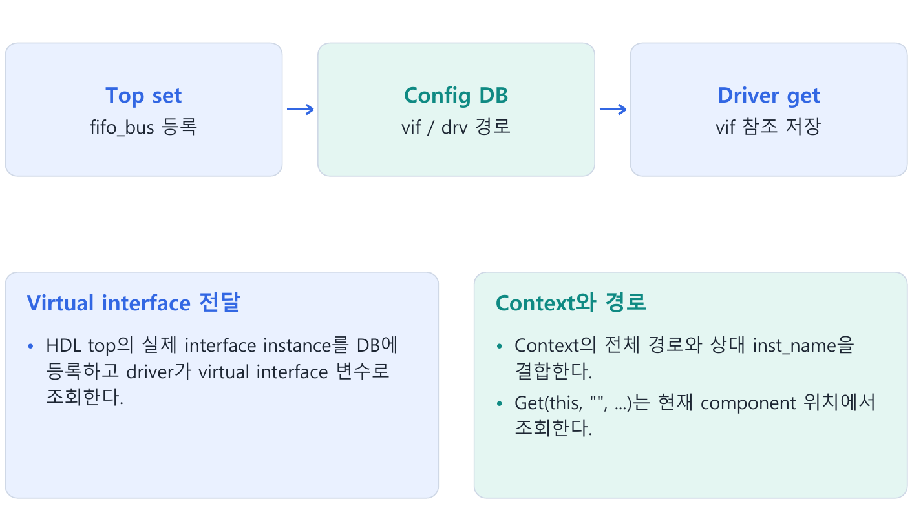
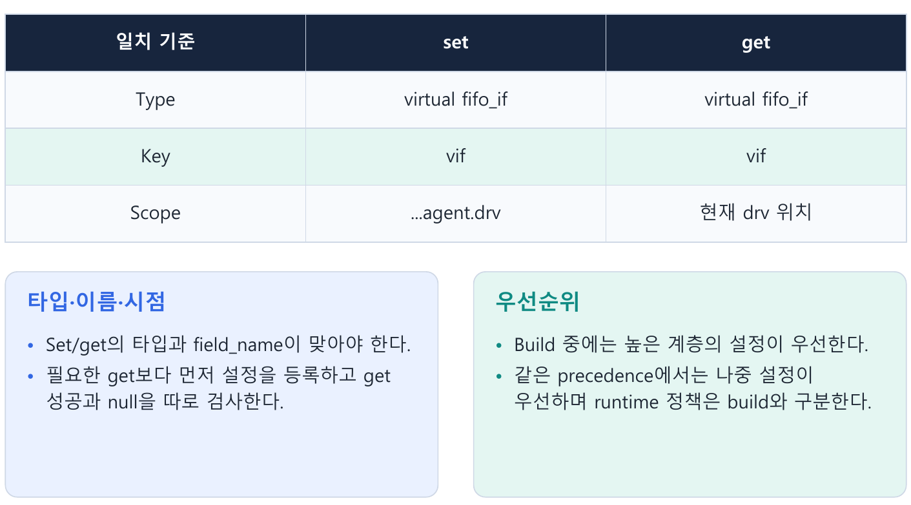
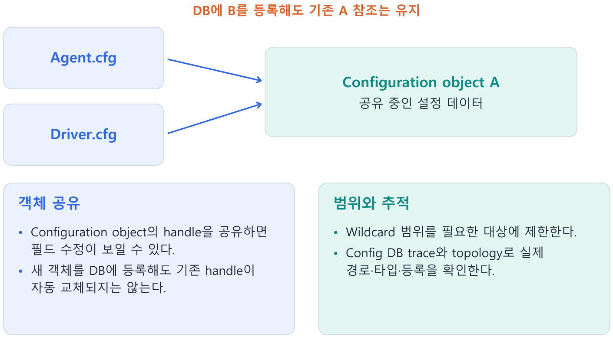
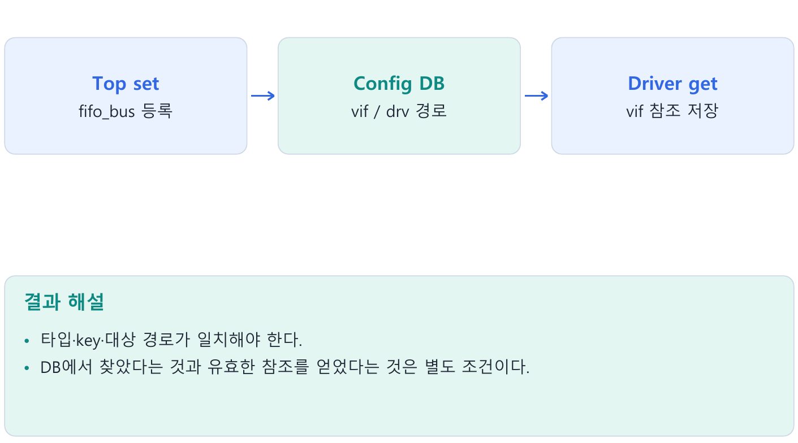

---
tags:
  - config_db
  - virtual_interface
  - scope
  - configuration
cssclasses:
  - uvm-study-note
---

#config_db #virtual_interface #scope #configuration

# **1. 소개**

- Config DB는 계층 경로에 맞춰 설정을 등록하고 조회하는 저장소다.
- Virtual interface와 configuration object를 전달할 때 타입·이름·경로·시점을 함께 맞춰야 한다.

# **2. 구조와 흐름**



# **3. 핵심 개념**

## **3.1. 왜 virtual interface와 config DB가 필요한가**

- 실제 interface는 module 계층에 존재하고, UVM driver/monitor는 동적으로 생성되는 class 객체다.
- Class에서 사용할 실제 interface를 참조로 지정해야 한다.
- Driver가 특정 top 경로를 직접 고정해서 참조하면 다른 DUT·top에서 재사용하기 어렵다.

| 요소 | 역할 |
|---|---|
| 실제 interface | DUT와 연결된 신호를 담는 인스턴스 |
| virtual interface | class에서 실제 interface를 가리키는 참조 변수 |
| config DB | 설정값·객체 handle·interface 참조를 대상 경로에 전달 |

```text
Top: 실제 interface 생성 → DUT port 연결
  → config DB set으로 참조 등록
Driver build_phase: get → virtual interface 변수에 저장
Driver run_phase: 참조를 통해 protocol timing에 맞춰 신호 구동
```

- Config DB가 DUT 신호를 배선하는 것은 아니다.
- Top에서 DUT와 실제 interface를 연결하고, class 쪽에는 그 interface 참조를 전달한다.
- Virtual interface가 별도 신호를 만들지도 않는다.

## **3.2. 선언만 하면 연결되지 않는다**

```systemverilog
// top module 내부: 실제 interface 인스턴스
fifo_if fifo_bus(clk);

// driver class 내부: 참조 변수 선언
virtual fifo_if vif;
```

- 위의 두 줄은 각기 다른 위치의 예시다.
- vif는 선언 직후 null이며 fifo_bus와 자동 연결되지 않는다.
- 유효한 참조가 있어야 vif.wr_en 등으로 실제 신호에 접근할 수 있다.

- 신호가 아직 들어오지 않은 것과 참조가 null인 것은 다르다.
- 실제 interface의 신호가 0이어도 접근할 수 있지만, null 참조에는 접근할 대상이 없다.
- 구동은 유효한 참조를 확보하고 정해진 clocking/timing 규칙에 따라 수행한다.

## **3.3. Top의 set과 driver의 get**



```systemverilog
// top module 내부
fifo_if fifo_bus(clk);
initial begin
  uvm_config_db#(virtual fifo_if)::set(
    null, "uvm_test_top.env.agent.drv", "vif", fifo_bus
  );
  run_test();
end
```

```systemverilog
// driver 클래스 내부
virtual fifo_if vif;
function void build_phase(uvm_phase phase);
  super.build_phase(phase);
  if (!uvm_config_db#(virtual fifo_if)::get(this, "", "vif", vif))
    `uvm_fatal("NO_VIF", "interface 설정을 찾지 못했습니다")
  if (vif == null)
    `uvm_fatal("NULL_VIF", "interface 참조가 null입니다")
endfunction
```

- 예제는 이미 정의된 fifo_if와 test/env/agent/driver 구조를 가정한 부분 코드다.
- `import uvm_pkg::*;`, include, DUT port 연결 등 전체 환경을 새로 작성한 것은 아니다.

| 인자 | set | get |
|---|---|---|
| 타입 T | 전달할 설정 타입 | 같은 타입으로 조회 |
| context | 기준 component, null이면 root 기준 | 조회 기준 component |
| inst_name | 기준에서의 상대 대상 경로 | 기준에서의 상대 조회 경로 |
| field_name | 설정을 등록할 이름 | 찾을 설정 이름 |
| 마지막 인자 | 등록할 값·참조 | 조회한 값을 저장할 변수 |

- `get(this, "", ...)`는 현재 component의 전체 경로에서 조회한다.
- 빈 경로가 모든 component라는 뜻은 아니다.
- `get()`은 찾았으면 1, 못 찾았으면 0을 반환한다.

## **3.4. Context와 상대 경로**

```systemverilog
// env의 build_phase()
uvm_config_db#(int)::set(
  this, "agent.drv", "timeout_cycles", 100
);
```

- 현재 env의 full name이 uvm_test_top.env라면 대상은 uvm_test_top.env.agent.drv다.
- driver는 자기 build_phase에서 같은 int 타입, 이름 timeout_cycles로 get한다.

- 대상을 agent까지만 지정하면 그 자식 drv에 자동 확장되지 않는다.
- 공유 설정이 필요하면 `agent.*` 같은 패턴을 사용하거나 agent가 가져온 뒤 자식에게 다시 전달한다.

## **3.5. 변수 이름과 component 이름**

```systemverilog
// agent 내부
driver_h = fifo_driver::type_id::create("fifo_drv", this);
```

- driver_h는 handle 변수 이름이고 fifo_drv는 UVM component 인스턴스 이름이다.
- Parent this와 인스턴스 이름으로 hierarchy가 만들어진다.
- 설정 경로에는 fifo_drv가 들어간다.

- `get_full_name()`은 현재 component의 전체 UVM 경로를 반환한다.
- 예상 경로가 uvm_test_top.env.agent.fifo_drv인지 실제 이름과 부모를 확인한다.
- Top module의 HDL 계층 경로와 UVM component의 논리 계층 경로도 혼동하지 않는다.

## **3.6. 이름·타입·경로를 맞춘다**



- vif로 등록하고 fifo_vif로 찾으면 매칭되지 않는다.
- int로 등록하고 string으로 찾으면 같은 설정을 가져올 수 없다.
- drv 대상으로 등록하고 mon이 자기 경로에서 찾으면 범위가 다르다.
- interface parameter와 modport가 다르면 virtual interface 타입도 다르다.

```systemverilog
uvm_config_db#(virtual fifo_if)::set(...);
uvm_config_db#(virtual fifo_if)::get(...);
// virtual fifo_if.DRV와 섞어서 조회하지 않는다.
```

- Modport 타입을 사용하려면 set/get의 타입과 전달할 참조를 그 타입에 맞춰 일관되게 구성한다.
- 구체적 문법과 simulator 지원은 실습 때 확인한다.

## **3.7. Wildcard 범위와 get의 책임**

```systemverilog
// env 내부
uvm_config_db#(int)::set(
  this, "agent.*", "timeout_cycles", 100
);
```

- 이 범위에 포함된 drv, mon, sqr가 같은 이름과 타입으로 get할 수 있다.
- DB에 설정했다고 component 변수에 자동 대입되는 것은 아니다.

- Common flag 같은 공통 설정에는 wildcard가 편리하다.
- 여러 agent에 각각 다른 실제 interface를 줘야 할 때 너무 넓은 wildcard를 사용하면 모두 같은 참조를 가져갈 수 있다.
- 대상 경로를 구체적으로 지정하고 agent 단위 설정 객체를 사용하는 이유다.

## **3.8. Build 중 우선순위와 runtime 변경**

```systemverilog
// test build_phase()
uvm_config_db#(int)::set(
  this, "env.agent.drv", "timeout_cycles", 200
);
// env build_phase()
uvm_config_db#(int)::set(
  this, "agent.drv", "timeout_cycles", 100
);
```

- 두 대상이 같아도 build 중에는 더 높은 계층의 context에서 설정한 값이 우선한다.
- 위 예제에서는 env의 set이 뒤에 수행돼도 test의 200을 가져온다.
- 계층 기준은 문자열의 구체성보다 set의 context 깊이다.

| 조건 | 기본 우선순위 규칙 |
|---|---|
| build 중 다른 context 깊이 | 상위 context 우선 |
| 같은 우선순위의 설정 | 나중 설정 우선 |
| build 이후 일반 set | 기본 우선순위를 사용, 나중 설정 우선 |

- 이 규칙은 일반 config DB set/get의 설명이다.
- Resource precedence를 별도로 조작하는 고급 사용은 범위 밖이다.
- 더 구체적인 문자열이 항상 이긴다고 일반화하지 않는다.

- Driver가 build에서 정수 200을 가져온 뒤 DB에 300을 등록해도 driver의 정수 변수는 자동으로 바뀌지 않는다.
- 새 값을 사용하려면 다시 get해야 한다.

## **3.9. Configuration object로 설정을 묶는다**

```systemverilog
class fifo_config extends uvm_object;
  `uvm_object_utils(fifo_config)
  int timeout_cycles = 100;
  bit checks_enable = 1;
  virtual fifo_if vif;
  function new(string name = "fifo_config");
    super.new(name);
  endfunction
endclass
```

```systemverilog
// test build_phase()
cfg = fifo_config::type_id::create("cfg");
cfg.timeout_cycles = 200;
uvm_config_db#(fifo_config)::set(this, "env.agent", "cfg", cfg);

// agent build_phase()
if (!uvm_config_db#(fifo_config)::get(this, "", "cfg", cfg))
  `uvm_fatal("NO_CFG", "설정 객체를 찾지 못했습니다")
if (cfg == null)
  `uvm_fatal("NULL_CFG", "설정 객체가 null입니다")
```

- Virtual interface를 포함하는 cfg는 top/test의 적절한 경로에서 유효한 참조를 넣어야 한다.
- 객체 생성만으로 cfg.vif까지 자동 설정되지 않는다.

- Agent 단위 configuration object를 가져와 필요한 driver/monitor에 전달할 수 있다.
- Agent에만 설정한 cfg를 자식이 자동 수신하는 것은 아니다.
- Agent가 직접 전달하거나 자식 대상에 set하는 과정이 필요하다.

## **3.10. 객체 공유와 handle 교체**



- Config DB는 자동 clone을 하지 않는다.
- Object handle을 주고받으면 기본적으로 같은 객체를 공유한다.

```text
Test cfg ──> 객체 A <── Agent cfg
Config DB ─> 객체 A
```

- Test가 A.timeout_cycles를 300으로 수정하면 agent가 A의 필드를 읽을 때도 300이다.
- Agent가 이미 별도 정수 변수에 복사했다면 그 정수는 그대로다.

Test가 새 B를 생성해 DB에 다시 등록하면 다음처럼 된다.

```text
Test cfg ──> 객체 B <── Config DB
Agent cfg ─> 객체 A
```

- 이전에 받은 agent의 cfg는 자동으로 B를 가리키지 않는다.
- 다시 get해야 새 handle을 얻는다.
- 기존 객체 내용 수정, 새 객체 handle 등록, 정숫값 복사를 각각 구분한다.

## **3.11. Set 시점과 build 순서**

- Top의 같은 initial 블록에서 set → run_test 순으로 진행하면 build의 get 전에 등록한다.
- run_test 뒤에 set하면 초기 build에 필요한 설정을 제때 제공하지 못한다.

- 서로 다른 initial 블록은 별도 process다.
- 소스의 위아래 순서만으로 상대 실행 순서를 정의하지 않는다.
- 두 initial만으로 실패가 반드시 발생한다고 단정하기보다 초기화 의존 관계를 같은 process에서 명확히 표현한다.

- UVM build는 상위 component에서 하위로 진행된다.
- 부모 build에서 set을 완료하고 자식 build에서 get하는 흐름을 사용한다.
- 순서와 scope를 함께 확인한다.

## **3.12. Resource DB와 config DB**

| 항목 | resource DB | config DB |
|---|---|---|
| 범위 지정 | scope 문자열 직접 지정 | component context + 상대 경로 |
| 등록·조회 | set / read_by_name 등 | set / get |
| 주 활용 | 공유 resource | component별 설정 전달 |

- Config DB는 resource DB를 기반으로 component 계층을 고려한 접근과 우선순위를 제공한다.
- 서로 독립된 DB로 이해하지 않는다.
- Resource DB에도 scope가 있으므로 항상 전역이라는 뜻은 아니다.

```systemverilog
uvm_resource_db#(bit)::set(
  "uvm_test_top.env.*", "checks_enable", 1, this
);
uvm_config_db#(bit)::set(
  this, "env.*", "checks_enable", 1
);
```

- 위는 test 안의 범위 비교 예시이며 둘을 같은 이름으로 동시에 사용하라는 실행 코드가 아니다.
- Resource DB의 accessor는 진단용 호출자 정보이며 config DB의 context와 동일한 상대 경로 기능이 아니다.

## **3.13. 실패 디버깅**

- 조회 실패와 null 참조는 별개다.
- 등록된 값이 null이면 get이 성공할 수도 있다.
- `get()` 반환값 검사와 값의 유효성 검사를 함께 한다.

1. 실제 component get_full_name 확인: create 이름과 parent가 예상과 같은가?
2. set/get의 field_name과 type 비교: parameter/modport도 일치하는가?
3. Context와 상대 경로를 합쳤을 때 scope가 맞는가?
4. get 전에 set이 실행됐는가?  
   상위 설정 우선순위는 의도대로인가?
5. 성공해서 받은 interface/cfg가 null은 아닌가?

- 실행 시 `+UVM_CONFIG_DB_TRACE`로 set/get trace를 확인할 수 있다.
- `uvm_top.print_topology()`로 구조도 확인한다.
- Report와 추적은 13장에서 설명한다.

# **4. 핵심 예제**

```systemverilog
// HDL top: run_test() 전에 등록
uvm_config_db#(virtual fifo_if)::set(
  null, "uvm_test_top.env.agent.drv", "vif", fifo_bus);
// Driver build_phase
if (!uvm_config_db#(virtual fifo_if)::get(
      this, "", "vif", vif))
  `uvm_fatal("NO_VIF", "Interface not found")
if (vif == null)
  `uvm_fatal("NULL_VIF", "Interface is null")
```

- 타입·key·대상 경로가 일치해야 한다.
- DB에서 찾았다는 것과 유효한 참조를 얻었다는 것은 별도 조건이다.



# **5. 주의점**

- Handle 변수 이름 대신 create의 instance 이름이 component 경로에 들어간다.
- DB의 값 변경이 이미 가져온 scalar 변수를 자동 갱신하지 않는다.
- 실제 interface와 virtual 참조를 구분한다.

# **6. 핵심 정리**

- **Virtual interface 전달**: HDL top의 실제 interface instance를 DB에 등록하고 driver가 virtual interface 변수로 조회한다.
- **Context와 경로**: Context의 전체 경로와 상대 inst_name을 결합한다.  
  Get(this, "", ...)는 현재 component 위치에서 조회한다.
- **타입·이름·시점**: Set/get의 타입과 field_name이 맞아야 한다.  
  필요한 get보다 먼저 설정을 등록하고 get 성공과 null을 따로 검사한다.
- **우선순위**: Build 중에는 높은 계층의 설정이 우선한다.  
  같은 precedence에서는 나중 설정이 우선하며 runtime 정책은 build와 구분한다.
- **객체 공유**: Configuration object의 handle을 공유하면 필드 수정이 보일 수 있다.  
  새 객체를 DB에 등록해도 기존 handle이 자동 교체되지는 않는다.
- **범위와 추적**: Wildcard 범위를 필요한 대상에 제한한다.  
  Config DB trace와 topology로 실제 경로·타입·등록을 확인한다.

# **7. 확인 문제와 해설**

## **문제 1**

Get 성공이면 vif가 반드시 non-null인가?

- **해설:** 아니다.
- 별도 null 검사가 필요하다.

## **문제 2**

DB에 새 객체 B를 등록하면 기존 agent의 A 참조는?

**해설:** 다시 조회·대입하지 않으면 A를 유지한다.

## **문제 3**

Create("drv", this)의 경로 leaf는?

- **해설:** drv다.
- Handle 변수 이름과 별개다.

# **8. 참고 자료**

- [UVM 1.2 Class Reference](https://verificationacademy.com/verification-methodology-reference/uvm/docs_1.2/html/)
- [UVM 1.2 Configuration Database Reference](https://verificationacademy.com/verification-methodology-reference/uvm/docs_1.2/html/files/base/uvm_config_db-svh.html)
- [Accellera UVM 표준·참고 구현](https://www.accellera.org/downloads/standards/uvm)

[목차](<UVM 기초 - 목차.md>)
