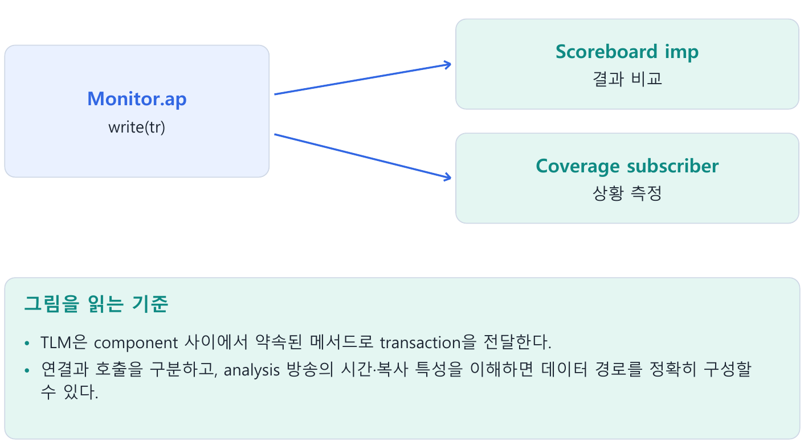
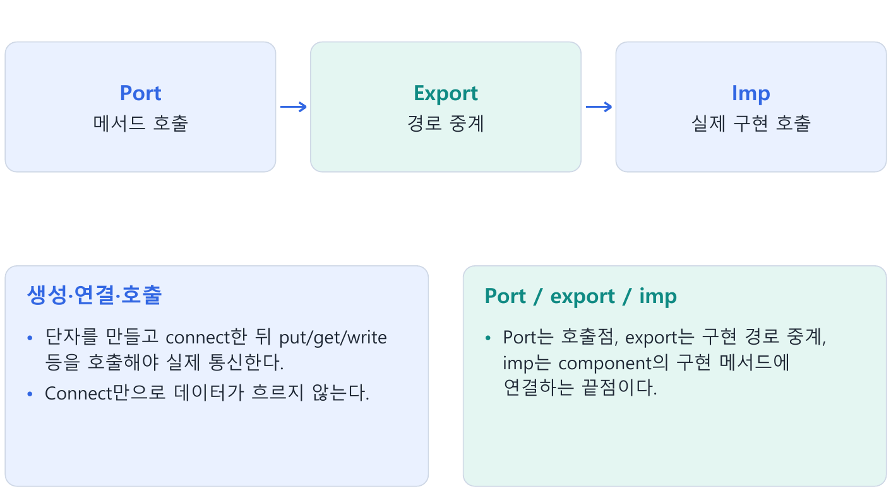
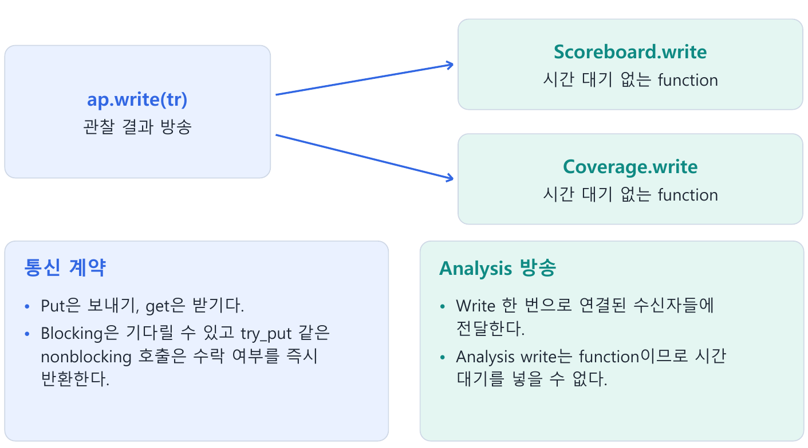
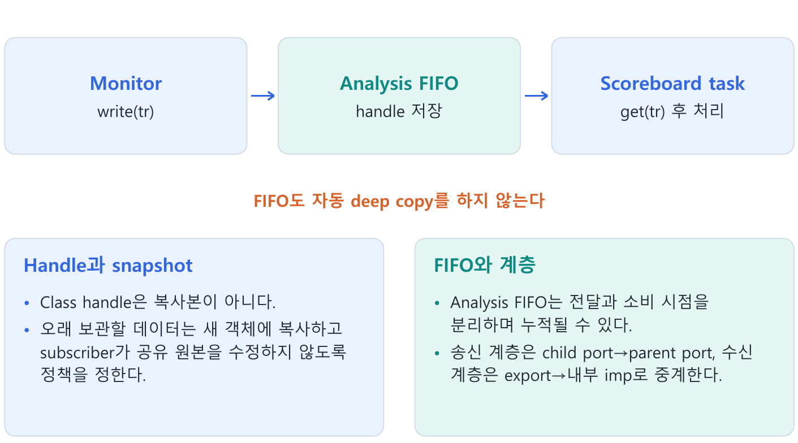
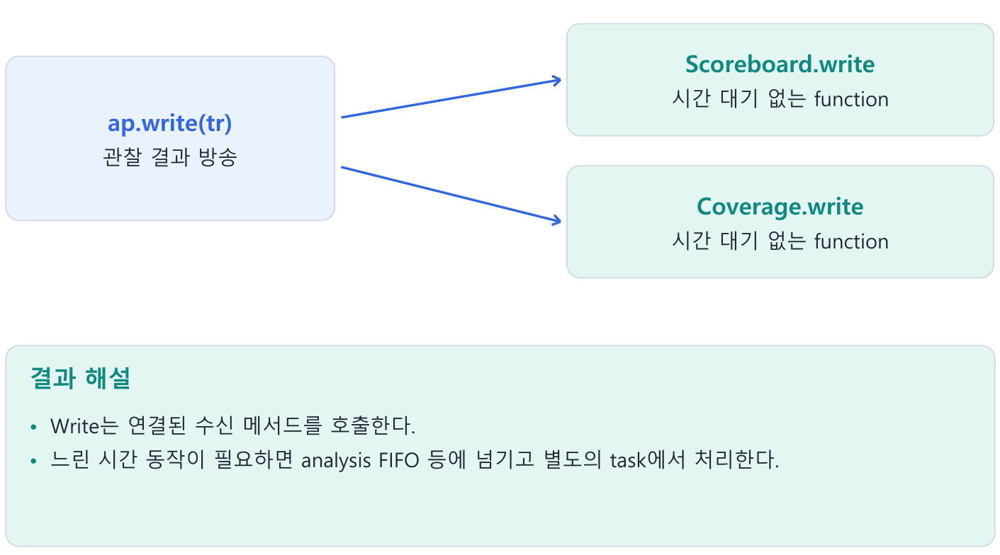

---
tags:
  - tlm
  - analysis
  - port
  - export
  - imp
  - fifo
cssclasses:
  - uvm-study-note
---

#tlm #analysis #port #export #imp #fifo

# **1. 소개**

- TLM은 component 사이에서 약속된 메서드로 transaction을 전달한다.
- 연결과 호출을 구분하고, analysis 방송의 시간·복사 특성을 이해하면 데이터 경로를 정확히 구성할 수 있다.

# **2. 구조와 흐름**



# **3. 핵심 개념**

## **3.1. TLM이 필요한 이유**

- TLM(Transaction Level Modeling)은 component들이 약속된 메서드를 통해 transaction을 주고받도록 하는 통신 방식이다.
- 내부 queue나 특정 구현을 직접 참조하는 대신 put/get/write 등 정해진 interface를 사용해 component의 재사용성을 높인다.

```text
sequence → sequencer → driver → interface → DUT
           transaction 전달       신호 구동
```

- Driver와 DUT 사이의 신호 접근에는 virtual interface를 사용한다.
- Testbench 내부의 transaction 전달에는 TLM을 사용한다.
- TLM 연결이 DUT의 물리적인 신호 배선을 대신하지 않는다.

## **3.2. 생성, 연결, 실행은 다르다**

| 절차 | 의미 | 예 |
|---|---|---|
| 선언 | handle 변수와 타입 지정 | uvm_analysis_port #(my_txn) ap; |
| 생성 | 연결 객체 생성 | ap = new("ap", this); |
| 연결 | 호출이 도달할 상대 지정 | mon.ap.connect(sb.analysis_imp); |
| 사용 | transaction 전달 메서드 호출 | ap.write(tr); |

- Port/export/imp는 통상 constructor 또는 build_phase에서 new()로 생성한다.
- 관련 component도 먼저 생성돼 있어야 하며, connect_phase에서 구성된 환경의 연결을 만든다.
- 선언이나 생성만으로 자동 연결되지 않는다.

```systemverilog
// agent의 connect_phase
drv.seq_item_port.connect(sqr.seq_item_export);

// driver의 run_phase에서 사용하는 부분 코드
seq_item_port.get_next_item(req);
drive_item(req);
seq_item_port.item_done();
```

- connect()는 호출 경로를 만들 뿐, 그 자체로 item을 보내지 않는다.
- Driver가 get_next_item()을 호출하면 연결된 sequencer에 요청하고 item을 받아온다.
- 호출은 driver → sequencer, item의 이동은 sequencer → driver다.
- 이 pull interface에는 get_next_item/item_done 등 전용 handshake 메서드가 있으며 단순 blocking_get과 동일한 타입이 아니다.

## **3.3. Port, export, imp**



| 타입 계열 | 역할 |
|---|---|
| *_port | 상대의 interface 메서드를 호출하는 연결점 |
| *_export | 내부 구현으로 이어지는 interface를 외부 계층에 노출·중계 |
| *_imp | 호출을 구현 component의 메서드로 전달하는 끝점 |

```text
producer.put_port → consumer.put_imp → consumer.put(tr)
```

```systemverilog
// producer 내부
uvm_blocking_put_port #(my_txn) put_port;
// 생성 위치의 this는 producer
put_port = new("put_port", this);

// consumer 내부
uvm_blocking_put_imp #(my_txn, my_consumer) put_imp;
// 생성 위치의 this는 consumer
put_imp = new("put_imp", this);

// env의 connect_phase
producer.put_port.connect(consumer.put_imp);
```

- consumer는 `task put(my_txn tr); ... endtask`를 구현한다.
- imp의 첫 타입 인자는 transaction 타입, 두 번째는 메서드를 구현한 component 타입이다.
- Port와 imp를 직접 연결할 때 중간 export는 필요하지 않다.

- 예를 들어 imp 변수 이름을 put_export나 analysis_export로 지정할 수도 있다.
- 역할은 변수 이름이 아니라 선언 타입으로 판단한다.
- `uvm_blocking_put_imp #(my_txn, my_consumer) rx_export;`의 rx_export는 imp다.

## **3.4. Push, pull, FIFO, analysis**

| 방식 | 시작하는 쪽 | 메서드·의미 | 사용 위치 |
|---|---|---|---|
| Push | Producer | put()으로 전달 | 생성 결과를 소비자에 전달 |
| Pull | Consumer | get() 계열로 요청 | Driver가 sequencer에 요청 |
| FIFO | Producer와 consumer | 넣기와 꺼내기 시점을 분리 | 처리 속도·시점 분리 |
| Analysis | 관찰 결과의 생산자 | write()로 연결 대상에 알림 | Monitor → scoreboard·coverage |

- FIFO와 analysis는 함께 사용할 수 있다.
- Analysis는 전달 interface이며 FIFO는 받은 항목을 보관한다.
- UVM의 transaction FIFO와 검증 대상인 DUT FIFO도 서로 다른 대상이다.

## **3.5. Analysis의 1:N 전달**



```text
                    ┌→ scoreboard.write(tr)
monitor.ap.write(tr)┤
                    └→ coverage.write(tr)
```

```systemverilog
// monitor 내부 선언·생성
uvm_analysis_port #(my_txn) ap;
// constructor/build_phase의 문장
ap = new("ap", this);

// scoreboard 내부 선언·생성
uvm_analysis_imp #(my_txn, my_scoreboard) analysis_imp;
analysis_imp = new("analysis_imp", this);

// env의 connect_phase: 수신자 각각 연결
mon.ap.connect(sb.analysis_imp);
mon.ap.connect(cov.analysis_imp);

// monitor의 관찰 transaction 전달
ap.write(tr);
```

- 위 코드는 서로 다른 클래스·메서드 위치의 부분 코드다.
- my_txn, my_scoreboard와 coverage 클래스가 정의돼 있다고 가정한다.
- Coverage collector의 imp도 자신의 클래스 타입을 두 번째 인자로 생성해야 한다.

```systemverilog
// scoreboard 내부
function void write(my_txn tr);
  // 즉시 비교 또는 이후 처리를 위한 보관
endfunction
```

- Scoreboard만 연결하면 coverage에는 전달되지 않는다.
- Analysis port는 연결 대상이 0개여도 write()가 반환할 수 있으므로 필수 수신자 연결은 따로 확인해야 한다.

## **3.6. Write는 function이다**

- write()에는 simulation 시간을 소비하는 delay/event 대기를 넣을 수 없다.
- 호출 과정에서 연결된 수신자들의 write()가 차례로 실행되며 모든 호출이 끝난 후 반환한다.
- 수신자별로 독립적인 병렬 task가 생기는 것이 아니다.
- 수신자 실행 순서에 의존한 설계를 피한다.

- 연결된 수신자에 대한 function 호출은 순차적으로 진행되며 simulation time 대기를 포함하지 않는다.
- 시간 대기가 없다는 말은 CPU 처리 비용이 없다는 뜻도 아니다.

## **3.7. Handle 전달과 snapshot**

```systemverilog
// monitor
tr.data = 8'h11;
ap.write(tr);
tr.data = 8'h22;

// scoreboard의 write 안에서 실행한 문장
saved = tr;
```

- saved와 tr이 같은 객체를 가리키므로 마지막 변경 후 saved.data도 8'h22다.
- Analysis는 class 객체를 자동 clone하지 않는다.
- 수신자도 전달받은 transaction을 수정하지 않아야 한다.

보관 방법은 두 가지를 생각할 수 있다.

1. Monitor가 매 관찰마다 새 객체를 생성하고 발행 후 수정하지 않는다.  
   모든 수신자도 그 객체를 수정하지 않는다.
2. 나중에 처리할 수신자가 별도 snapshot을 만든다.  
   필요한 필드를 field macro 또는 do_copy()에서 올바르게 복사해야 한다.

```systemverilog
function void write(my_txn tr);
  my_txn snapshot;
  if (!$cast(snapshot, tr.clone()))
    `uvm_fatal("CLONE", "Transaction clone type mismatch")
  pending.push_back(snapshot);
endfunction
```

- pending은 my_txn handle queue라고 가정한다.
- clone()은 새 객체를 만들고 copy()로 내용을 복사하지만 내부 객체의 독립성은 복사 정책에 달려 있다.
- 이 코드는 실행 검증하지 않은 부분 예제다.

## **3.8. Analysis FIFO**



수신 즉시 처리하기 어렵거나 task에서 기다리며 비교하려면 uvm_tlm_analysis_fifo를 중간에 둘 수 있다.

```text
monitor.write(tr) → analysis FIFO에 보관 → scoreboard.get(tr) → 비교
```

```systemverilog
// scoreboard 내부 선언
uvm_tlm_analysis_fifo #(my_txn) rx_fifo;

// scoreboard의 build_phase
rx_fifo = new("rx_fifo", this);

// env의 connect_phase
mon.ap.connect(sb.rx_fifo.analysis_export);

// scoreboard의 run_phase: 반복 처리 본문의 일부
rx_fifo.get(tr);
```

- get()은 비어 있으면 기다리고, 항목을 받으면 FIFO에서 제거한다.
- 분석 FIFO의 analysis_export라는 멤버 이름만으로 별도 계층 export라고 단정하지 않는다.
- 실제 library 선언의 연결 타입을 확인한다.

- Analysis FIFO는 크기 제한이 없으며 full 때문에 write를 거부하지 않는다.
- Scoreboard가 꺼내지 않으면 항목이 쌓이고 메모리 사용량이 늘어난다.
- 객체를 자동 복사하지 않으므로 같은 객체 재사용 문제도 그대로 남는다.

## **3.9. Blocking, nonblocking, analysis의 차이**

| 호출 | 시간 대기 | 결과 |
|---|---|---|
| blocking put(tr) | 수신 task가 끝날 때까지 기다릴 수 있음 | 반환 시점의 의미는 구현 계약에 따름 |
| try_put(tr) | function이므로 시간 대기 없음 | 성공 1, 실패 0 |
| analysis write(tr) | function이므로 시간 대기 없음 | 수락 실패를 반환하는 흐름 제어 없음 |

- Blocking은 항상 delay가 생긴다는 뜻이 아니다.
- 제한된 uvm_tlm_fifo가 full이면 put()은 공간을 기다리고 try_put()은 0을 반환한다.
- 실패한 item은 저장되지 않았으므로 producer가 재시도 등 정책을 정해야 한다.

- write()의 수신자가 없다면 보관되지 않는다.
- 사용자 구현 수신자의 저장 공간이 제한돼 있다면 overflow 처리는 그 구현에 달려 있다.
- Analysis 자체는 저장·비교 성공이나 완료를 보장하지 않는다.

## **3.10. Hierarchical connection**

외부 env에 전달하는 monitor의 출력은 parent agent의 analysis port로 노출하는 것이 일반적인 구조다.

```systemverilog
// agent 내부 선언·생성: parent 출력은 port로 노출
uvm_analysis_port #(my_txn) ap;
ap = new("ap", this);

// agent의 connect_phase
mon.ap.connect(ap);

// env의 connect_phase
agt.ap.connect(sb.analysis_imp);
```

```text
agent.monitor.ap → agent.ap → scoreboard.analysis_imp → scoreboard.write()
```

입력 측 구현을 parent에 노출할 때는 export를 사용한다.

```systemverilog
// scoreboard wrapper 내부
uvm_analysis_export #(my_txn) analysis_export;
analysis_export = new("analysis_export", this);
// wrapper의 connect_phase: 내부 sink가 write를 구현
analysis_export.connect(sink.analysis_imp);
// env의 connect_phase
agt.ap.connect(sb.analysis_export);
```

- 재사용 가능한 계층 연결 예제는 위처럼 송신 측 port-to-port, 수신 측 export-to-imp로 정리한다.
- 실제 최종 처리는 imp가 연결한 구현 메서드에서 한다.

## **3.11. 다중 입력과 TLM-2의 위치**

- 서로 다른 입력은 write_in/write_out 같은 메서드로 구분할 수 있다.
- Analysis export는 내부 수신 구현으로 중계하고 최종 처리는 imp가 연결한 메서드에서 수행한다.

- TLM-2는 socket/transport, delay 객체, transaction 진행 phase를 다루는 별도 통신 규약이다.
- b_transport는 task이고 nb_transport_fw/bw는 function이다.
- Sequence-driver item 전달과 analysis 통신에 사용하는 TLM-1과 계약이 다르다.

# **4. 핵심 예제**

```systemverilog
// env connect_phase
mon.ap.connect(sb.analysis_imp);
mon.ap.connect(cov.analysis_export);
// monitor: 새로운 관찰 결과 발행
ap.write(tr);
// scoreboard의 수신 메서드
function void write(fifo_item tr);
  process_observation(tr);
endfunction
```

- Write는 연결된 수신 메서드를 호출한다.
- 느린 시간 동작이 필요하면 analysis FIFO 등에 넘기고 별도의 task에서 처리한다.



# **5. 주의점**

- Analysis에는 수신자의 ready/수락 handshake가 없다.
- Analysis FIFO가 객체를 자동 deep copy하지는 않는다.
- 변수 이름이 export여도 선언 타입이 imp면 역할은 imp다.

# **6. 핵심 정리**

- **생성·연결·호출**: 단자를 만들고 connect한 뒤 put/get/write 등을 호출해야 실제 통신한다.  
  Connect만으로 데이터가 흐르지 않는다.
- **Port / export / imp**: Port는 호출점, export는 구현 경로 중계, imp는 component의 구현 메서드에 연결하는 끝점이다.
- **통신 계약**: Put은 보내기, get은 받기다.  
  Blocking은 기다릴 수 있고 try_put 같은 nonblocking 호출은 수락 여부를 즉시 반환한다.
- **Analysis 방송**: Write 한 번으로 연결된 수신자들에 전달한다.  
  Analysis write는 function이므로 시간 대기를 넣을 수 없다.
- **Handle과 snapshot**: Class handle은 복사본이 아니다.  
  오래 보관할 데이터는 새 객체에 복사하고 subscriber가 공유 원본을 수정하지 않도록 정책을 정한다.
- **FIFO와 계층**: Analysis FIFO는 전달과 소비 시점을 분리하며 누적될 수 있다.  
  송신 계층은 child port→parent port, 수신 계층은 export→내부 imp로 중계한다.

# **7. 확인 문제와 해설**

## **문제 1**

Connect만 했을 때 transaction이 전달되는가?

**해설:** 호출이 없으므로 전달되지 않는다.

## **문제 2**

Write 안에서 @(posedge clk)를 기다릴 수 있는가?

**해설:** Function이므로 시간 대기는 불가능하다.

## **문제 3**

Subscriber 하나가 공유 tr을 수정하면?

**해설:** 다른 수신자나 보관한 handle에 영향이 생길 수 있다.

# **8. 참고 자료**

- [UVM 1.2 Class Reference](https://verificationacademy.com/verification-methodology-reference/uvm/docs_1.2/html/)
- [UVM 1.2 Analysis Ports](https://verificationacademy.com/verification-methodology-reference/uvm/docs_1.2/html/files/tlm1/uvm_analysis_port-svh.html)
- [UVM 1.2 TLM FIFO Classes](https://verificationacademy.com/verification-methodology-reference/uvm/docs_1.2/html/files/tlm1/uvm_tlm_fifos-svh.html)

[목차](<UVM 기초 - 목차.md>)
