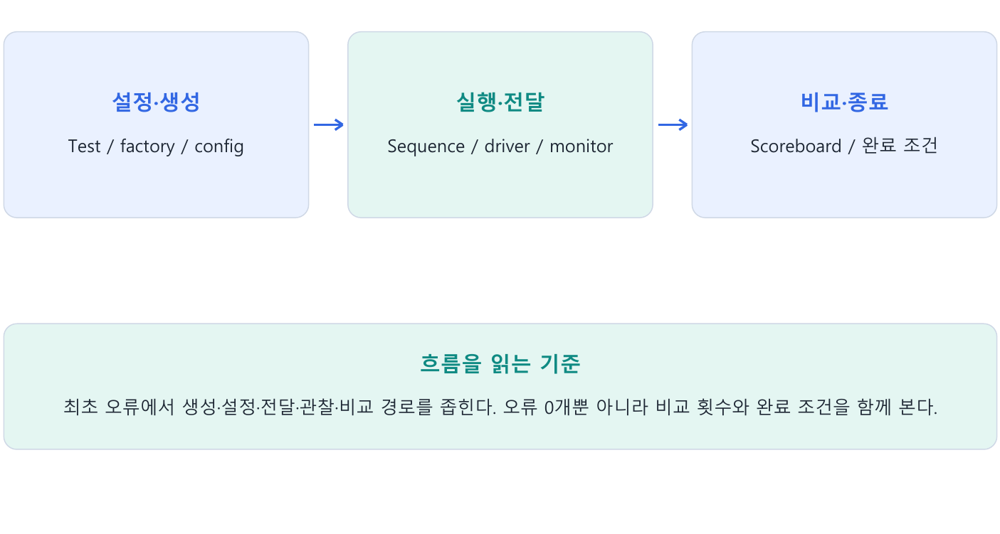

---
tags:
  - report
  - verbosity
  - debug
  - topology
  - timeout
cssclasses:
  - uvm-study-note
---

# 13장. Report와 디버깅

#report #verbosity #debug #topology #timeout

## 1. 장 소개

UVM report는 로그의 종류와 상세도를 관리하고 오류 원인을 추적할 정보를 남긴다. 최초 오류부터 실행 경로를 좁히고, 오류 횟수뿐 아니라 실제 비교와 완료 여부를 확인한다.

## 2. 구조와 흐름



## 3. 핵심 개념

### 3.1. Report의 목적과 종류

Report는 검증 중 발생한 정보·경고·오류를 분류하고, 원인을 추적할 정보를 남기는 기능이다. 오류만 출력하는 것이 아니라 실행 경로와 검증 완료 여부를 확인하는 데 사용한다.

| 매크로 | 용도 | 기본 동작 |
|---|---|---|
| `uvm_info` | 진행·디버깅 정보 | verbosity에 따라 출력 |
| `uvm_warning` | 주의할 상황 | 경고 출력 |
| `uvm_error` | 검증 실패 | 출력·오류 집계, 일반적으로 계속 실행 |
| `uvm_fatal` | 계속 진행할 수 없는 상황 | 출력 후 종료 |

이 표는 기본 report 설정 기준이다. Action, report catcher, quit count 등으로 동작을 바꿀 수 있다. `uvm_error`도 설정된 오류 횟수 제한에 도달하면 종료될 수 있다. 

데이터 한 건의 불일치 이후에도 비교를 계속할 수 있다면 error가 적절하다. Driver가 사용할 virtual interface가 없으면 정상 구동을 계속할 수 없으므로 fatal이 적절하다.

```systemverilog
if (actual !== expected)
  `uvm_error("FIFO_DATA",
    $sformatf("expected=0x%0h actual=0x%0h", expected, actual))
```

`!==`는 X/Z까지 포함해 비교한다. 정상 데이터가 기대되는 유효한 출력 시점에 검사한다.

### 3.2. Severity와 verbosity

Severity는 메시지 종류이고 verbosity는 정보 로그의 상세도다. 메시지 verbosity가 해당 reporter의 출력 설정 이하일 때 info가 출력된다.

```systemverilog
`uvm_info("START", "Test started", UVM_LOW)
`uvm_info("TRACE", "Driver received an item", UVM_HIGH)
```

| 출력 설정 | LOW 메시지 | MEDIUM 메시지 | HIGH 메시지 |
|---|---|---|---|
| UVM_LOW | 출력 | 숨김 | 숨김 |
| UVM_MEDIUM | 출력 | 출력 | 숨김 |
| UVM_HIGH | 출력 | 출력 | 출력 |

출력 설정을 높이면 더 많은 정보가 보인다. 반대로 코드에서 특정 메시지의 verbosity를 높이면 더 상세한 출력 설정에서만 그 메시지가 보인다. 두 의미를 혼동하지 않는다.

`uvm_warning`, `uvm_error`, `uvm_fatal` 매크로에는 사용자가 지정하는 verbosity 인자가 없으며 UVM_NONE을 사용한다. 일반적인 verbosity 필터로 오류를 숨기지 않는다. 별도 action 설정 등으로 출력 동작을 바꾸는 것은 가능하다.

```text
+UVM_VERBOSITY=UVM_HIGH
```

실행 환경의 UVM library와 simulator 옵션을 맞춰 사용한다.

### 3.3. Report ID와 메시지 본문

ID는 메시지의 종류를 분류한다. 같은 데이터 불일치에는 같은 ID를 사용하고, 매번 달라지는 값은 본문에 넣는다. ID만 지정한다고 필터링이 자동으로 수행되는 것은 아니다.

```systemverilog
`uvm_error("REG_DATA",
  $sformatf("addr=0x%0h expected=0x%0h actual=0x%0h",
            addr, expected, actual))
```

주소가 있어야 어느 register의 비교인지 알 수 있다. 필요하면 transaction 번호나 동작 종류도 추가한다. 기본 UVM 로그의 시각·component 경로·ID와 본문을 함께 읽는다.

### 3.4. 최초 오류와 config DB 디버깅

```text
0 ns   driver     [NO_VIF]   Virtual interface not found
100 ns scoreboard [NO_DATA] No read data observed
```

Driver의 설정 실패가 뒤의 데이터 누락을 유발했을 수 있다. 최초 오류부터 원인과 이후 결과의 관계를 확인한다.

```systemverilog
// top: run_test()보다 먼저 등록
uvm_config_db#(virtual fifo_if)::set(
  null, "uvm_test_top.env.agent.drv", "vif", fifo_if_inst);

// driver의 build_phase
if (!uvm_config_db#(virtual fifo_if)::get(this, "", "vif", vif))
  `uvm_fatal("NO_VIF", "Virtual interface not found")
if (vif == null)
  `uvm_fatal("NULL_VIF", "Virtual interface handle is null")
```

확인 항목은 타입, field 이름, 조회 component 경로, 등록 시점이다. Get 성공과 non-null은 별도 조건이다. Config DB는 직접 보내는 통로보다 경로에 맞춰 조회할 설정을 등록하는 저장소로 이해한다.

### 3.5. 타입·handle·instance 이름과 factory

```systemverilog
fifo_driver driver_h;
driver_h = fifo_driver::type_id::create("drv", this);
```

| 표현 | 의미 |
|---|---|
| fifo_driver | 생성 요청 타입 |
| driver_h | handle 변수 |
| drv | component instance 이름 |
| this | 부모 component |

부모가 `uvm_test_top.env.agent`라면 경로는 `uvm_test_top.env.agent.drv`다. Factory override로 실제 타입을 `debug_fifo_driver`로 교체해도 이름은 drv로 유지된다. `create("debug_drv", this)`로 생성하면 경로 마지막 이름도 debug_drv로 바뀌므로 기존 정확한 config DB 경로와 일치하지 않는다.

```systemverilog
fifo_driver::type_id::set_type_override(debug_fifo_driver::get_type());
driver_h = fifo_driver::type_id::create("drv", this);
`uvm_info("DRV_TYPE",
  $sformatf("path=%s type=%s", driver_h.get_full_name(),
            driver_h.get_type_name()), UVM_LOW)
```

`new("drv", this)`는 직접 fifo_driver를 생성하므로 factory override를 적용하지 않는다. `get_type_name()` 출력 예는 정상적으로 이름이 등록된 비매개변수 클래스 기준이다.

`uvm_top.print_topology()`는 생성된 계층을 확인하는 데 사용한다. End_of_elaboration_phase에서 출력하면 구성 이후 계층을 볼 수 있지만, build_phase의 fatal로 이미 종료되면 도달하지 못한다. 이 경우 실패 지점에서 `get_full_name()`을 출력한다.

### 3.6. TLM 연결과 데이터 흐름 디버깅

```systemverilog
// env connect_phase
agent.mon.ap.connect(sb.analysis_imp);

// monitor 송신 직전
`uvm_info("MON_TX", "Observed transaction", UVM_LOW)
ap.write(tr);

// scoreboard write() 진입
`uvm_info("SB_RX", "Received transaction", UVM_LOW)
```

두 로그가 표시되는 설정이라는 전제에서 MON_TX만 보이면 수신 단자까지의 연결을 먼저 확인한다. Analysis port는 수신자 없이 호출할 수도 있다. MON_TX는 관찰·송신 직전까지 실행했다는 증거이지 수신 증거는 아니다. 중간 export가 있으면 끝까지 연결을 따라간다.

SB_RX도 보이면 scoreboard 내부 조건과 예상값 준비를 확인한다.

```systemverilog
if (tr.read_valid) begin
  compare_count++;
  if (tr.rdata !== expected) begin
    mismatch_count++;
    `uvm_error("FIFO_DATA", "Read data mismatch")
  end
end
```

실제 코드에는 유효한 expected가 존재하는지, 올바른 응답에 대응하는지 확인하는 처리가 필요하다. 위 예제는 counter의 의미만 설명한다.

### 3.7. 오류 0개와 검증 완료는 다르다

| 결과 | 판단 |
|---|---|
| 비교 0건 / 불일치 0건 | 비교 미수행, 정상 판단 불가 |
| 필요한 10건 중 8건 / 불일치 0건 | 수행한 8건은 통과, 전체 검증 미완료 |
| 필요한 10건 모두 비교 / 불일치 0건 | 계획한 비교 완료, 다른 종료 조건도 확인 |

Check_phase에서 비교 횟수, 미처리 예상 응답, 최종 상태를 점검하고 report_phase에서 요약한다. 의도적으로 FIFO에 남겨 둔 저장 데이터와 비교해야 할 미처리 응답을 구분한다. 모든 queue가 무조건 비어야 하는 것은 아니다.

Check_phase는 function phase이므로 남은 응답을 시간 대기하며 처리할 수 없다. 필요한 응답 처리는 run_phase 종료 전에 완료해야 한다.

```systemverilog
phase.raise_objection(this);
seq.start(env.agent.seqr);
wait (env.sb.compare_count == expected_count);
phase.drop_objection(this);
```

이 예제는 완료 조건을 설명하며, 응답 누락 시 무한 대기를 막는 timeout이 생략되어 있다. 실제 구현에서는 완료와 timeout을 함께 처리해야 한다. 고정 `#100ns`는 지연이 길면 조기 종료하고 짧으면 불필요하게 기다린다. Request 전달 완료, driver 처리 완료, DUT 응답과 비교 완료는 항상 같은 시점이 아니다.

## 4. 핵심 예제

```systemverilog
`uvm_info("TRACE", "Item received", UVM_HIGH)
if (actual !== expected)
  `uvm_error("REG_DATA",
    $sformatf("addr=%0h expected=%0h actual=%0h",
              addr, expected, actual))
// 실제 계층과 타입 확인
uvm_top.print_topology();
```

ID는 같은 종류의 메시지에 재사용하고 매번 달라지는 값은 본문에 넣는다. Topology 출력은 구조 구성 이후 phase에 배치한다.

## 5. 주의점

- Error macro는 일반 info verbosity로 숨겨지는 로그가 아니다.
- Factory override는 타입을 바꾸며 create 이름을 자동 변경하지 않는다.
- 비교 0건·error 0건을 검증 성공으로 판단하지 않는다.

## 6. 핵심 정리

- **Severity**: Info는 정보, warning은 주의, error는 검증 실패, fatal은 계속 진행할 수 없는 상황에 사용한다.
- **Verbosity**: 메시지 수준이 출력 설정 이하이면 info가 보인다. 설정을 높이면 더 상세한 로그까지 출력한다.
- **ID와 본문**: ID는 종류를 분류한다. 본문에는 주소·동작·예상값·실제값·transaction 정보 등 원인 추적에 필요한 값을 남긴다.
- **최초 오류**: NO_VIF 같은 설정 오류가 뒤의 데이터 누락을 유발할 수 있다. 최초 오류와 이후 결과의 관계부터 확인한다.
- **데이터 경로**: Monitor 송신과 scoreboard 수신 로그를 비교한다. 수신 후에는 유효 조건·예상값·비교 횟수를 확인한다.
- **검증 완료**: 오류 0개가 비교 수행을 보장하지 않는다. 필요한 비교 횟수, pending 응답, 최종 상태와 timeout을 함께 확인한다.

## 7. 확인 문제와 해설

### 문제 1

LOW 설정에서 HIGH info는 출력되는가?

**해설:** 일반 설정에서는 숨겨진다.

### 문제 2

필요 비교 10건 중 8건만 완료하고 error 0이면?

**해설:** 수행한 비교는 통과했지만 전체는 미완료다.

### 문제 3

수신 로그는 있는데 비교 횟수가 0이라면?

**해설:** 내부 유효 조건과 예상값·비교 실행 경로를 확인한다.

## 8. 참고 자료

- [UVM 1.2 Class Reference](https://verificationacademy.com/verification-methodology-reference/uvm/docs_1.2/html/)
- [UVM 1.2 Report Macros](https://verificationacademy.com/verification-methodology-reference/uvm/docs_1.2/html/files/macros/uvm_message_defines-svh.html)
- [Report Object](https://verificationacademy.com/verification-methodology-reference/uvm/docs_1.2/html/files/base/uvm_report_object-svh.html)

[목차](<UVM 기초 - 목차.md>)
