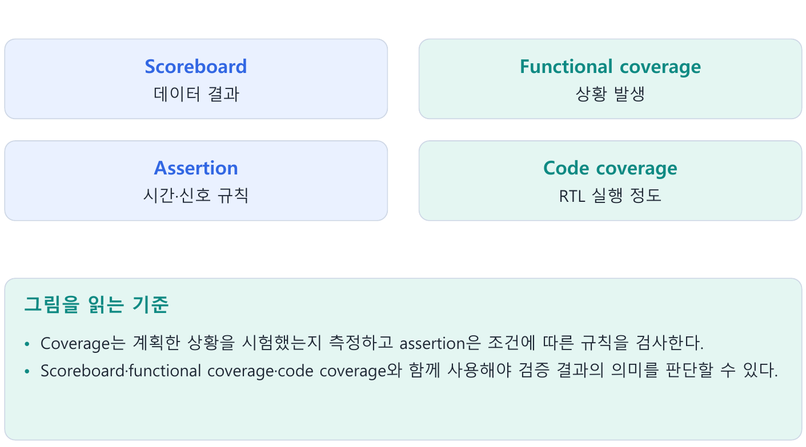
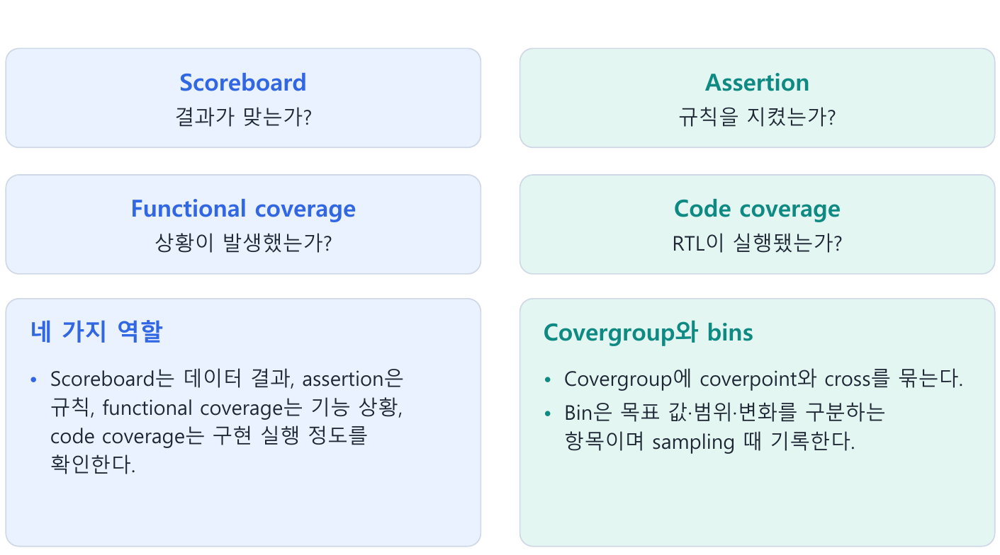
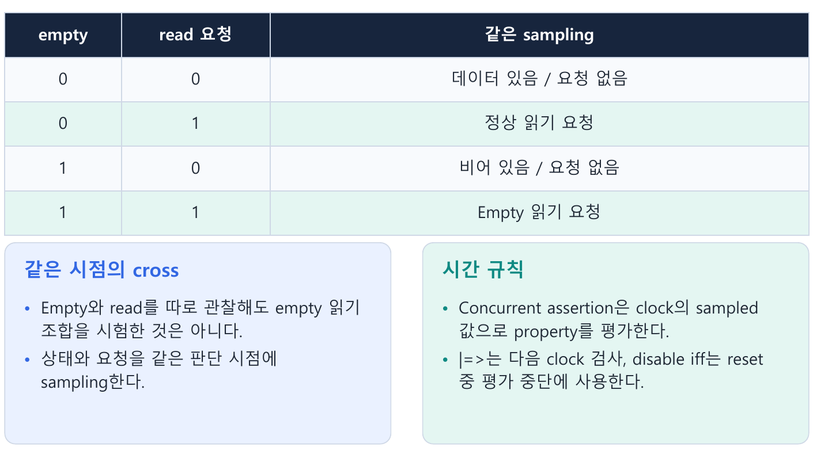
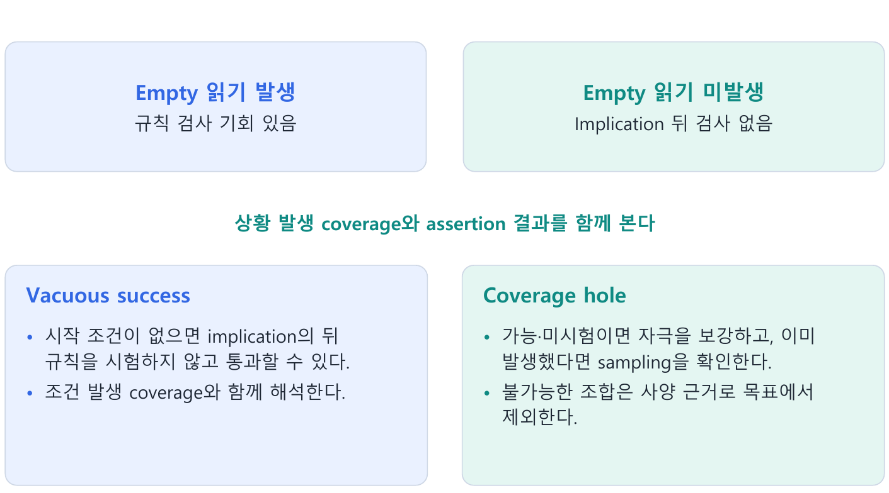
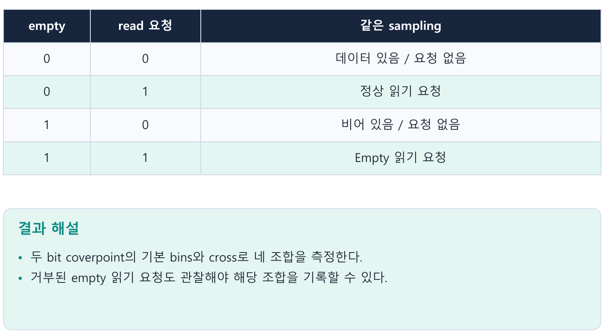

---
tags:
  - coverage
  - covergroup
  - coverpoint
  - bins
  - cross
  - assertion
cssclasses:
  - uvm-study-note
---

#coverage #covergroup #coverpoint #bins #cross #assertion

# **1. 소개**

- Coverage는 계획한 상황을 시험했는지 측정하고 assertion은 조건에 따른 규칙을 검사한다.
- Scoreboard·functional coverage·code coverage와 함께 사용해야 검증 결과의 의미를 판단할 수 있다.

# **2. 구조와 흐름**



# **3. 핵심 개념**

## **3.1. 왜 coverage가 필요한가**



- 모든 비교가 통과했더라도 중요한 상황을 시험하지 않았다면 그 기능을 검증했다고 말할 수 없다.
- FIFO의 일반 쓰기·읽기 100건을 통과해도 full 추가 쓰기나 empty 읽기를 하지 않았다면 해당 경계 동작을 검증했다고 볼 수 없다.

| 기능 | 질문 |
|---|---|
| Scoreboard | 예상 결과와 실제 결과가 일치하는가? |
| Functional coverage | 검증 계획에서 정의한 상황이 발생했는가? |
| Assertion | 신호·시간 규칙이 지켜졌는가? |
| Code coverage | RTL 문장·분기·신호 변화 등이 얼마나 실행됐는가? |

- Coverage는 정확성 검사를 대체하지 않는다.
- 상황이 발생한 사실과 결과가 맞은 사실을 구분한다.

## **3.2. Coverpoint와 cross**



- Coverpoint는 특정 값이나 범위를 관찰하는 측정 지점이다.
- Bin은 측정할 값·범위를 구분하는 항목이다.
- Cross는 여러 coverpoint의 조합을 측정한다.

```systemverilog
covergroup fifo_cg with function sample(bit empty_s, bit rd_s);
  cp_empty : coverpoint empty_s;
  cp_read  : coverpoint rd_s;
  empty_read : cross cp_empty, cp_read;
endgroup

// 먼저 cg = new()로 covergroup instance를 생성한다.
// 같은 요청 판단 시점에서 관찰한 두 값을 함께 넘긴다.
cg.sample(empty_before, read_request);
```

- 위의 bit 인자에는 0/1 값을 측정하며 기본 bin이 생성된다.
- X/Z 상태를 검사하려면 별도의 관찰·검사 방식을 정의한다.
- Sampling 계약은 실제 interface·clocking과 DUT timing에 맞게 정해야 한다.

| empty | rd_en | 조합의 의미 |
|---|---|---|
| 0 | 0 | 데이터 있음 / 읽기 요청 없음 |
| 0 | 1 | 데이터 있을 때 읽기 요청 |
| 1 | 0 | 비어 있음 / 읽기 요청 없음 |
| 1 | 1 | 비어 있을 때 읽기 요청 |

- Empty와 read를 서로 다른 cycle에서 관찰해 각각의 coverpoint가 채워져도, empty 읽기 조합을 시험한 것은 아니다.
- DUT가 요청을 판단하는 같은 시점의 상태와 요청을 측정해야 한다.
- 수락된 읽기만 수집하면 거부되는 empty 읽기 요청을 놓칠 수 있다.

## **3.3. Coverage가 오류를 판정하지 않는 이유**

- Empty 읽기 조합이 발생한 뒤 DUT가 잘못해서 읽기 포인터를 증가시켜도 stimulus coverage는 채워질 수 있다.
- 그 동작이 옳은지는 사양을 기준으로 scoreboard 또는 assertion이 검사한다.

- 검증 계획에서 빠뜨린 기능은 coverage 100%에서도 빠져 있다.
- 잘못된 sampling, 약한 checker, 잘못된 예상 모델도 결과를 왜곡한다.
- 따라서 100%는 정의된 목표의 달성이지 무결함 보장이 아니다.

## **3.4. Assertion과 시간 규칙**

- Assertion은 특정 조건에서 지켜야 할 신호·시간 규칙을 검사한다.
- 예를 들어 사양이 “empty 읽기는 거부하고 읽기 포인터를 유지한다”라면 다음과 같이 표현할 수 있다.

```systemverilog
assert property (@(posedge clk) disable iff (!rst_n)
  (empty && rd_en) |=> $stable(rd_ptr));
```

| 문법 | 의미 |
|---|---|
| @(posedge clk) | 상승 에지에서 값을 sampling |
| disable iff (!rst_n) | active-low reset 중 검사 비활성화·진행 중 attempt 취소 |
| empty && rd_en | 검사 시작 조건 |
| \|=> | 다음 clock sampling에서 뒤 조건 검사 |
| $stable(rd_ptr) | 직전 sampling 값과 동일한지 검사 |

- 이 assertion은 reset 외 다른 포인터 변경 원인이 없고, empty 상태 read를 거부하는 사양을 가정한 FIFO 예제다.
- 동시 write의 empty bypass 등 다른 계약에는 그대로 적용할 수 없다.
- Internal rd_ptr 접근 방식도 실제 DUT에 맞춰야 한다.

- Concurrent assertion은 clock의 sampled 값을 사용한다.
- 요청 에지에서 NBA로 갱신되는 포인터 값은 다음 에지의 sampling에서 확인하는 구조다.
- `disable iff`의 reset 조건은 일반 sampled 표현과 평가 특성이 다르므로 실제 reset timing을 확인해야 한다.
- 세부 scheduling과 race 분석은 실제 환경에서 함께 확인해야 한다.

## **3.5. Vacuous success**



- 앞 조건이 성립하지 않으면 implication은 뒤 조건 검사를 요구하지 않는다.
- Empty 읽기를 한 번도 하지 않았어도 위 assertion에서 failure가 없을 수 있다.
- 이런 통과를 vacuous success라고 한다.

```text
Assertion failure 0개 + empty 읽기 coverage 0
→ empty 읽기 동작을 정상이라고 확인한 것이 아님
```

- Coverage는 검사할 상황이 발생했는지, assertion은 발생한 상황의 규칙이 맞는지 확인한다.
- 조건의 실제 발생과 attempt·검사 횟수를 함께 보는 것이 중요하다.
- `cover property` 등의 상세 구현은 환경의 검사 목적에 맞춰 선택한다.

## **3.6. Code coverage와 functional coverage**

- Code coverage는 구현을 기준으로 실행 정도를 측정하고, functional coverage는 사양·검증 계획을 기준으로 상황을 측정한다.
- Code coverage의 종류와 지원 범위는 simulator·도구에 따라 다르다.

- Code coverage 100%여도 full 상태의 read/write 동시 요청 같은 특정 조합은 놓칠 수 있다.
- 반대로 functional coverage 100%여도 정의되지 않은 RTL 경로나 기능은 남아 있을 수 있다.
- 둘은 함께 확인하며, checker의 정확성도 별도 검토한다.

## **3.7. 빈 coverage 항목을 분석하는 순서**

1. 사양상 가능한 상황인지 확인한다.
2. 가능하지만 미시험이라면 sequence·constraint를 조정해 해당 상황을 만든다.
3. 이미 발생했다면 sampling 시점·수집 경로·coverage 정의를 확인한다.
4. 불가능한 조합은 사양 근거를 남기고 coverage 목표에서 제외한다.

- 같은 시점의 full=1과 empty=1을 허용하지 않는 사양이라면 채울 목표로 취급하지 않는다.
- 실제 발생 여부를 오류 규칙으로 검사할 수 있다.
- Ignore bin이나 coverage exclusion으로 불가능한 목표를 제외할 때는 사양 근거를 명확히 한다.
- Illegal bin은 발생하면 오류인 값을 구분하며 전용 checker의 역할과 함께 검토한다.

- Full 동시 read/write가 가능하지만 coverage 0이면 FIFO를 full로 만든 뒤 같은 cycle에 두 요청을 넣는다.
- 이후 결과는 DUT 사양으로 검사한다.

```text
깊이 4, 초기 [A, B, C, D], read + E write
사양 1: full이어도 read가 수락되면 write도 수락 → [B, C, D, E]
사양 2: 요청 직전 full이면 write 거부           → [B, C, D]
```

- 모델에서 pop 후 push로 계산하는 순서는 DUT가 실제로 시간상 읽기 후 쓰기를 실행한다는 뜻이 아니다.
- 두 동작은 같은 clock edge에 함께 수락될 수 있다.
- 이 규칙은 설명용 가정이며 FIFO의 수락 사양에 따라 적용한다.

## **3.8. Configuration·stimulus·correctness coverage**

Configuration coverage는 선택한 설정을, stimulus coverage는 관찰한 자극의 속성을, correctness coverage는 검사에 통과한 결과를 측정한다.

- Uvm_subscriber의 write()에서 covergroup.sample()을 호출하면 monitor의 analysis 방송과 연결할 수 있다.
- Scoreboard와 coverage collector는 같은 analysis port에서 각각 입력을 받을 수 있다.
- Correctness coverage는 실제 비교 성공 조건에서 sampling하므로 단순 자극 발생 측정과 구분한다.

# **4. 핵심 예제**

```systemverilog
covergroup fifo_cg with function sample(bit e, bit r);
  cp_empty : coverpoint e;
  cp_read  : coverpoint r;
  empty_read : cross cp_empty, cp_read;
endgroup
// 클래스 constructor에서 cg = new();
// 같은 판단 시점의 값을 전달
cg.sample(empty_before, read_request);
```

- 두 bit coverpoint의 기본 bins와 cross로 네 조합을 측정한다.
- 거부된 empty 읽기 요청도 관찰해야 해당 조합을 기록할 수 있다.



# **5. 주의점**

- Coverage 100%는 오류가 없다는 보장이 아니다.
- 수락된 읽기만 수집하면 거부되는 empty 요청을 놓칠 수 있다.
- Assertion의 timing과 reset은 실제 DUT 계약에 맞춰 정의한다.

# **6. 핵심 정리**

- **네 가지 역할**: Scoreboard는 데이터 결과, assertion은 규칙, functional coverage는 기능 상황, code coverage는 구현 실행 정도를 확인한다.
- **Covergroup와 bins**: Covergroup에 coverpoint와 cross를 묶는다.  
  Bin은 목표 값·범위·변화를 구분하는 항목이며 sampling 때 기록한다.
- **같은 시점의 cross**: Empty와 read를 따로 관찰해도 empty 읽기 조합을 시험한 것은 아니다.  
  상태와 요청을 같은 판단 시점에 sampling한다.
- **시간 규칙**: Concurrent assertion은 clock의 sampled 값으로 property를 평가한다.  
  |=>는 다음 clock 검사, disable iff는 reset 중 평가 중단에 사용한다.
- **Vacuous success**: 시작 조건이 없으면 implication의 뒤 규칙을 시험하지 않고 통과할 수 있다.  
  조건 발생 coverage와 함께 해석한다.
- **Coverage hole**: 가능·미시험이면 자극을 보강하고, 이미 발생했다면 sampling을 확인한다.  
  불가능한 조합은 사양 근거로 목표에서 제외한다.

# **7. 확인 문제와 해설**

## **문제 1**

Coverage가 채워지면 데이터 결과도 맞는가?

- **해설:** 아니다.
- Scoreboard 등으로 별도 검사한다.

## **문제 2**

Assertion failure 0인데 시작 조건이 한 번도 없었다면?

**해설:** 해당 상황의 규칙을 확인했다고 볼 수 없다.

## **문제 3**

Functional coverage 100%의 범위는?

- **해설:** 정의한 coverage 목표의 범위다.
- 계획 누락은 별도 검토한다.

# **8. 참고 자료**

- [UVM 1.2 Class Reference](https://verificationacademy.com/verification-methodology-reference/uvm/docs_1.2/html/)
- [Accellera SystemVerilog tutorial - implication과 vacuous success](https://accellera.com/images/resources/videos/systemverilog-design-tutorial-2015.pdf)

[목차](<UVM 기초 - 목차.md>)
