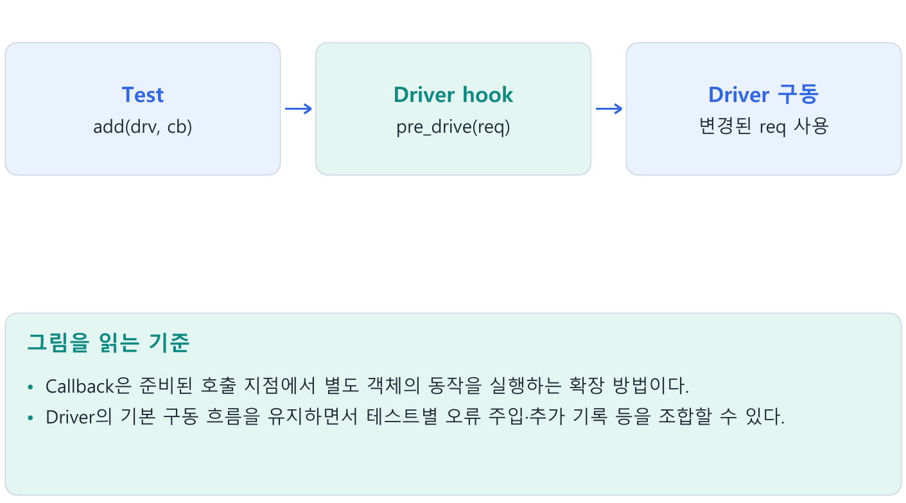
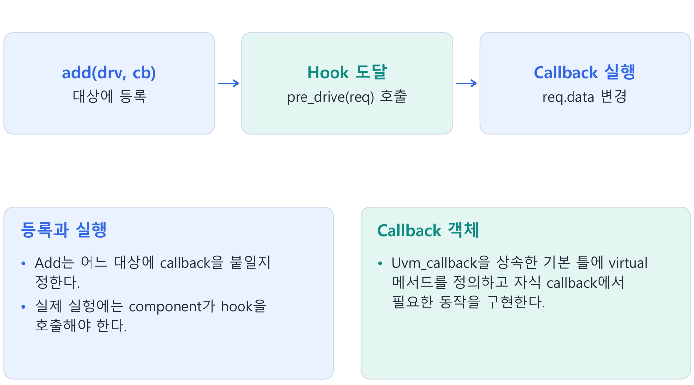
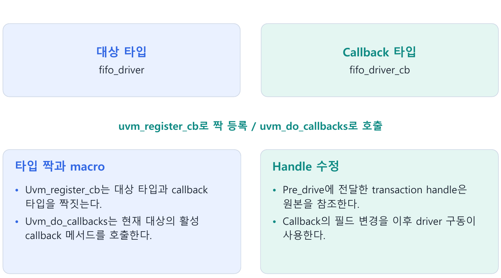
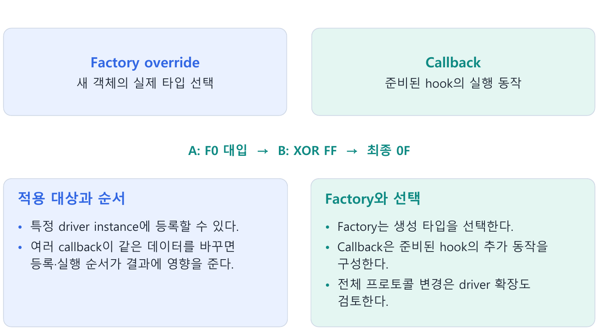
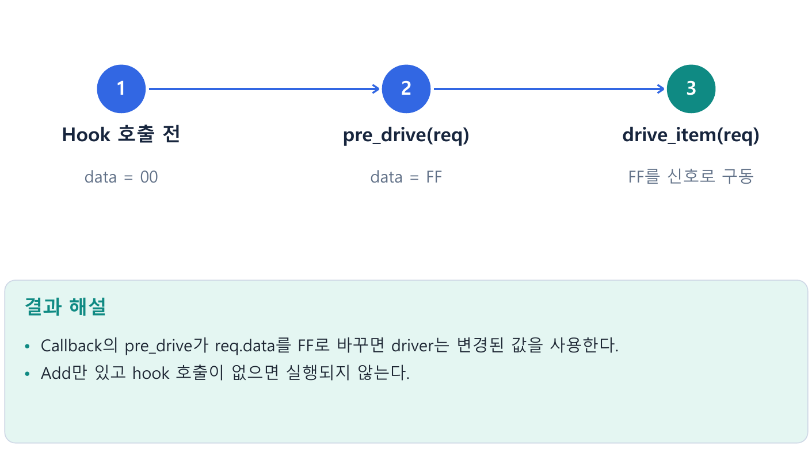

---
tags:
  - callback
  - hook
  - driver
  - factory
  - error_injection
cssclasses:
  - uvm-study-note
---

#callback #hook #driver #factory #error_injection

# **1. 소개**

- Callback은 준비된 호출 지점에서 별도 객체의 동작을 실행하는 확장 방법이다.
- Driver의 기본 구동 흐름을 유지하면서 테스트별 오류 주입·추가 기록 등을 조합할 수 있다.

# **2. 구조와 흐름**



# **3. 핵심 개념**

## **3.1. Callback의 필요성**



- 기본 driver가 요청 수신 → 신호 구동 → 요청 완료 순서로 동작한다고 가정하자.
- 특정 테스트에서만 구동 직전에 데이터를 변조하거나 추가 로그를 남기고 싶을 때, 매번 driver 자식 클래스를 늘리는 대신 별도 callback 객체로 추가 동작을 구성할 수 있다.

- Callback은 대상 코드에 미리 준비한 hook에서 호출된다.
- 임의의 코드 위치에 자동으로 실행을 끼워 넣는 기능이 아니다.
- 대상 클래스가 필요한 확장 지점을 제공해야 한다.

## **3.2. Callback 기본 타입과 구현**

```systemverilog
class fifo_driver_cb extends uvm_callback;
  `uvm_object_utils(fifo_driver_cb)

  function new(string name = "fifo_driver_cb");
    super.new(name);
  endfunction

  virtual function void pre_drive(fifo_item tr);
  endfunction
endclass

class corrupt_data_cb extends fifo_driver_cb;
  `uvm_object_utils(corrupt_data_cb)

  function new(string name = "corrupt_data_cb");
    super.new(name);
  endfunction

  virtual function void pre_drive(fifo_item tr);
    tr.data = 8'hFF;
  endfunction
endclass
```

- `fifo_driver_cb`는 추가 동작의 메서드 이름과 인수를 정하는 공통 틀이다.
- 빈 기본 구현은 추가 동작을 하지 않는다.
- `corrupt_data_cb`는 virtual 메서드를 재정의해 실제 데이터 변경을 구현한다.

- 이 예제는 시간을 소비하지 않는 function이다.
- 추가 동작에 clock 대기 등이 필요하면 기본 callback과 자식 구현의 signature를 task로 맞추고 시간 대기가 가능한 호출 위치에서 사용한다.

## **3.3. 대상 타입 등록과 hook 호출**



```systemverilog
class fifo_driver extends uvm_driver#(fifo_item);
  `uvm_component_utils(fifo_driver)
  `uvm_register_cb(fifo_driver, fifo_driver_cb)

  function new(string name, uvm_component parent);
    super.new(name, parent);
  endfunction

  task run_phase(uvm_phase phase);
    forever begin
      seq_item_port.get_next_item(req);
      `uvm_do_callbacks(
        fifo_driver, fifo_driver_cb, pre_drive(req))
      drive_item(req);
      seq_item_port.item_done();
    end
  endtask
  // drive_item와 virtual interface 설정은 프로토콜에 맞춰 구현한다.
endclass
```

- `uvm_register_cb(T, CB)`는 대상 타입 T와 callback 기본 타입 CB를 짝짓는다.
- 이것만으로 callback 인스턴스가 만들어지거나 특정 driver에 등록되지는 않는다.

- `uvm_do_callbacks(T, CB, METHOD)`는 실행이 그 지점에 도달했을 때 현재 대상 객체에 등록된 활성 callback의 메서드를 호출한다.
- 첫 두 인수는 타입 이름이고, 기본 대상은 호출한 객체 `this`다.

- Hook의 위치가 동작 순서를 결정한다.
- 여기서는 item을 받은 뒤 callback으로 값을 변경하고, 변경된 요청을 구동한 뒤 완료를 통지한다.

## **3.4. 테스트에서 객체 생성과 등록**

```systemverilog
// Test의 멤버
corrupt_data_cb cb;

// env.agent.drv가 build에서 생성돼 있다는 가정
function void connect_phase(uvm_phase phase);
  super.connect_phase(phase);
  cb = corrupt_data_cb::type_id::create("cb");
  uvm_callbacks#(fifo_driver, fifo_driver_cb)::add(
    env.agent.drv, cb);
endfunction
```

- Create는 callback 객체를 만든다.
- Add는 이미 존재하는 driver에 그 객체를 등록한다.
- Driver가 hook을 호출하기 전까지 pre_drive의 추가 동작은 실행되지 않는다.

- Add의 template 인수는 등록한 pair에 맞춘다.
- 실제 callback 객체는 기본 타입 `fifo_driver_cb`를 상속한 `corrupt_data_cb`여도 된다.

## **3.5. Transaction handle과 변경 값**

- `pre_drive(req)`에 전달한 tr은 같은 transaction 객체를 참조한다.
- `tr.data = 8'hFF`는 해당 객체의 필드를 바꾸므로 이후 `drive_item(req)`가 보는 값도 FF다.

```text
요청 수신: req.data = 12
Hook 호출: tr와 req는 같은 객체를 참조
Callback:  tr.data = FF
신호 구동: req.data = FF 사용
```

- 이 동작은 새로운 transaction 복사본을 만드는 것이 아니다.
- Callback 안에서 local handle에 다른 객체를 대입하는 것과, 전달받은 객체의 필드를 수정하는 것도 구분한다.

## **3.6. 적용 범위와 여러 callback의 순서**

- 특정 `drv0`에만 callback을 add했다면 같은 클래스의 `drv1`에는 그 인스턴스 등록이 적용되지 않는다.
- Type-wide 등록과 특정 객체 등록은 적용 범위를 구분해 사용한다.

- 같은 대상에 여러 callback을 등록할 수 있다.
- 기본 append 및 prepend 정책과 활성 여부에 따라 실행 순서를 확인한다.
- 다음 두 동작을 A → B 순서로 실행한다고 가정한다.

```systemverilog
// Callback A
tr.data = 8'hF0;
// Callback B
tr.data = tr.data ^ 8'hFF;
```

- 결과는 `0F`다.
- B → A 순서면 마지막 대입으로 `F0`이 된다.
- 같은 필드를 수정하는 callback 조합에서는 순서가 테스트 의미의 일부다.

## **3.7. Factory override와 비교**



| 관점 | Factory override | Callback |
|---|---|---|
| 바꾸는 것 | 생성 요청의 실제 타입 | 준비된 hook의 추가 동작 |
| 적용 시점 | 객체 생성 때 | 실행이 hook에 도달할 때 |
| 준비 조건 | 등록·create·호환되는 대체 타입 | 타입 pair·hook·callback 등록 |
| 기존 객체 | 소급 교체하지 않음 | 준비된 객체에 추가 동작 등록 가능 |

- 프로토콜 구동 방식 전체를 바꾸려면 driver 상속과 factory override가 자연스럽다.
- 기본 구동 흐름을 유지하면서 특정 지점의 오류 주입이나 추가 기록을 바꾸려면 callback이 유용하다.
- 두 방식은 함께 사용할 수도 있다.

## **3.8. 오류 주입과 검증의 기준**

- Callback으로 쓰기 데이터 12를 FF로 바꾸고 DUT가 FF를 수락했다면, FIFO reference model도 실제 수락된 FF를 저장한다.
- 원래 sequence의 12를 그대로 예상값으로 사용하면 정상 결과를 불일치로 판정할 수 있다.

- 반대로 full 때문에 그 쓰기가 거부됐다면 예상 queue에 FF를 추가하지 않는다.
- 오류 주입이 데이터 변경인지, 프로토콜 위반인지, DUT 오류 응답을 유도하는 것인지에 따라 checker의 기대 동작도 정의한다.

- Driver의 post_drive hook에서 coverage를 수집할 수 있지만, 해당 값은 driver가 보낸 자극에 대한 정보다.
- 실제 수락과 DUT 결과를 측정하려면 monitor 관찰 및 검사 결과를 기준으로 한다.

# **4. 핵심 예제**

```systemverilog
// Test: driver 생성 후 등록
cb = corrupt_data_cb::type_id::create("cb");
uvm_callbacks#(fifo_driver, fifo_driver_cb)::add(
  env.agent.drv, cb);
// Driver: 요청을 받은 뒤 구동 직전
`uvm_do_callbacks(
  fifo_driver, fifo_driver_cb, pre_drive(req))
drive_item(req);
```

- Callback의 pre_drive가 req.data를 FF로 바꾸면 driver는 변경된 값을 사용한다.
- Add만 있고 hook 호출이 없으면 실행되지 않는다.



# **5. 주의점**

- uvm_register_cb만으로 callback 객체가 생성·등록되지는 않는다.
- 한 instance에 등록한 callback이 다른 instance에 자동 적용되지는 않는다.
- 오류 주입 뒤 scoreboard는 실제 수락된 입력과 사양을 기준으로 예상값을 만든다.

# **6. 핵심 정리**

- **등록과 실행**: Add는 어느 대상에 callback을 붙일지 정한다.  
  실제 실행에는 component가 hook을 호출해야 한다.
- **Callback 객체**: Uvm_callback을 상속한 기본 틀에 virtual 메서드를 정의하고 자식 callback에서 필요한 동작을 구현한다.
- **타입 짝과 macro**: Uvm_register_cb는 대상 타입과 callback 타입을 짝짓는다.  
  Uvm_do_callbacks는 현재 대상의 활성 callback 메서드를 호출한다.
- **Handle 수정**: Pre_drive에 전달한 transaction handle은 원본을 참조한다.  
  Callback의 필드 변경을 이후 driver 구동이 사용한다.
- **적용 대상과 순서**: 특정 driver instance에 등록할 수 있다.  
  여러 callback이 같은 데이터를 바꾸면 등록·실행 순서가 결과에 영향을 준다.
- **Factory와 선택**: Factory는 생성 타입을 선택한다.  
  Callback은 준비된 hook의 추가 동작을 구성한다.  
  전체 프로토콜 변경은 driver 확장도 검토한다.

# **7. 확인 문제와 해설**

## **문제 1**

Add만 하고 hook 호출이 없으면 데이터가 바뀌는가?

- **해설:** 아니다.
- Callback 메서드가 실행되지 않는다.

## **문제 2**

A가 F0 대입, B가 FF XOR, A→B면 결과는?

- **해설:** 0F다.
- 반대 순서면 마지막 대입으로 F0이다.

## **문제 3**

변경된 FF 쓰기가 full에서 거부되면?

**해설:** Scoreboard 예상 queue에 추가하지 않는다.

# **8. 참고 자료**

- [UVM 1.2 Class Reference](https://verificationacademy.com/verification-methodology-reference/uvm/docs_1.2/html/)
- [Callback classes](https://verificationacademy.com/verification-methodology-reference/uvm/docs_1.2/html/files/base/uvm_callback-svh.html)
- [Callback macros](https://verificationacademy.com/verification-methodology-reference/uvm/docs_1.2/html/files/macros/uvm_callback_defines-svh.html)

[목차](<UVM 기초 - 목차.md>)
