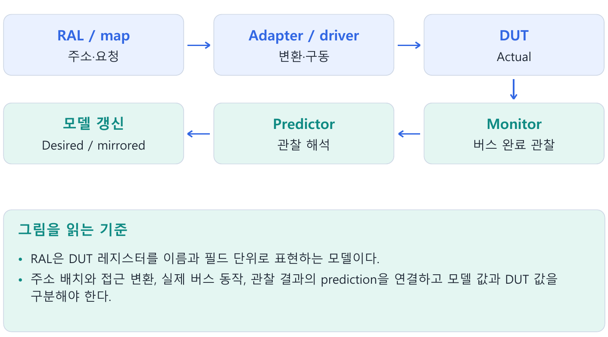
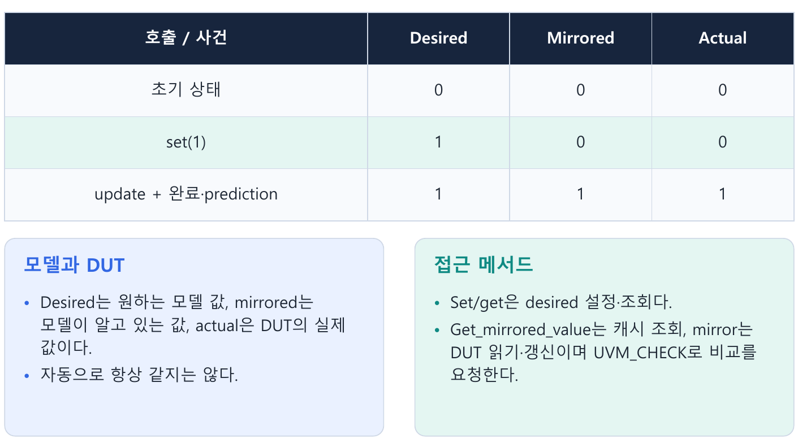
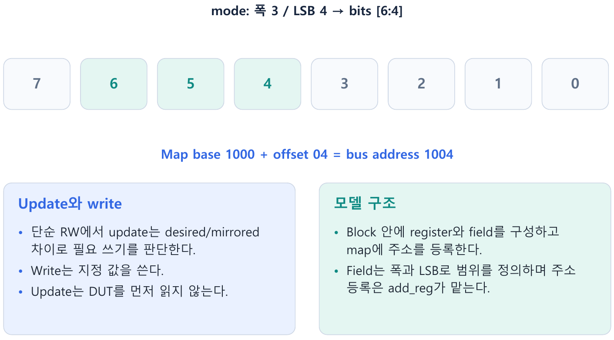
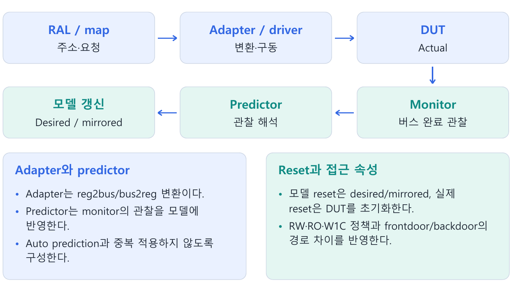
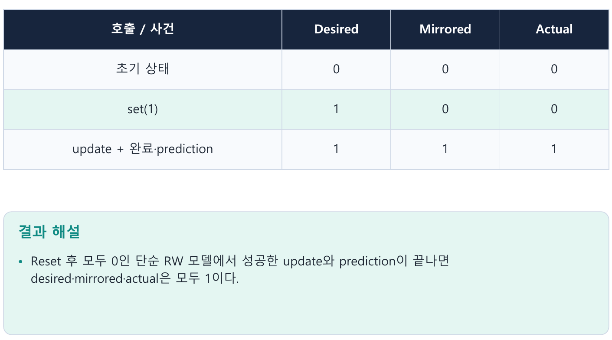

---
tags:
  - RAL
  - register
  - map
  - adapter
  - predictor
  - mirror
cssclasses:
  - uvm-study-note
---

#RAL #register #map #adapter #predictor #mirror

# **1. 소개**

- RAL은 DUT 레지스터를 이름과 필드 단위로 표현하는 모델이다.
- 주소 배치와 접근 변환, 실제 버스 동작, 관찰 결과의 prediction을 연결하고 모델 값과 DUT 값을 구분해야 한다.

# **2. 구조와 흐름**



# **3. 핵심 개념**

## **3.1. RAL의 목적과 작은 register map**

- 레지스터 주소와 필드 위치를 모든 sequence에 직접 적으면 사양 변경 때 여러 코드를 수정해야 한다.
- RAL은 이 정보를 모델에 모으고 register·field 이름으로 접근하도록 돕는다.

이 장은 32비트 bus와 바이트 주소를 사용하는 작은 register DUT를 가정한다.

| 레지스터 | Offset | 필드 | 속성 | Reset |
|---|---|---|---|---|
| CTRL | 0x00 | enable[0] | RW | 0 |
| STATUS | 0x04 | busy[0] | RO | 0 |

- Map base는 0x1000이다.
- 따라서 CTRL은 0x1000, STATUS는 0x1004에 배치된다.
- 정의하지 않은 상위 비트는 예제에서 0으로 가정한다.

```systemverilog
uvm_status_e status;
model.CTRL.write(status, 32'h1, UVM_FRONTDOOR);
```

- 이 API는 요청을 표현한다.
- 실제 frontdoor 접근에는 map·adapter·sequencer·driver와 interface가 연결돼 있어야 한다.
- 모델 객체의 존재 자체가 DUT 값을 바꾸지는 않는다.

## **3.2. Desired·mirrored·actual**



| 값 | 의미 | 대표 조회 |
|---|---|---|
| Desired | 모델에서 설정하고 싶은 값 | get() |
| Mirrored | 접근·관찰을 바탕으로 모델이 알고 있는 값 | get_mirrored_value() |
| Actual | DUT에 실제 저장된 값 | 실제 read·peek 등으로 관찰 |

- 단순 RW 필드에서 DUT와 모델 reset이 끝나 모두 0이라고 가정하자.
- `CTRL.set(1)` 뒤에는 desired=1, mirrored=0, actual=0이다.
- 성공한 write와 적절한 prediction이 끝나면 모델에 접근 결과가 반영된다.

- DUT 내부 동작으로 값이 바뀌어도 모델이 관찰하지 못하면 mirrored와 actual이 다를 수 있다.
- Mirrored는 실제 신호를 직접 연결한 변수가 아니라 모델이 보관하는 상태다.

## **3.3. Set·update·write와 조회**

| API | 역할 | DUT 접근 |
|---|---|---|
| set(value) | 접근 정책에 따라 desired 설정 | 없음 |
| get() | desired 조회 | 없음 |
| get_mirrored_value() | mirrored 조회 | 없음 |
| update(status) | 모델에서 필요한 변경을 DUT에 반영 | 필요할 때 쓰기 |
| write(status, value) | 지정한 값 쓰기 | 있음 |
| read(status, data) | DUT 값을 읽어 data로 반환 | 있음 |
| mirror(status, check) | DUT 값을 읽어 비교·모델 갱신 | 있음 |

- 단순 RW에서 update는 desired와 mirrored가 다르면 desired를 쓰려고 한다.
- 실제 DUT를 먼저 읽어서 차이를 알아내는 함수가 아니다.
- W1C 등 다른 속성에서는 해당 정책과 needs_update 처리까지 고려해야 한다.

- Desired와 mirrored가 모두 1인데 실제 DUT만 reset돼 0이 된 경우, 단순 RW의 update는 차이가 없다고 판단해 쓰지 않는다.
- 다시 원하는 값을 명시적으로 쓰려면 write를 사용할 수 있다.

## **3.4. Mirror의 갱신과 비교**

```systemverilog
// 캐시 값 조회: DUT 접근 없음
value = model.CTRL.get_mirrored_value();

// 실제 읽기와 모델 반영
model.CTRL.mirror(status);

// 비교 가능한 필드에서 기존 mirror와 읽은 값을 비교
model.CTRL.mirror(status, UVM_CHECK);
```

- Mirror의 기본 check 인수는 UVM_NO_CHECK다.
- UVM_CHECK를 요청하면 비교가 활성화된 필드에서 읽기 전 mirrored와 실제 읽은 값을 비교한다.
- 이후 접근 정책에 따라 모델을 갱신한다.

- 단순 RW에서 읽은 0을 모델에 반영하면 desired와 mirrored 모두 0이 된다.
- 기존 desired=1을 보존한 채 자동으로 재쓰기하는 흐름이 아니다.
- 다시 1을 적용하려면 set(1)→update 또는 write(status, 1)을 사용한다.

- Map의 check-on-read와 field의 compare 정책도 검사 여부에 영향을 준다.
- 정상 완료 status와 데이터의 올바름은 별도로 확인한다.

## **3.5. Block·register·field·map**



```text
device_reg_block : uvm_reg_block
├─ CTRL : uvm_reg
│  └─ enable : uvm_reg_field
├─ STATUS : uvm_reg
│  └─ busy : uvm_reg_field
└─ default_map : uvm_reg_map
   ├─ CTRL   → offset 00
   └─ STATUS → offset 04
```

- Register는 한 접근 단위, field는 비트 구간, block은 관련 register의 묶음이다.
- Map은 주소 배치와 bus 접근 정보를 관리한다.
- 같은 register를 여러 map에 배치하는 것도 가능하다.

- Register model의 build()는 사용자 function이다.
- Component의 build_phase처럼 UVM이 자동으로 모델 내부 필드를 만들어주는 hook이 아니므로 명시적으로 호출한다.

## **3.6. Field 구성 코드**

```systemverilog
class ctrl_reg extends uvm_reg;
  `uvm_object_utils(ctrl_reg)
  rand uvm_reg_field enable;

  function new(string name = "ctrl_reg");
    super.new(name, 32, UVM_NO_COVERAGE);
  endfunction

  virtual function void build();
    enable = uvm_reg_field::type_id::create("enable");
    enable.configure(this, 1, 0, "RW", 0, 0, 1, 1, 0);
  endfunction
endclass

class status_reg extends uvm_reg;
  `uvm_object_utils(status_reg)
  uvm_reg_field busy;

  function new(string name = "status_reg");
    super.new(name, 32, UVM_NO_COVERAGE);
  endfunction

  virtual function void build();
    busy = uvm_reg_field::type_id::create("busy");
    busy.configure(this, 1, 0, "RO", 1, 0, 1, 0, 0);
  endfunction
endclass
```

- Configure의 인수는 parent register, 폭, LSB, 접근 속성, volatile, reset 값, has_reset, is_rand, individually_accessible 순서다.
- CTRL.enable은 1비트·LSB 0·RW·reset 0이다.
- STATUS.busy는 DUT 자체 동작으로 바뀔 수 있는 RO 필드로 volatile을 지정한다.
- Volatile 지정만으로 모델이 내부 변화를 자동 관찰하지는 않는다.

- 3비트 필드가 [6:4]라면 폭 3과 LSB 4를 전달한다.
- [15:8]은 폭 8과 LSB 8이다.
- 최상위 위치는 LSB+폭-1로 계산한다.

- Configure는 모델 사양을 정의한다.
- RTL의 접근 속성이나 실제 reset 동작을 바꾸는 호출이 아니다.

## **3.7. Block과 주소 등록**

```systemverilog
class device_reg_block extends uvm_reg_block;
  `uvm_object_utils(device_reg_block)
  rand ctrl_reg CTRL;
  status_reg STATUS;

  function new(string name = "device_reg_block");
    super.new(name, UVM_NO_COVERAGE);
  endfunction

  virtual function void build();
    default_map = create_map("default_map", 'h1000, 4,
                             UVM_LITTLE_ENDIAN, 1);
    CTRL = ctrl_reg::type_id::create("CTRL");
    CTRL.configure(this);
    CTRL.build();
    STATUS = status_reg::type_id::create("STATUS");
    STATUS.configure(this);
    STATUS.build();
    default_map.add_reg(CTRL, 'h00, "RW");
    default_map.add_reg(STATUS, 'h04, "RO");
  endfunction
endclass
```

- Create_map의 4는 bus 폭 4바이트, 마지막 1은 바이트 주소 단위다.
- Add_reg가 register와 offset을 연결한다.
- Default_map이라는 이름이 생성한 모든 register를 자동 배치한다는 뜻은 아니다.

- Configure(this)는 register의 소속 block을, build는 내부 field 구성을, add_reg는 주소 배치를 정한다.
- 환경에서 model.build() 이후 lock_model()로 구조를 마무리한다.
- Lock 이후에도 읽기·쓰기·모델값 갱신은 가능하다.

## **3.8. Adapter와 완료 정보**

- Adapter는 register 공통 접근 정보인 uvm_reg_bus_op과 실제 bus transaction을 변환한다.
- Reg2bus는 요청 방향, bus2reg는 관찰·완료 정보의 해석 방향이다.
- 신호 구동은 driver가 담당한다.

아래 코드는 addr/data가 32비트이고 write·error 정보를 가진 reg_bus_item을 가정한 adapter 내부 메서드다.

```systemverilog
function uvm_sequence_item reg2bus(const ref uvm_reg_bus_op rw);
  reg_bus_item tr;
  tr = reg_bus_item::type_id::create("tr");
  tr.write = (rw.kind == UVM_WRITE);
  tr.addr = rw.addr;
  tr.data = rw.data;
  tr.error = 0;
  return tr;
endfunction

function void bus2reg(uvm_sequence_item item,
                      ref uvm_reg_bus_op rw);
  reg_bus_item tr;
  if (!$cast(tr, item))
    `uvm_fatal("ADAPTER", "Wrong bus item type")
  rw.kind = tr.write ? UVM_WRITE : UVM_READ;
  rw.addr = tr.addr;
  rw.data = tr.data;
  rw.status = tr.error ? UVM_NOT_OK : UVM_IS_OK;
endfunction
```

- Reg2bus가 transaction을 반환한 시점에는 실제 전송이 끝난 것이 아니다.
- Sequencer와 driver의 처리가 필요하다.
- Bus2reg는 올바른 read data와 완료 status를 받아야 한다.

- Driver가 원래 request에 read data·오류를 기록하고 item_done하는 방식이면 adapter의 provides_responses=0을 사용한다.
- 별도 response 객체를 반환하면 provides_responses=1과 response ID·내용 전달을 맞춘다.
- Byte enable 지원 여부도 실제 bus 사양에 맞춘다.

## **3.9. Prediction과 환경 연결**



- Auto prediction은 해당 map을 거친 RAL 접근 결과를 모델에 반영한다.
- Monitor 기반 predictor는 실제 관찰한 bus 접근을 받아 모델에 반영하므로 RAL 밖에서 시작된 접근도 관찰 범위 안이면 처리할 수 있다.

```systemverilog
// env build_phase: agent는 별도로 생성한다.
model = device_reg_block::type_id::create("model");
model.build();
model.lock_model();
adapter = reg_adapter::type_id::create("adapter");
predictor = uvm_reg_predictor#(reg_bus_item)::type_id::create(
  "predictor", this);

// env connect_phase
model.default_map.set_sequencer(agent.sqr, adapter);
model.default_map.set_auto_predict(0);
predictor.map = model.default_map;
predictor.adapter = adapter;
agent.mon.ap.connect(predictor.bus_in);
```

- Model·adapter는 object, predictor는 component이므로 생성 시 parent 사용이 다르다.
- Set_sequencer는 접근 경로를, monitor의 analysis 연결은 모델 갱신 경로를 준비한다.
- Agent 내부 driver-sequencer 연결과 virtual interface도 별도로 필요하다.

- 이 예제는 중복 반영을 피하기 위해 auto prediction을 끄고 monitor 기반 prediction을 사용한다.
- Monitor는 완료·응답 상태를 반영한 transaction을 발행해야 한다.
- 실패한 전송을 성공한 쓰기로 반영해서는 안 된다.

- DUT 쓰기가 성공해도 두 prediction 경로가 모두 동작하지 않으면 write만으로 mirrored가 갱신되지 않을 수 있다.
- 반면 read/mirror의 실제 읽기 모델 반영은 해당 API 계약에 따른다.
- DUT 내부 자체 변화는 bus 관찰만으로 모든 순간에 알 수 없으므로 적절한 읽기·검사·관찰 정책이 필요하다.

## **3.10. Reset과 접근 속성**

```systemverilog
apply_dut_reset(); // 실제 reset 신호를 구동하는 사용자 task
model.reset();    // 모델의 정의된 reset 값 반영
```

- Reset 값이 0이고 세 값이 모두 1이었다면 model.reset만 호출한 뒤에는 desired=0, mirrored=0, actual=1이다.
- 실제 DUT reset만 수행하고 다른 관찰이 없다면 1,1,0이다.
- 각 field의 has_reset과 reset kind에 맞게 모델을 초기화한다.

| 정책 | 의미 | 현재 1111에 0101 쓰기 |
|---|---|---|
| RW | 쓴 값을 저장 | 0101 |
| RO | 버스 쓰기로 변경 불가 | 내부 동작이 없으면 유지 |
| W1C | 1을 쓴 비트 지움 | 1010 |

- W1C는 interrupt/error 상태 해제 등에 사용한다.
- Write 데이터 자체를 최종 register 값으로 대입하는 모델이면 이 정책을 잘못 반영하게 된다.

## **3.11. Frontdoor·backdoor와 검증 범위**

- Frontdoor는 정상 bus 경로를 통과한다.
- Address decode·handshake·접근 권한을 실제 경로에서 시험하려면 이 접근이 필요하다.

- Backdoor는 HDL path나 사용자 backdoor로 내부 저장 공간에 접근한다.
- 내부 초기화·값 확인에 유용하지만 이 조작만으로 버스 경로의 정확성을 검증하지는 않는다.
- Peek/poke는 직접 backdoor 조회·설정이며 frontdoor의 정상 버스 부작용과 구분한다.

- Register read/write API를 backdoor 경로로 사용하는 경우에도 필드 접근 정책과 부작용 처리를 해당 API 계약에 맞춰 해석한다.
- Backdoor write와 poke를 항상 같은 동작으로 취급하지 않는다.

## **3.12. 전체 접근 흐름과 결과 확인**

```systemverilog
uvm_status_e status;
uvm_reg_data_t data;
model.CTRL.write(status, 32'h1, UVM_FRONTDOOR);
if (status != UVM_IS_OK)
  `uvm_fatal("RAL_WRITE", "Access failed")
model.CTRL.read(status, data, UVM_FRONTDOOR);
if (status != UVM_IS_OK)
  `uvm_fatal("RAL_READ", "Access failed")
if (data !== 32'h1)
  `uvm_error("RAL_DATA", "CTRL readback mismatch")
```

- CTRL의 RW 값이 유지되고 내부 변화나 read 부작용이 없다는 가정이다.
- 성공 status는 접근 완료를 나타내며, 데이터까지 기대대로인지는 별도 비교한다.
- 실제 sequence에서는 모델 handle을 전달하고 필요하면 register API의 parent sequence를 지정한다.

- 테스트는 실제 reset과 모델 reset, sequence 실행, 필요한 관찰·비교 완료를 objection 수명 안에 배치한다.
- 모델 생성 → 구조 구성 → 주소 등록 → 접근 연결 → prediction 연결 → 실제 접근 → 결과 확인의 흐름으로 전체 환경을 점검한다.

# **4. 핵심 예제**

```systemverilog
// 실제 접근 경로
model.default_map.set_sequencer(agent.sqr, adapter);
// 관찰 결과의 prediction 경로
predictor.map = model.default_map;
predictor.adapter = adapter;
agent.mon.ap.connect(predictor.bus_in);
model.default_map.set_auto_predict(0);
// 성공한 접근과 prediction 완료를 전제
model.CTRL.set(1);
model.CTRL.update(status);
```

Reset 후 모두 0인 단순 RW 모델에서 성공한 update와 prediction이 끝나면 desired·mirrored·actual은 모두 1이다.



# **5. 주의점**

- DUT 쓰기 성공만으로 mirrored가 갱신된다고 가정하지 않는다.
- 모델 reset은 DUT reset 신호를 구동하지 않는다.
- Backdoor 성공만으로 버스 주소 해석·handshake가 정상이라고 판단하지 않는다.

# **6. 핵심 정리**

- **모델과 DUT**: Desired는 원하는 모델 값, mirrored는 모델이 알고 있는 값, actual은 DUT의 실제 값이다.  
  자동으로 항상 같지는 않다.
- **접근 메서드**: Set/get은 desired 설정·조회다.  
  Get_mirrored_value는 캐시 조회, mirror는 DUT 읽기·갱신이며 UVM_CHECK로 비교를 요청한다.
- **Update와 write**: 단순 RW에서 update는 desired/mirrored 차이로 필요 쓰기를 판단한다.  
  Write는 지정 값을 쓴다.  
  Update는 DUT를 먼저 읽지 않는다.
- **모델 구조**: Block 안에 register와 field를 구성하고 map에 주소를 등록한다.  
  Field는 폭과 LSB로 범위를 정의하며 주소 등록은 add_reg가 맡는다.
- **Adapter와 predictor**: Adapter는 reg2bus/bus2reg 변환이다.  
  Predictor는 monitor의 관찰을 모델에 반영한다.  
  Auto prediction과 중복 적용하지 않도록 구성한다.
- **Reset과 접근 속성**: 모델 reset은 desired/mirrored, 실제 reset은 DUT를 초기화한다.  
  RW·RO·W1C 정책과 frontdoor/backdoor의 경로 차이를 반영한다.

# **7. 확인 문제와 해설**

## **문제 1**

- Set(1)만 호출하면 세 값은?
- 초기값은 모두 0.

**해설:** 단순 RW에서 desired=1, mirrored=0, actual=0이다.

## **문제 2**

모두 1일 때 reset 값 0의 model.reset만 하면?

- **해설:** 0, 0, 1이다.
- DUT actual은 그대로다.

## **문제 3**

W1C 현재값 1111에 0101을 쓰면?

**해설:** 1을 쓴 비트를 지워 1010이 된다.

# **8. 참고 자료**

- [UVM 1.2 Class Reference](https://verificationacademy.com/verification-methodology-reference/uvm/docs_1.2/html/)
- [Register](https://verificationacademy.com/verification-methodology-reference/uvm/docs_1.2/html/files/reg/uvm_reg-svh.html)
- [Register field](https://verificationacademy.com/verification-methodology-reference/uvm/docs_1.2/html/files/reg/uvm_reg_field-svh.html)
- [Register map](https://verificationacademy.com/verification-methodology-reference/uvm/docs_1.2/html/files/reg/uvm_reg_map-svh.html)
- [Adapter](https://verificationacademy.com/verification-methodology-reference/uvm/docs_1.2/html/files/reg/uvm_reg_adapter-svh.html)
- [Predictor](https://verificationacademy.com/verification-methodology-reference/uvm/docs_1.2/html/files/reg/uvm_reg_predictor-svh.html)

[목차](<UVM 기초 - 목차.md>)
