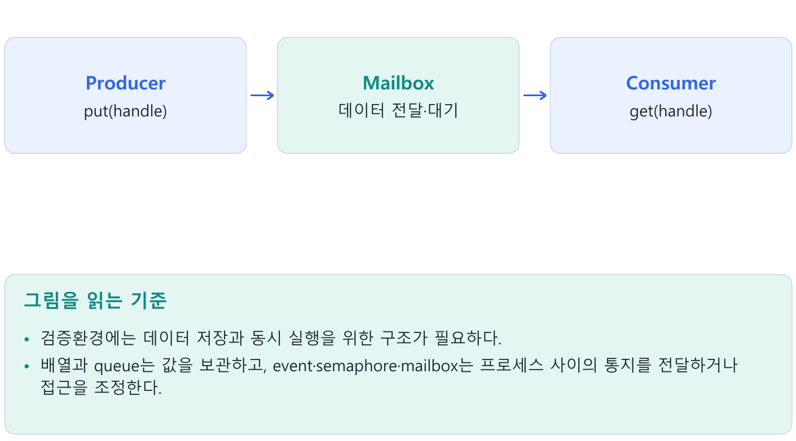
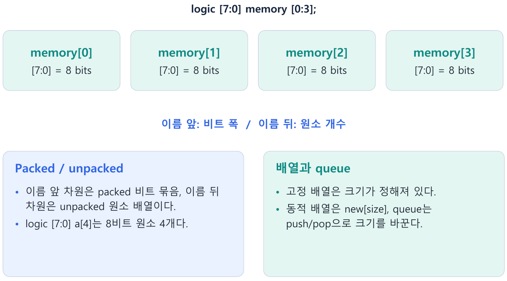
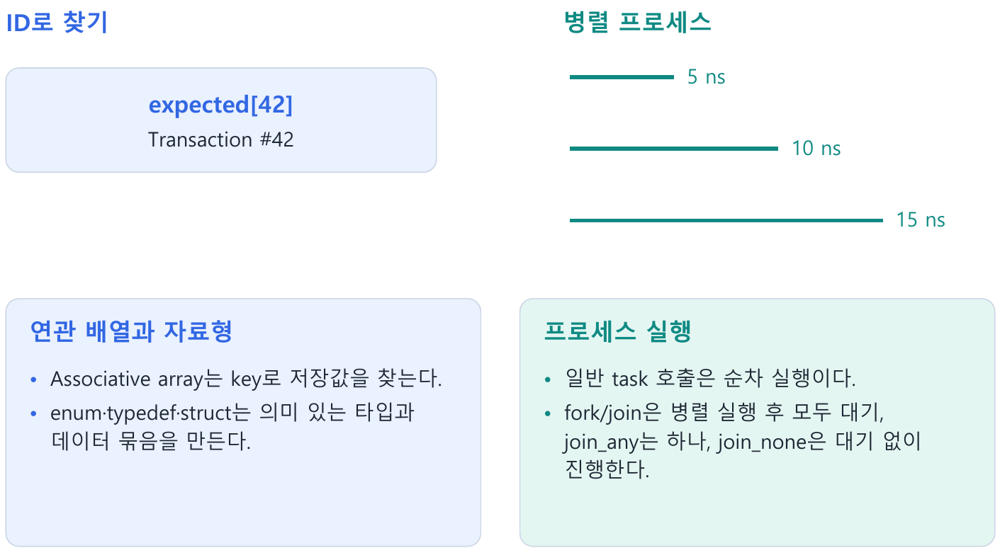
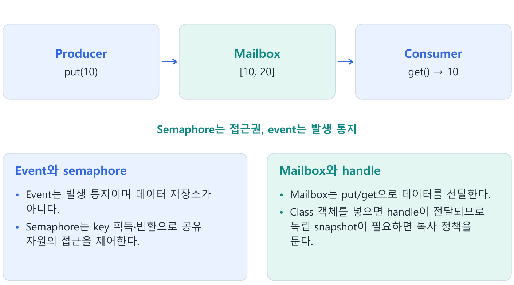
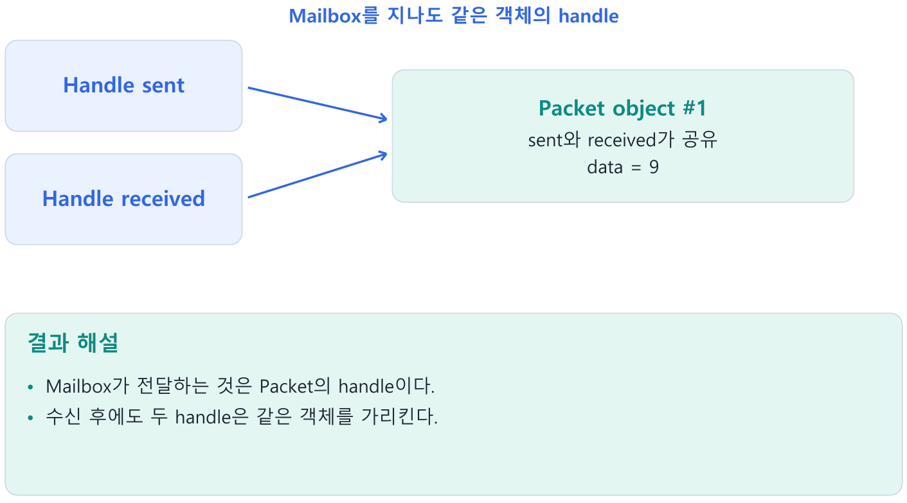

---
tags:
  - array
  - queue
  - mailbox
  - semaphore
  - process
cssclasses:
  - uvm-study-note
---

#array #queue #mailbox #semaphore #process

# **1. 소개**

- 검증환경에는 데이터 저장과 동시 실행을 위한 구조가 필요하다.
- 배열과 queue는 값을 보관하고, event·semaphore·mailbox는 프로세스 사이의 통지를 전달하거나 접근을 조정한다.

# **2. 구조와 흐름**



# **3. 핵심 개념**

## **3.1. Packed array와 unpacked array**



Dimension이 변수 이름 **앞**에 있으면 packed, **뒤**에 있으면 unpacked다.

```systemverilog
bit [7:0] a;       // 8-bit packed vector
bit b [7:0];       // 1-bit element 8개인 unpacked array
bit [3:0][7:0] c;  // 32-bit packed array
bit [7:0] d [3:0]; // 8-bit packed element 4개인 unpacked array
```

```systemverilog
logic [7:0] memory [0:15];
```

- `memory`: `logic [7:0]` element 16개
- `memory[3]`: type은 `logic [7:0]`, 폭은 8bit
- `memory[3][2]`: 네 번째 element의 bit 2
- packed는 vector처럼 bit 연산과 slicing에 적합하다.
- unpacked는 여러 element를 배열로 관리하는 데 적합하다.

## **3.2. Fixed array와 dynamic array**

```systemverilog
int fixed_array[4];
int dynamic_array[];
```

- Fixed array: 선언할 때 element 수가 고정된다.
- Dynamic array: 선언 직후 크기는 0이며 runtime에 `new[n]`으로 할당한다.
- `int`는 element type이고, `[4]` 또는 `new[4]`는 element 수다.  
  폭과 array 크기를 혼동하지 않는다.

```systemverilog
int values[];

values = new[3];
values[0] = 10;
values[1] = 20;
values[2] = 30;

values = new[5](values); // 기존 값을 보존하며 크기 변경
values.delete();         // size를 0으로 만듦
```

- `new[5]`: 새 배열을 할당하며 기존 값 보존을 기대하면 안 된다.
- `new[5](values)`: 기존 값을 앞에서부터 복사하고 추가된 `int` element는 0으로 초기화한다.
- `values.size()`: 현재 element 수를 반환한다.

### **foreach와 array method**

- `foreach`는 실제 index를 따라 element를 처리한다.
- `find()`는 조건에 맞는 element들의 queue를 반환하고, `find_index()`는 index들의 queue를 반환한다.
- `sort()`는 순서를 바꾸며 associative array에 같은 방식으로 적용하지 않는다.
- `sum() with (int'(item))`처럼 expression의 폭을 넓히면 작은 element type의 산술 폭 문제를 피할 수 있다.

```systemverilog
int values[$] = {3, 8, 5};
int large[$];
large = values.find() with (item > 4);
values.sort();
```

- Streaming operator는 bit열을 정한 순서와 chunk 크기로 묶거나 풀 때 사용한다.
- UVM의 `pack()`은 object field와 packer 정책을 사용하므로, SystemVerilog streaming 구문과 같은 API로 취급하지 않는다.

## **3.3. Queue**

Queue는 양쪽 끝에서 element를 추가·제거하기 편한 가변 크기 자료구조다.

```systemverilog
int q[$];

q.push_back(10);  // {10}
q.push_back(20);  // {10, 20}
q.push_front(5);  // {5, 10, 20}

int a = q.pop_front(); // a=5, q={10,20}
int b = q.pop_back();  // b=20, q={10}
```

- `q[0]`: 첫 element를 제거하지 않고 읽는다.
- `q[$]`: 마지막 element를 제거하지 않고 읽는다.
- `pop_*()`은 값을 반환하면서 queue에서 제거한다.
- Scoreboard의 in-order expected transaction 대기열 등에 적합하다.

## **3.4. Associative array**



사용한 key에 대해서만 element가 존재하는 sparse 자료구조다.

```systemverilog
int score_by_id[int];       // value type=int, key type=int
int score_by_name[string];  // value type=int, key type=string

score_by_id[10] = 95;
score_by_id[42] = 80;
```

주요 method:

```systemverilog
score_by_id.exists(10); // key 존재 여부
score_by_id.num();      // element 수
score_by_id.delete(10); // 특정 key 삭제
score_by_id.delete();   // 전체 삭제
```

- 기존 key에 다시 대입하면 element 수가 늘지 않고 값만 덮어쓴다.
- Transaction ID를 이용하는 out-of-order scoreboard matching 등에 적합하다.

## **3.5. Enum, typedef, struct**

### **Enum과 typedef**

```systemverilog
typedef enum logic [1:0] {
  IDLE  = 2'b00,
  READ  = 2'b01,
  WRITE = 2'b10,
  ERROR = 2'b11
} state_t;
```

- `enum`: 서로 관련된 named value 집합을 하나의 type으로 정의한다.
- `typedef`: 그 type에 재사용할 이름 `state_t`를 부여한다.
- `state.name()`으로 현재 enum 이름을 문자열로 얻을 수 있다.
- `parameter`도 값에 이름을 붙이지만, enum은 named value의 집합과 type을 만든다는 점이 다르다.

### **Struct**

```systemverilog
typedef struct {
  bit [7:0]  address;
  bit [31:0] data;
  bit        write;
} bus_item_t;
```

- Struct는 관련 field를 하나의 value로 묶는다.
- Struct variable 대입은 class handle assignment와 달리 field 값 복사다.

```systemverilog
bus_item_t a, b;
b = a;
b.data = 32'h1234; // a.data에는 영향 없음
```

`struct packed`은 모든 field를 연속된 packed vector처럼 배치한다.

```systemverilog
typedef struct packed {
  bit [3:0]  opcode;
  bit [7:0]  address;
  bit [15:0] data;
} packet_t; // 총 28bit
```

선언 순서대로 `opcode`가 MSB 쪽, `data`가 LSB 쪽에 배치된다.

## **3.6. Process, thread, fork-join**

`fork` 안의 각 statement는 별도의 child thread로 동시 진행된다.

| 문법 | Parent가 기다리는 조건 | 남은 child thread |
|---|---|---|
| `join` | 모든 child 종료 | 없음 |
| `join_any` | 하나의 child 종료 | 계속 실행 |
| `join_none` | 기다리지 않음 | 계속 실행 |
| `wait fork` | 모든 child 종료 | 완료될 때까지 대기 |
| `disable fork` | 기다림 기능이 아님 | 활성 child를 종료 |

`join_any`는 남은 thread를 자동으로 종료하지 않는다.

```systemverilog
fork
  forever begin
    #10;
    monitor();
  end
  begin
    #105;
  end
join_any

disable fork; // forever monitor 종료
```

- `join_none`으로 생성한 child는 parent가 처음 멈추거나 종료될 때 실행을 시작한다.
- Zero-time 코드의 순서를 분석할 때 주의한다.

### **Function/task와 순차·동시 실행**

- Function은 시간 소비가 불가능하고 task는 가능하다.
- 일반적인 task 호출은 호출한 process에서 순차 실행된다.
- 10ns task 뒤에 20ns task를 호출하면 30ns, 두 task를 fork...join으로 동시에 시작하면 20ns가 걸리는 예로 8장에서 확인했다.
- Simulator의 논리적 동시 실행과 CPU core 수는 별개의 문제다.

- `disable fork`는 가장 가까운 fork 블록 이름만 기준으로 종료하는 문법이 아니다.
- 호출한 process의 활성 자손 process에 영향을 줄 수 있으므로, 종료할 작업을 별도 parent process 아래에 묶어 범위를 제어한다.
- 형제 child의 실행 순서는 의존하지 않는다.

## **3.7. Event**

Event는 데이터를 저장하지 않고 어떤 일이 발생했다는 사실만 알린다.

```systemverilog
event done;

-> done; // trigger
@done;   // 다음 trigger 대기
```

- `@done`이 대기를 시작하기 전에 trigger가 이미 지나가면 event가 유실될 수 있다.
- Event는 과거 trigger 횟수를 queue처럼 기억하지 않는다.
- `done.triggered`는 같은 time slot의 race 완화에는 도움이 되지만 이전 simulation time의 trigger를 복구하지는 않는다.

### **Event의 발생과 완료 상태**

- `wait(done.triggered)`는 현재 time slot에서 발생한 trigger를 볼 수 있지만 과거 발생을 계속 저장하지 않는다.
- 반복 완료 확인에는 지속되는 `bit done_flag`나 mailbox처럼 의도에 맞는 상태/데이터 수단을 사용한다.
- `if`는 확인 시점에 한 번 분기하고 `wait(condition)`은 참이 될 때까지 process를 대기시킨다.
- 이미 참이면 즉시 통과한다.

## **3.8. Semaphore**

Semaphore는 제한된 수의 key로 공유 자원 접근을 제어한다.

```systemverilog
semaphore bus_lock = new(1);

bus_lock.get(1); // key가 없으면 기다림
// shared bus 사용
bus_lock.put(1); // key 반환
```

- `get(n)`: blocking.  
  key가 충분할 때까지 기다린다.
- `try_get(n)`: nonblocking.  
  성공하면 1, 실패하면 0을 즉시 반환한다.
- `put()` 누락 시 다른 thread가 계속 기다리는 deadlock이 발생할 수 있다.
- 동일 시점에 경쟁하는 thread 중 누가 먼저 key를 얻는지는 코드만으로 단정하지 않는다.

## **3.9. Mailbox**



Mailbox는 producer와 consumer 사이에서 데이터를 안전하게 전달하는 synchronized communication 수단이다.

```systemverilog
mailbox #(int) mbx = new(2); // int 전용, 용량 2
```

| Method | 빈 상태 또는 가득 찬 상태 | 값 제거 |
|---|---|---|
| `put()` | 가득 차면 기다림 | 해당 없음 |
| `try_put()` | 가득 차면 즉시 0 | 해당 없음 |
| `get()` | 비면 기다림 | 제거함 |
| `try_get()` | 비면 즉시 0 | 성공 시 제거 |
| `peek()` | 비면 기다림 | 제거하지 않음 |
| `try_peek()` | 비면 즉시 0 | 제거하지 않음 |

- `mailbox #(int)`에는 `int`만 넣을 수 있다.
- `peek()`과 `try_peek()`의 차이는 제거 여부가 아니라 blocking 여부다.

### **Mailbox가 class object를 전달하는 경우**

```systemverilog
mailbox #(Packet) mbx = new();
Packet sent, received;
sent = new();
mbx.put(sent);
mbx.get(received); // 같은 object의 handle을 전달
```

- 동기화된 전달과 object 복사는 별개의 일이다.
- Producer가 전달 후 같은 object를 수정하면 consumer가 보는 값도 바뀔 수 있다.
- 독립 snapshot이 필요하면 복사 정책을 정한다.

- Try_get()/try_peek()의 반환값을 mailbox 길이로 해석하지 않는다.
- Parameterized mailbox에서 반환값은 성공 여부를 판정하는 status로 사용한다.
- `num()`은 순간 길이이며 `num()>0` 확인 후 get() 사이에 다른 consumer가 제거할 수 있으므로 atomic한 try_get()과 같지 않다.

## **3.10. 도구 선택 기준**

| 상황 | 적합한 도구 |
|---|---|
| 한 component 안에서 순서대로 저장·제거 | Queue |
| Process 사이 producer-consumer 데이터 전달 | Mailbox |
| 발생 사실만 알림 | Event |
| 공유 자원의 동시 접근 제한 | Semaphore |
| 연속되지 않은 ID 기반 조회 | Associative array |

- Shared variable이나 queue만 여러 thread가 함께 사용하면 대기·깨우기·동시 접근 정책을 직접 구현해야 한다.
- Mailbox와 semaphore는 이 동기화 의도를 명시적으로 표현한다.

# **4. 핵심 예제**

```systemverilog
mailbox #(Packet) mbx = new();
Packet sent, received;
sent = new(7);
mbx.put(sent);
mbx.get(received);
sent.data = 9;
// received.data도 9
```

- Mailbox가 전달하는 것은 Packet의 handle이다.
- 수신 후에도 두 handle은 같은 객체를 가리킨다.



# **5. 주의점**

- Event를 과거 발생 이력을 저장하는 queue처럼 사용하지 않는다.
- disable fork는 현재 프로세스의 활성 자손에 영향을 준다.
- 시간 대기를 허용하는 task라는 이유만으로 병렬 실행되지는 않는다.

# **6. 핵심 정리**

- **Packed / unpacked**: 이름 앞 차원은 packed 비트 묶음, 이름 뒤 차원은 unpacked 원소 배열이다.  
  logic [7:0] a[4]는 8비트 원소 4개다.
- **배열과 queue**: 고정 배열은 크기가 정해져 있다.  
  동적 배열은 new[size], queue는 push/pop으로 크기를 바꾼다.
- **연관 배열과 자료형**: Associative array는 key로 저장값을 찾는다.  
  enum·typedef·struct는 의미 있는 타입과 데이터 묶음을 만든다.
- **프로세스 실행**: 일반 task 호출은 순차 실행이다.  
  fork/join은 병렬 실행 후 모두 대기, join_any는 하나, join_none은 대기 없이 진행한다.
- **Event와 semaphore**: Event는 발생 통지이며 데이터 저장소가 아니다.  
  Semaphore는 key 획득·반환으로 공유 자원의 접근을 제어한다.
- **Mailbox와 handle**: Mailbox는 put/get으로 데이터를 전달한다.  
  Class 객체를 넣으면 handle이 전달되므로 독립 snapshot이 필요하면 복사 정책을 둔다.

# **7. 확인 문제와 해설**

## **문제 1**

logic [7:0] a[4]의 원소 수와 원소 폭은?

**해설:** 4개, 각 8비트다.

## **문제 2**

10ns와 20ns task를 fork/join으로 실행하면?

**해설:** 같이 시작한다면 20ns 뒤 모두 완료된다.

## **문제 3**

Mailbox 수신 객체를 독립시키려면?

**해설:** 새 객체에 필요한 필드와 중첩 객체를 복사한다.

# **8. 참고 자료**

- IEEE 1800 SystemVerilog의 class·자료형·randomization·timing 문법
- [UVM 1.2 Class Reference](https://verificationacademy.com/verification-methodology-reference/uvm/docs_1.2/html/)

[목차](<UVM 기초 - 목차.md>)
