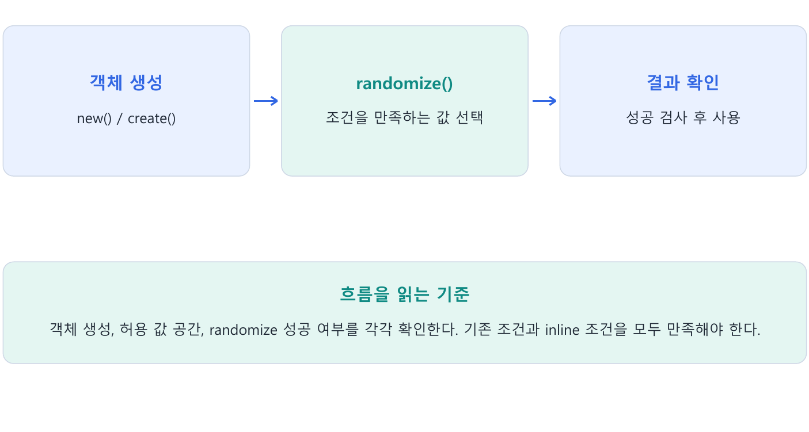

---
tags:
  - randomization
  - constraint
  - rand
  - randc
  - seed
cssclasses:
  - uvm-study-note
---

# 3장. Randomization과 Constraint

#randomization #constraint #rand #randc #seed

## 1. 장 소개

Constrained random은 허용된 값 공간에서 자극을 선택한다. 무작위 값 자체보다 유효한 조건, 경계 상황, 실패 처리와 재현 가능한 seed 관리가 중요하다.

## 2. 구조와 흐름



## 3. 핵심 개념

### 3.1. Randomization의 기본 구조

```systemverilog
class Packet;
  rand bit [3:0] addr;
       bit [3:0] data;
endclass

Packet p = new();
p.addr = 3;
p.data = 5;

if (!p.randomize())
  $error("Randomization failed");
```

- `new()`는 object를 생성한다.
- `randomize()`는 활성화된 `rand`와 `randc` field에 constraint를 만족하는 값을 실제로 반영한다.
- `rand`가 없는 `data`는 randomization 대상이 아니므로 기존값을 유지한다.
- `randomize()`는 성공 시 1, 실패 시 0을 반환한다. 반환값을 무시하지 않는다.
- Randomization이 실패하면 field는 이전값을 유지한다. 이 값을 정상 transaction으로 사용하면 안 된다.

#### 생성과 randomization을 분리한다

일반적인 `new()`는 constructor를 실행하며 randomize()를 자동 호출하지 않는다. Constructor에 명시적으로 호출한 경우만 별도다.

### 3.2. rand와 randc

```systemverilog
rand  bit [1:0] a;
randc bit [1:0] b;
```

- `rand`: 매 호출에서 합법적인 값 하나를 선택하며 같은 값이 연속으로 나올 수 있다.
- `randc`: random-cyclic 방식이다. 한 주기 안에서 가능한 값을 한 번씩 사용한 뒤 새 주기를 시작한다.
- `randc`도 주기 경계에서는 같은 값이 연속될 수 있다.

```text
첫 주기:  2, 0, 3, 1
둘째 주기: 1, 3, 0, 2
```

### 3.3. Constraint는 대입문이 아니라 조건이다

```systemverilog
constraint c_addr {
  addr >= 4;
  addr <= 9;
}
```

Constraint block 안의 식은 기본적으로 AND 관계다.

```text
(addr >= 4) AND (addr <= 9)
가능한 값: 4, 5, 6, 7, 8, 9
```

다음처럼 서로 모순되면 해가 없다.

```systemverilog
constraint c_bad {
  addr >= 4;
  addr < 3;
}
```

Solver는 활성화된 모든 조건을 동시에 만족하는 조합을 찾는다. 코드를 위에서 아래로 실행하며 값을 순서대로 대입하는 방식이 아니다.

### 3.4. Inline constraint와 inside

```systemverilog
if (!p.randomize() with {
  addr inside {[2:5], 9, [12:14]};
})
  $error("Randomization failed");
```

가능한 값은 `2, 3, 4, 5, 9, 12, 13, 14`다.

```systemverilog
!(addr inside {[2:5], 9, [12:14]});
```

`addr`가 4bit라면 가능한 값은 `0, 1, 6, 7, 8, 10, 11, 15`다.

Inline constraint는 기존 class constraint를 자동으로 대체하지 않는다. 보통 기존 조건에 AND로 추가되며 해당 `randomize()` 호출에만 적용된다.

#### Array의 크기와 각 element 조건

```systemverilog
class burst_item;
  rand bit [7:0] payload[];
  constraint c_payload {
    payload.size() inside {[2:8]};
    foreach (payload[i]) payload[i] inside {[1:15]};
    payload.sum() with (int'(item)) <= 60;
  }
endclass
```

Size, element 범위, 전체 합은 동시에 만족해야 하는 조건이다. 합계를 구하는 expression의 폭을 명시하고, 합과 size가 서로 모순되는지 확인한다. `unique { ... }`는 서로 다른 값을 요구하는 문법이며 randc의 호출 간 cycle과 구분한다.

### 3.5. dist와 가중치

```systemverilog
mode dist {
  0 := 1,
  1 := 3
};
```

가중치 합이 4이므로 `0`은 25%, `1`은 75%의 확률을 갖는다. 네 번 호출한다고 반드시 1회와 3회로 나뉘는 것은 아니다.

범위에서는 `:=`와 `:/`의 차이가 중요하다.

```systemverilog
value dist {
  0     := 10,
  [1:3] := 30
};
```

`:=`는 범위의 각 값에 weight를 적용한다. Weight는 `10, 30, 30, 30`이고 확률은 `10%, 30%, 30%, 30%`다.

```systemverilog
value dist {
  0     :/ 10,
  [1:3] :/ 30
};
```

`:/`는 범위 전체가 weight를 나눠 갖는다. `[1:3]`의 각 값은 weight 10을 가지므로 네 값의 확률은 각각 25%다.

### 3.6. Implication과 conditional constraint

```systemverilog
write == 1 -> addr inside {[8:15]};
```

- `write == 1`이면 오른쪽 조건을 반드시 만족한다.
- `write == 0`이면 implication 전체가 참이 되며 이 식은 `addr`를 제한하지 않는다.

양쪽 경우를 모두 제한하려면 conditional constraint를 사용한다.

```systemverilog
if (write)
  addr inside {[8:15]};
else
  addr inside {[0:3]};
```

### 3.7. solve before

```systemverilog
constraint c_value {
  (kind == 0) -> length == 0;
  (kind == 1) -> length inside {[1:3]};
  solve kind before length;
}
```

`solve before`는 합법적인 조합을 바꾸지 않고 분포에 영향을 준다. 
위 예제에서는 `kind`를 먼저 선택하므로 `kind=0`과 `kind=1`이 각각 약 50%가 된다. 이후 선택된 `kind` 안에서 가능한 `length`가 나뉜다.

```text
P(kind=0, length=0) = 1/2
P(kind=1, length=1) = 1/2 × 1/3 = 1/6
P(kind=1, length=2) = 1/6
P(kind=1, length=3) = 1/6
```

`solve before`는 절차적 실행 순서도 아니고 값의 대입 순서도 아니다.

### 3.8. soft constraint

```systemverilog
constraint c_default {
  soft addr inside {[0:7]};
}
```

`soft`는 기본 조건이다. 다른 조건이 생겼다고 즉시 사라지는 것이 아니라, 함께 만족할 수 없을 때 우선순위가 높은 조건에 양보한다.

```systemverilog
p.randomize() with { addr inside {[4:11]}; };
```

두 조건의 교집합이 있으므로 soft constraint는 유지되고 최종 범위는 `4~7`이다. 
교집합이 전혀 없다면 hard inline constraint가 유지되고 soft constraint가 제거된다. Class soft와 inline soft가 충돌하면 inline soft가 우선한다.

#### Must-obey와 scenario rule

이 분류는 사양상 항상 지킬 조건과 특정 test가 선택한 조건을 나눠 관리하라는 설계 관점이다. 별도의 언어 keyword가 아니다. Scenario별 constraint를 이름별로 나누면 constraint_mode()로 의도를 드러내기 쉽다. Illegal stimulus를 검증할 때는 어떤 규칙을 의도적으로 해제했는지 기록한다.

### 3.9. rand_mode와 constraint_mode

```systemverilog
p.addr.rand_mode(0);          // addr 값을 새로 뽑지 않음
p.c_addr.constraint_mode(0);  // c_addr 조건을 검사하지 않음
```

두 메서드는 서로 독립적이다. `rand_mode(0)`으로 field를 고정해도 그 field를 참조하는 constraint는 자동으로 꺼지지 않는다.

```systemverilog
p.addr = 12;
p.addr.rand_mode(0);

constraint c_addr {
  addr inside {[0:3]};
}
```

Solver는 `addr`를 변경할 수 없으며 고정된 `12`가 조건을 위반하므로 randomization은 실패한다. 실패 후 `addr`는 12를 유지한다.

```text
rand 활성화   → 현재값을 solver가 변경할 수 있음
rand 비활성화 → 현재값이 고정되며 constraint 검사에는 계속 참여함
```

### 3.10. pre_randomize와 post_randomize

```systemverilog
function void pre_randomize();
  // 랜덤화 전 mode나 constraint 상태 조정
endfunction

function void post_randomize();
  // 결정된 값으로 파생값 또는 checksum 계산
endfunction
```

호출 흐름은 다음과 같다.

```text
randomize() 호출
→ pre_randomize()
→ constraint solving 및 값 반영
→ 성공 시 post_randomize()
→ 반환
```

`pre_randomize()`에서 rand field에 값을 대입해도 `rand_mode`가 켜져 있으면 solver가 그 값을 다시 바꿀 수 있다. 
두 hook은 function이므로 simulation time을 소비할 수 없다.

#### Solver 안의 function과 재현성

Constraint 안의 function은 부작용 없는 계산으로 작성한다. 호출 횟수·순서를 로그 제어 수단으로 사용하거나 randomization mode를 함수 안에서 바꾸지 않는다. Seed, test 이름, simulator/UVM 버전, 실패한 constraint와 호출 위치를 함께 남겨 재현한다. 분포 설명은 값의 폭과 다른 활성 constraint를 명시한 예제에 한정한다.

### 3.11. Constraint 상속과 override

부모와 자식의 constraint 이름이 다르면 두 조건이 모두 적용된다.

```systemverilog
class BasePacket;
  rand bit [3:0] addr;
  constraint c_range { addr inside {[2:10]}; }
endclass

class PacketA extends BasePacket;
  constraint c_even { addr % 2 == 0; }
endclass
```

최종 가능한 값은 `2, 4, 6, 8, 10`이다.

자식 class에서 부모와 같은 이름의 constraint block을 선언하면 부모 constraint를 override한다.

```systemverilog
class PacketB extends BasePacket;
  constraint c_range { addr inside {[12:15]}; }
endclass
```

최종 가능한 값은 `12, 13, 14, 15`다.

#### Factory가 constraint를 교체하는 연결

자식 transaction에 다른 이름의 constraint를 추가하면 부모의 조건과 함께 적용된다. 같은 이름이면 상속된 constraint를 대체한다. Factory override는 이런 자식 type을 생성하도록 선택하며, randomize()는 그 실제 object의 활성 constraint를 사용한다. Factory 자체가 rand field에 값을 넣는 것은 아니다.

### 3.12. Conflicting, over-constrained, under-constrained

| 상태 | 의미 | 결과 또는 위험 |
|---|---|---|
| Conflicting | 조건이 모순되어 해가 없음 | `randomize()` 실패 |
| Over-constrained | 합법적인 상황을 지나치게 제한 | 성공할 수 있지만 검증 다양성 감소 |
| Under-constrained | 필요한 조건이 빠짐 | 합법 범위 밖의 값이나 의도하지 않은 조합 생성 |

Over-constrained가 반드시 실패를 뜻하는 것은 아니다. 
예를 들어 사양상 `1~8`이 모두 합법인데 `length == 4`만 허용하면 해는 있지만 다른 합법적 경우를 검증하지 못한다.

### 3.13. 실패를 안전하게 처리하기

```systemverilog
if (!item.randomize())
  `uvm_fatal("RANDFAIL", "Item randomization failed")
```

반환값을 무시하면 실패 이전의 값이 driver로 전달될 수 있다. Constraint를 작성한 뒤에는 다음을 확인한다.

1. 값 공간이 의도한 범위인가?
2. 모든 조건을 동시에 만족하는 해가 있는가?
3. 분포가 의도와 일치하는가?
4. 필요 이상으로 합법적 경우를 제외하지 않았는가?
5. 실패를 즉시 보고하고 transaction 전달을 중단하는가?

## 4. 핵심 예제

```systemverilog
class item;
  rand bit [7:0] data;
  constraint valid_c { data inside {[1:10]}; }
endclass
item tr = new();
if (!tr.randomize() with { data > 5; })
  $fatal(1, "Randomization failed");
```

기존 범위 1~10과 inline 조건 data > 5를 함께 만족해야 하므로 최종 허용 범위는 6~10이다.

## 5. 주의점

- 생성만으로 rand 필드가 자동 randomize되지는 않는다.
- post_randomize에서 값을 바꾸면 조건을 어긴 값이 될 수 있다.
- 실패 후 기존 값을 정상 자극인 것처럼 사용하지 않는다.

## 6. 핵심 정리

- **rand / randc**: rand는 무작위 값, randc는 변수의 유효 값 공간을 순환한다. 매번 새 객체를 만들면 이전 객체의 순환 상태는 이어지지 않는다.
- **조건과 충돌**: Constraint는 대입 순서가 아닌 관계식이다. Inline constraint는 기존 조건에 더해지며 충돌하면 randomize()가 실패한다.
- **범위와 확률**: inside는 허용 집합, dist는 가중치를 정한다. :=는 각 값에, :/는 범위 전체에 가중치를 배분한다.
- **선택 순서와 기본값**: solve before는 선택 확률에 영향을 준다. soft constraint는 더 강한 조건과 충돌하면 양보하는 기본 조건이다.
- **동작 제어와 hook**: rand_mode는 변수의 무작위화, constraint_mode는 조건 활성화를 제어한다. pre/post_randomize는 호출 전후 동작을 추가한다.
- **상속과 실패 처리**: 같은 이름의 constraint는 자식에서 재정의할 수 있다. 실패를 검사하고 성공한 값만 자극으로 사용한다.

## 7. 확인 문제와 해설

### 문제 1

data inside {[1:10]}에 data > 20을 추가하면?

**해설:** 조건이 충돌하므로 실패한다.

### 문제 2

rand_mode(0)는 constraint도 끄는가?

**해설:** 아니다. 조건은 남아 고정된 변수값을 제한할 수 있다.

### 문제 3

Seed를 남기는 이유는?

**해설:** 실패한 무작위 시나리오를 재현하기 위해서다.

## 8. 참고 자료

- IEEE 1800 SystemVerilog의 class·자료형·randomization·timing 문법
- [UVM 1.2 Class Reference](https://verificationacademy.com/verification-methodology-reference/uvm/docs_1.2/html/)

[목차](<UVM 기초 - 목차.md>)
