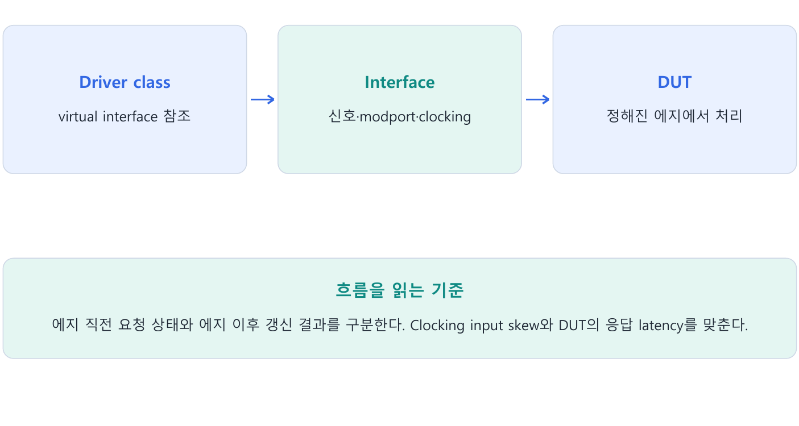

---
tags:
  - interface
  - virtual_interface
  - clocking
  - timing
  - race
cssclasses:
  - uvm-study-note
---

# 4장. Interface와 Simulation Timing

#interface #virtual_interface #clocking #timing #race

## 1. 장 소개

Class 기반 검증 코드가 DUT의 신호에 접근하려면 interface를 참조해야 한다. 올바른 값뿐 아니라 구동과 관찰 시점을 맞추는 것이 race를 피하고 정확한 검증을 만드는 핵심이다.

## 2. 구조와 흐름



## 3. 핵심 개념

### 3.1. Interface가 필요한 이유

여러 protocol 신호를 module port로 각각 전달하면 component가 늘어날수록 연결 코드가 반복된다.
신호 방향, clock 기준 동작, 공통 task도 여러 위치에 흩어질 수 있다.

Interface는 관련 신호와 timing 규칙을 하나의 구조로 묶는다.

```systemverilog
interface bus_if(input logic clk);
  logic       valid;
  logic       ready;
  logic [7:0] data;
endinterface
```

Interface에는 다음 항목을 함께 둘 수 있다.

- Protocol signal
- `modport`
- `clocking block`
- 공통 task와 function

#### Program은 UVM의 필수 조건이 아니다

Program block은 Reactive region을 활용하는 설명 방식이다. UVM top을 module로 작성해 run_test()를 호출할 수도 있다. 어느 방식이든 pin 접근 timing과 clocking block 정책을 명시해야 한다. NBA, Observed, Reactive/Re-NBA 등 실제 scheduling은 4장의 단순 그림보다 세부적이다.

### 3.2. Interface type과 instance

```systemverilog
interface bus_if(input logic clk);
  logic       valid;
  logic       ready;
  logic [7:0] data;
endinterface

module top;
  logic clk;
  bus_if bus(.clk(clk));
endmodule
```

`bus_if`는 interface의 구조를 정의한 type이다.
`bus`는 top에서 실제로 생성된 interface instance다.

```text
bus_if → interface 설계도
bus    → 실제 interface instance
```

`clk`는 top에서 생성한 clock을 interface가 입력으로 받는다.
`valid`, `ready`, `data`는 interface 내부에 선언된 protocol signal이다.

### 3.3. DUT 연결 방식

DUT가 개별 port를 사용하면 interface signal을 각각 연결한다.

```systemverilog
dut u_dut (
  .clk   (clk),
  .valid (bus.valid),
  .ready (bus.ready),
  .data  (bus.data)
);
```

DUT도 interface port를 받도록 작성하면 interface instance 하나로 연결할 수 있다.

```systemverilog
module dut(bus_if bus);
  // ...
endmodule

dut u_dut(bus);
```

Interface의 목적은 port 수를 줄이는 것에만 있지 않다.
Protocol의 신호, 역할, 구동 시점과 sampling 시점을 한곳에 정의하는 것이 더 중요한 목적이다.

### 3.4. Modport

`modport`는 interface를 사용하는 주체별로 신호 접근 방향을 정의한다.
방향은 interface의 절대적인 방향이 아니라 해당 modport를 사용하는 쪽에서 본 방향이다.

```systemverilog
interface bus_if(input logic clk);
  logic       valid;
  logic       ready;
  logic [7:0] data;

  modport DUT (
    input  clk,
    input  valid,
    input  data,
    output ready
  );

  modport DRV (
    input  clk,
    input  ready,
    output valid,
    output data
  );

  modport MON (
    input clk,
    input valid,
    input ready,
    input data
  );
endinterface
```

Driver는 `valid`와 `data`를 구동하고 `ready`를 읽는다.
Monitor는 모든 신호를 관찰하며 어떤 신호도 구동하지 않는다.
DUT는 `valid`와 `data`를 입력받고 `ready`를 출력한다.

### 3.5. Virtual interface

실제 interface instance는 module과 함께 elaboration 과정에서 정적으로 생성된다.
Class object는 simulation 중 `new()`로 동적으로 생성된다.
Class 안에서는 실제 interface instance를 `new()`로 만들 수 없다.

Class는 `virtual interface` handle을 통해 top에서 생성된 실제 interface instance를 가리킨다.

```systemverilog
class Driver;
  virtual bus_if.DRV vif;
endclass
```

각 부분의 의미는 다음과 같다.

```text
virtual → 실제 interface를 가리키는 handle
bus_if  → interface type
.DRV    → 사용할 modport
vif     → 사용자가 정한 member variable 이름
```

`vif`는 SystemVerilog keyword가 아니다.
Virtual interface의 줄임말로 자주 사용하는 관례적인 이름이다.

```systemverilog
Driver drv = new();
drv.vif = bus;
```

이 대입은 interface를 복사하거나 새로 만들지 않는다.
`drv.vif`가 실제 instance `bus`를 가리키게 한다.

#### Parameter와 modport도 type의 일부다

```systemverilog
interface bus_if #(parameter int DW = 8)(input logic clk);
  logic [DW-1:0] data;
endinterface
// class 안의 선언 예
virtual bus_if#(16) vif;
```

실제 instance, virtual interface 선언, 이후 config DB의 type parameter는 폭과 modport까지 일치시킨다. Config DB 전달 상세는 10장에서 확인한다. Constructor를 통한 직접 전달도 가능하며 interface를 복사하지 않고 실제 instance에 대한 참조를 전달한다.

### 3.6. Null virtual interface

Class object만 생성하고 `vif`를 연결하지 않으면 `vif`는 null이다.

```systemverilog
Driver drv = new();

if (drv.vif == null)
  $fatal(1, "virtual interface is null");
```

Null 상태에서 `vif.drv_cb`나 `vif.data`에 접근하면 runtime 오류가 발생한다.
이는 신호가 단순히 전달되지 않는 상태가 아니라 유효한 interface instance가 전혀 연결되지 않은 상태다.

### 3.7. Clocking block

`clocking block`은 특정 clock event를 기준으로 testbench가 신호를 언제 구동하고 sampling할지 정의한다.

```systemverilog
clocking drv_cb @(posedge clk);
  default input #1step output #0;
  output valid, data;
  input  ready;
endclocking
```

`drv_cb`는 사용자가 정한 이름이다.
보통 driver용 clocking block이라는 의미로 사용한다.

```systemverilog
@(vif.drv_cb);
vif.drv_cb.valid <= 1;
vif.drv_cb.data  <= 8'h55;
```

`@(vif.drv_cb)`는 `drv_cb`에 지정된 `posedge clk` event를 기다린다.
`vif.drv_cb.valid`는 별도의 가상 신호가 아니라 실제 interface instance의 `valid`에 대한 clocking block view다.

#### Clocking input skew와 output skew

Clocking block의 input은 관찰하는 쪽, output은 구동하는 쪽이다. 일반적인 양의 input skew는 edge보다 앞서 sampling하고, 양의 output skew는 edge 뒤에 구동한다. 명시하지 않은 기본값은 input #1step, output #0이다. Clocking block의 input #0과 절차문 `#0;`은 같은 동작이 아니다. 절차문 #0만으로 NBA 이후 관찰을 보장하지 않는다.

### 3.8. Modport와 clocking block의 차이

```text
modport        → 누가 무엇을 읽고 쓸 수 있는가
clocking block → 언제 구동하고 sampling하는가
```

`modport`는 접근 역할과 방향을 구분한다.
`clocking block`은 clock을 기준으로 접근 시점을 구분한다.

### 3.9. Race condition

DUT와 testbench가 같은 clock edge와 같은 simulation event region에서 같은 신호를 읽고 쓰면 실행 순서에 따라 결과가 달라질 수 있다.

```systemverilog
// DUT
always_ff @(posedge clk) begin
  if (valid)
    captured_data <= data;
end

// Testbench
@(posedge clk);
valid = 1;
data  = 8'hA5;
```

같은 `posedge`에서 DUT와 testbench가 모두 깨어난다.
Testbench가 먼저 실행되면 DUT가 새 값을 볼 수 있다.
DUT가 먼저 실행되면 이전 값을 볼 수 있다.
이처럼 실행 순서에 따라 결과가 바뀌는 상황이 race condition이다.

### 3.10. Blocking과 nonblocking assignment

Blocking assignment는 statement가 실행되는 즉시 왼쪽 값을 갱신한다.

```systemverilog
data = 8'hA5;
```

Nonblocking assignment는 오른쪽 값을 현재 region에서 계산하고 왼쪽 값의 갱신을 NBA region에 예약한다.

```systemverilog
data <= 8'hA5;
```

```text
Active region → 오른쪽 값 계산, update 예약
NBA region    → 왼쪽 값 실제 갱신
```

Nonblocking assignment를 사용하면 같은 Active region의 다른 process는 update 이전 값을 읽는다.
이는 실행 순서에 따른 불확실성을 줄이지만, 어느 cycle의 값을 관찰할지는 여전히 protocol에 맞게 설계해야 한다.

### 3.11. Driver의 구동 시점

Driver가 clocking block의 `output #0`으로 edge에서 값을 구동하면 DUT가 같은 edge에서 새 값을 받아야 하는 것으로 해석하지 않는다.
Driver는 다음 sampling edge에서 사용할 값을 준비한다.

```text
5ns posedge
├─ DUT는 기존의 안정된 입력을 sampling
└─ Driver는 valid=1, data=A5 구동

5ns~15ns
└─ valid=1, data=A5 안정적으로 유지

15ns posedge
└─ DUT가 valid=1, data=A5 sampling
```

이 방식은 DUT와 driver가 같은 edge의 Active region에서 먼저 실행되려고 경쟁하는 상황을 피한다.

### 3.12. Monitor의 sampling 시점

DUT가 registered output을 nonblocking assignment로 갱신한다고 가정한다.

```systemverilog
always_ff @(posedge clk)
  result <= input_data;
```

Edge 직전 `result=10`이고 `input_data=20`이라면 event 흐름은 다음과 같다.

```text
Edge 직전 → result=10
Active    → result <= 20 update 예약
NBA       → result=20 실제 반영
Observed  → 갱신된 result 관찰 가능
```

#### 한 monitor에서 요청과 결과의 시점을 구분

기존 통합 예제의 모든 신호 input #0은 출력 갱신 관찰을 설명한 예다. 그대로 사용하면 driver가 edge 뒤에 갱신한 입력을 DUT가 그 edge에서 사용한 입력으로 오해할 수 있다. 실제 protocol monitor는 요청 수락 시점의 입력과 등록 출력 갱신 시점을 각각 정한다.

```systemverilog
clocking mon_cb @(posedge clk);
  input #1step valid, ready, data;
  input #0 result;
endclocking
```

이 예도 protocol에서 ready와 result의 의미를 확인해 선택해야 한다. FIFO에서는 wr_en/rd_en, full/empty의 edge 직전 상태로 수락을 판단하고 해당 edge 뒤의 등록 출력은 별도 timing으로 연결할 수 있다. 구체 정책은 DUT RTL을 읽은 뒤 정한다.

### 3.13. input #1step과 input #0

```systemverilog
clocking mon_before_cb @(posedge clk);
  input #1step result;
endclocking
```

`input #1step`은 clock edge 바로 직전의 안정된 값을 sampling한다.
위 예제에서는 이전값 `10`을 본다.

```systemverilog
clocking mon_after_cb @(posedge clk);
  input #0 result;
endclocking
```

`input #0`은 같은 time slot에서 DUT의 NBA update가 반영된 뒤 값을 sampling한다.
위 예제에서는 갱신된 값 `20`을 본다.

```text
input #1step → edge 직전값
input #0     → NBA 반영 후 값
```

어느 방식이 옳은지는 protocol에서 정의한 관찰 시점에 따라 결정한다.
Request와 input의 edge 직전 상태를 기록할 때는 `#1step`이 적합할 수 있다.
해당 edge에서 갱신된 registered output을 기록할 때는 `#0`을 고려할 수 있다.

### 3.14. 임의의 #1 delay가 위험한 이유

`#1step`은 simulator time precision의 한 단계로 edge 직전을 의미한다.
`#1`은 현재 `timeunit`을 기준으로 실제 simulation time을 1만큼 지연한다.

Race를 피하려고 monitor에 임의의 `#1` delay를 넣으면 clock 주기나 `timeunit`이 변경될 때 sampling 위치도 달라진다.
이 방식은 timing 문제를 해결하지 않고 우연히 숨길 수 있다.
Clocking block과 명확한 skew를 사용해 의도한 sampling 시점을 표현하는 편이 안전하다.

### 3.15. 통합 예제

```systemverilog
interface bus_if(input logic clk);
  logic       valid;
  logic       ready;
  logic [7:0] data;
  logic [7:0] result;

  clocking drv_cb @(posedge clk);
    default input #1step output #0;
    output valid, data;
    input  ready;
  endclocking

  clocking mon_cb @(posedge clk);
    input #0 valid, ready, data, result;
  endclocking

  modport DRV (clocking drv_cb);
  modport MON (clocking mon_cb);
endinterface

class Driver;
  virtual bus_if.DRV vif;
endclass

class Monitor;
  virtual bus_if.MON vif;
endclass
```

Driver는 `valid`와 `data`를 구동하고 `ready`를 관찰한다.
Monitor는 모든 신호를 관찰하며 아무 신호도 구동하지 않는다.
`mon_cb`의 `input #0`은 DUT의 NBA update가 반영된 registered output을 sampling할 수 있다.

## 4. 핵심 예제

```systemverilog
interface bus_if(input logic clk);
  logic valid, ready;
  logic [7:0] data;
  clocking drv_cb @(posedge clk);
    default input #1step output #0;
    input ready;
    output valid, data;
  endclocking
endinterface
```

Driver는 ready의 sampling과 valid/data 구동을 clocking 규칙으로 표현한다. DUT가 값을 수락하는 에지는 별도의 프로토콜 계약에 따른다.

## 5. 주의점

- Clocking input #0과 절차문의 #0 delay는 같은 의미가 아니다.
- 같은 posedge에서 구동·관찰하면 자동으로 안전한 것은 아니다.
- Interface parameter와 modport도 virtual interface 타입에 맞춘다.

## 6. 핵심 정리

- **Interface와 instance**: Interface 정의는 신호 묶음의 타입이고 HDL top에서 만든 instance가 실제 신호를 가진다.
- **Virtual interface**: Class의 virtual interface는 실제 interface instance를 참조한다. 선언만으로 연결되지 않으며 null을 검사한다.
- **Modport / clocking**: Modport는 접근 방향·뷰를 정한다. Clocking block은 이벤트와 input/output skew로 구동·관찰 시점을 표현한다.
- **Blocking / NBA**: Blocking은 해당 프로세스에서 즉시 대입한다. Nonblocking은 RHS를 평가하고 NBA 영역에서 갱신하므로 같은 에지의 관찰 시점이 중요하다.
- **Sampling 기준**: Clocking input #1step은 에지 직전 안정값, input #0은 같은 에지의 Observed 영역 값에 대응한다. 프로토콜 계약에 맞춰 선택한다.
- **요청과 응답 timing**: 요청 수락 때의 상태와 등록된 출력의 유효 시점은 다를 수 있다. Arbitrary #delay보다 사양과 scheduling을 기준으로 관찰한다.

## 7. 확인 문제와 해설

### 문제 1

Virtual interface 선언만 하면 실제 신호에 연결되는가?

**해설:** 아니다. 실제 instance 참조를 전달해야 한다.

### 문제 2

Modport와 clocking block의 역할 차이는?

**해설:** 접근 뷰·방향과 구동·sampling timing이다.

### 문제 3

등록 출력은 요청 수락 에지의 이전 rdata와 비교해도 되는가?

**해설:** 출력 latency와 유효 시점을 먼저 확인해야 한다.

## 8. 참고 자료

- IEEE 1800 SystemVerilog의 class·자료형·randomization·timing 문법
- [UVM 1.2 Class Reference](https://verificationacademy.com/verification-methodology-reference/uvm/docs_1.2/html/)

[목차](<UVM 기초 - 목차.md>)
