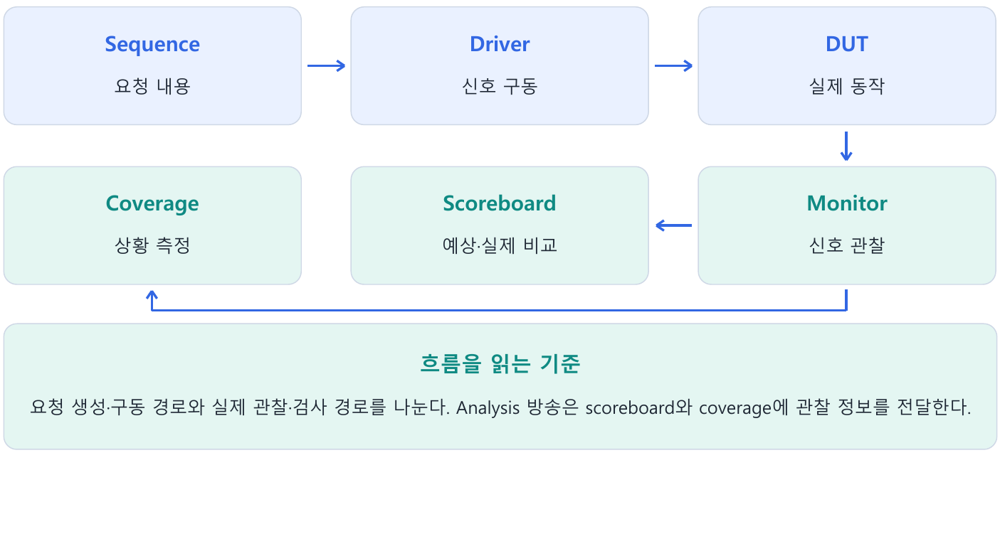

---
tags:
  - uvm
  - test
  - env
  - agent
  - driver
  - monitor
  - scoreboard
cssclasses:
  - uvm-study-note
---

# 5장. UVM 개요와 전체 구조

#uvm #test #env #agent #driver #monitor #scoreboard

## 1. 장 소개

UVM은 검증환경의 역할과 실행·생성·통신 방식을 표준화한다. 요청을 만드는 흐름과 실제 동작을 관찰하고 검사하는 흐름을 구분하면 재사용 가능한 구조를 이해하기 쉽다.

## 2. 구조와 흐름



## 3. 핵심 개념

### 3.1. UVM이 필요한 이유

작은 testbench에서는 하나의 `initial` block에서 입력 생성, pin 구동, 출력 관찰, 결과 비교를 모두 수행할 수 있다. 검증 규모가 커지면 stimulus, protocol timing, checking, coverage가 뒤섞이고 test마다 같은 코드가 반복된다.

UVM은 책임을 나누고 transaction 단위로 연결하여 검증환경을 재사용할 수 있게 한다.

```text
검증 의도와 순서        → sequence
transaction 전달 중재  → sequencer
pin-level 구동          → driver
실제 pin 관찰           → monitor
expected 계산           → reference model
expected/actual 비교    → scoreboard
검증 범위 측정          → coverage subscriber
```

### 3.2. Directed와 constrained-random verification

Directed verification은 검증자가 시험할 값을 직접 지정한다.

```systemverilog
item.addr  = 8'h10;
item.data  = 8'h55;
item.write = 1;
```

특정 기능, 경계값, 이미 발견한 버그를 정확히 재현하기 좋다. 다만 검증자가 생각한 경우만 시험하기 쉽다.

Constrained-random verification은 합법적인 값 공간을 constraint로 정의하고 그 안에서 다양한 값을 생성한다.

```systemverilog
assert(item.randomize() with {
  addr inside {[8'h10:8'h1F]};
  write == 1;
});
```

예상하지 못한 조합을 넓게 탐색할 수 있지만, 중요한 경우가 실제로 생성됐는지는 coverage로 확인해야 한다.

`randomize()`를 사용했는지만으로 두 방식을 구분하지 않는다. 모든 field를 하나의 값으로 고정했다면 문법은 randomization이어도 검증 의도는 directed에 가깝다.

```text
Directed           → 정확한 경우 지정
Constrained-random → 합법 공간을 정의하고 여러 조합 탐색
```

실제 검증에서는 두 방식을 함께 사용한다.

### 3.3. Transaction-level verification

Transaction은 여러 pin 변화로 이루어진 protocol 동작을 의미 있는 작업 하나로 표현한다.

```systemverilog
item.write = 1;
item.addr  = 8'h20;
item.data  = 8'hA5;
```

```text
Transaction level: 0x20 주소에 0xA5를 쓴다.
Pin level: valid를 올리고, addr/data를 구동하고, ready를 기다린다.
```

Sequence는 무엇을 보낼지 결정하고 driver는 그 작업을 protocol signal과 timing으로 변환한다. Protocol timing이 변경돼도 sequence를 유지하고 driver를 중심으로 수정할 수 있으므로 재사용성이 높아진다.

Sequence가 virtual interface를 직접 사용하면 signal 이름과 timing에 결합되어 재사용성이 낮아진다.

### 3.4. UVM 전체 흐름

```text
test
→ sequence
→ sequencer
→ driver
→ interface
→ DUT
→ monitor
→ analysis port
→ scoreboard / coverage
```

각 화살표가 모두 parent-child 생성을 뜻하지는 않는다. 위치에 따라 sequence 시작, transaction 중재, signal 변환, 관찰 결과 방송을 의미한다.

```text
Test          → 환경과 시나리오를 선택한다.
Sequence      → transaction을 생성하고 순서를 정한다.
Sequencer     → sequence와 driver 사이 전달을 중재한다.
Driver        → transaction을 signal로 변환하고 구동한다.
Interface     → class 세계와 DUT signal을 연결한다.
DUT           → 설계 기능을 수행한다.
Monitor       → signal을 관찰하고 transaction으로 복원한다.
Analysis port → 관찰 transaction을 방송한다.
Scoreboard    → expected와 actual을 비교한다.
Coverage      → 어떤 값과 조합이 검증됐는지 측정한다.
```

### 3.5. Test, environment, agent

일반적인 구성과 생성 관계는 다음과 같다.

```text
UVM
└─ test
   └─ environment
      ├─ agent
      │  ├─ sequencer
      │  ├─ driver
      │  └─ monitor
      ├─ reference model
      ├─ scoreboard
      └─ coverage subscriber
```

- Test: 이번 simulation의 environment, 설정, 실행할 sequence를 선택한다.
- Environment: agent, scoreboard 등 검증 구성 요소를 묶고 연결한다.
- Agent: 특정 interface 또는 protocol 하나의 구동과 관찰 요소를 묶는다.

Test, environment, agent는 구조와 구성을 담당한다. 실제 pin-level 구동과 관찰은 driver와 monitor가 담당한다.

### 3.6. Active agent와 passive agent

Active agent는 stimulus를 보내고 실제 interface도 관찰한다.

```text
active agent
├─ sequencer
├─ driver
└─ monitor
```

Passive agent는 다른 주체가 구동하는 interface를 관찰만 한다.

```text
passive agent
└─ monitor
```

Active agent에도 monitor가 필요하다. Driver transaction은 보내려던 의도를 나타내지만, monitor transaction은 interface에서 실제로 성립한 동작을 나타낸다.

이미 외부 장치가 구동하는 signal을 UVM driver도 구동하면 multiple-driver contention이 발생하고 값이 `X`가 될 수 있다.

### 3.7. Sequencer, driver, monitor

Sequencer는 sequence 자체를 driver로 보내는 것이 아니다. Sequence가 만든 transaction의 전달을 중재한다.

```text
Sequence   → 무엇을 어떤 순서로 보낼지 결정
Sequencer  → transaction 전달을 중재
Driver     → transaction을 pin-level signal로 변환
Monitor    → 실제 pin-level signal을 transaction으로 복원
```

Monitor는 driver의 원래 transaction을 그대로 받지 않는다. 실제 interface를 독립적으로 관찰해야 driver 오류, handshake 실패, DUT와의 실제 상호작용을 검출할 수 있다.

### 3.8. Analysis port와 subscriber

Monitor는 관찰한 transaction을 analysis port로 발행한다.

```text
                         ┌─> scoreboard
monitor ── analysis ─────┼─> coverage subscriber
                         └─> logger
```

Analysis port는 독립적인 component가 아니라 transaction을 1:N으로 방송하는 통신 통로다. 구체적인 연결 문법은 11장에서 설명한다.

Subscriber는 transaction을 구독하여 처리하는 component다. Coverage에만 한정되지 않으며 logging이나 통계 수집에도 사용할 수 있다.

### 3.9. Reference model, scoreboard, coverage

```text
입력 monitor → reference model → expected ─┐
                                           ├→ scoreboard → match/mismatch
출력 monitor ──────────────────→ actual ───┘

monitor transaction → coverage subscriber → 검증된 값과 조합 기록
```

- Reference model: 입력 transaction으로 올바른 expected result를 계산한다.
- Scoreboard: expected와 actual을 비교하여 correctness를 판단한다.
- Coverage subscriber: 무엇을 얼마나 시험했는지 측정한다.

작은 환경에서는 prediction과 comparison을 scoreboard 하나에 넣을 수 있다. 큰 환경에서는 reference model과 scoreboard를 분리하면 각각 교체하고 재사용하기 쉽다.

모든 비교가 pass여도 coverage가 낮으면 검증이 충분하지 않을 수 있다. 반대로 coverage가 높아도 결과 비교가 없다면 DUT가 올바르게 동작했다고 판단할 수 없다.

### 3.10. Virtual sequence와 virtual sequencer

여러 agent의 동작을 하나의 복합 시나리오로 조정할 때 사용한다.

```text
virtual sequence
   │ 실행 순서 지휘
   ▼
virtual sequencer
   ├─ spi_sequencer handle
   ├─ uart_sequencer handle
   └─ reset_sequencer handle
```

Virtual sequence는 여러 protocol sequence의 실행 순서를 결정한다.

```text
1. SPI 설정 sequence 실행
2. UART sequence 실행
3. Reset sequence 실행
```

Virtual sequencer는 각 protocol의 실제 sequencer handle을 보관한다. Sequence들의 집합이 아니며, 일반적으로 자기 driver가 없고 pin을 직접 구동하지 않는다.

```text
virtual sequence → SPI sequence → SPI sequencer → SPI driver → SPI pin
```

실제 pin timing은 각 protocol driver가 담당한다.

### 3.11. 생성, hierarchy, 수명, 책임

| 대상 | 일반적인 생성 주체 | UVM hierarchy | 일반적인 수명 | Transaction 역할 | Pin 접근 | Correctness 판단 |
|---|---|---:|---|---|---|---:|
| Test | UVM | 있음 | Simulation 전체 | 시나리오 선택 | 안 함 | 보통 안 함 |
| Environment | Test | 있음 | Simulation 전체 | 구조와 연결 | 안 함 | 안 함 |
| Agent | Environment | 있음 | Simulation 전체 | Protocol 묶음 | 안 함 | 안 함 |
| Sequence | Test/virtual sequence 등 | 없음 | 실행 기간 | 생성·순서 결정 | 안 함 | 안 함 |
| Transaction | Sequence/monitor | 없음 | 전달·처리 기간 | 전달되는 데이터 | 안 함 | 안 함 |
| Sequencer | Agent | 있음 | Simulation 전체 | 중재·전달 | 안 함 | 안 함 |
| Driver | Agent | 있음 | Simulation 전체 | Signal로 변환 | 구동 | 안 함 |
| Monitor | Agent | 있음 | Simulation 전체 | Transaction으로 복원 | 관찰 | 보통 안 함 |
| Scoreboard | Environment | 있음 | Simulation 전체 | Expected/actual 비교 | 안 함 | 함 |
| Coverage subscriber | Environment | 있음 | Simulation 전체 | 검증 범위 측정 | 안 함 | 안 함 |
| Virtual sequencer | Environment | 있음 | Simulation 전체 | Sequencer handle 제공 | 안 함 | 안 함 |
| Virtual sequence | Test 등 | 없음 | 실행 기간 | 여러 sequence 지휘 | 안 함 | 안 함 |

Interface와 DUT는 UVM component hierarchy가 아니라 top의 HDL hierarchy에 존재하며 simulation 동안 유지된다.

#### UVM은 library와 실행 framework다

SystemVerilog class library를 import하고 macro를 include해 기반 class/API를 사용한다. 등록된 test를 run_test()가 선택·생성하고 component hierarchy에 phase를 적용한다. 사용자는 phase method를 구현하며 보통 이를 직접 호출하지 않는다. Test 선택과 종료 절차 상세는 8·13장로 연결한다.

#### 생성, 실행, 연결은 서로 다른 동작이다

| 대상 | 생성 | 실행 계기 | 연결 |
|---|---|---|---|
| Component | build에서 create(name, parent) | UVM scheduler의 phase 호출 | connect에서 port 연결 |
| Sequence | 필요할 때 create(name) | start(sequencer) | 사용할 sequencer 지정 |
| Transaction | sequence/monitor에서 create(name) | 사용자 method 호출 | handle을 통신 경로로 전달 |
| Interface | top에서 정적 instance | signal/process 동작 | DUT port와 virtual interface |

전체 화살표를 하나의 호출 체인이나 hierarchy로 오해하지 않는다. Sequence의 실행과 driver·monitor의 phase process는 병행된다. Driver를 교체하는 factory 설정, 설정값을 전달하는 config DB, 통신 port 연결은 각각 다른 작업이다.

#### Request와 response는 역할 이름이다

Transaction은 입력 stimulus에만 사용되지 않는다. 응답, 관찰 결과, 상태도 의미 있는 object로 모델링할 수 있다. DUT 요청을 받아 response를 만드는 reactive 환경은 FIFO의 입력 생성 환경과 책임 배치가 다를 수 있다.

#### UVM을 두 축으로 설명할 때의 범위

Component 쪽은 환경 구성·상시 구동/관찰, sequence 쪽은 시나리오 실행이라는 관점으로 구조를 설명할 수 있다. 엄밀한 class 전체 분류는 아니며 transaction, configuration object, RAL model처럼 sequence 이외의 object도 있다. Callback·RAL·TLM-2는 추가 설계 항목 주제로 남긴다.

## 4. 핵심 예제

```systemverilog
// agent의 connect_phase
drv.seq_item_port.connect(sqr.seq_item_export);
// env의 connect_phase
agent.mon.ap.connect(sb.analysis_imp);
agent.mon.ap.connect(cov.analysis_export);
```

요청 전달 경로와 관찰 결과의 방송 경로를 각각 연결한다. 연결만으로 sequence가 시작되거나 transaction이 발행되지는 않는다.

## 5. 주의점

- Driver의 의도만으로 DUT 실제 동작을 확인했다고 판단하지 않는다.
- Coverage가 채워져도 올바른 결과가 보장되지는 않는다.
- Sequencer와 sequence를 같은 대상으로 생각하지 않는다.

## 6. 핵심 정리

- **검증의 목적**: Directed test는 특정 상황을 명확히 만든다. Constrained random은 유효 공간을 넓게 탐색하며 checker와 coverage가 필요하다.
- **Transaction 수준**: Transaction은 의미 있는 동작 한 건을 표현한다. Driver가 이를 pin 동작으로 바꾸고 monitor가 pin 관찰을 transaction으로 재구성한다.
- **Test / env / agent**: Test는 환경과 시나리오를 선택한다. Env는 검증 구성을 묶고 agent는 프로토콜별 driver·sequencer·monitor 등을 묶는다.
- **Sequence / sequencer**: Sequence는 요청 시나리오다. Sequencer는 sequence들의 요청을 중재하며 driver와 item을 교환한다.
- **Monitor / scoreboard**: Monitor는 실제 신호를 관찰한다. Scoreboard는 사양 기반 예상값과 실제 결과를 비교한다.
- **Coverage와 재사용**: Coverage는 정의한 상황의 발생을 측정한다. 설정·factory·TLM으로 환경 내부 코드를 과도하게 변경하지 않고 테스트를 확장한다.

## 7. 확인 문제와 해설

### 문제 1

Driver와 monitor의 차이는?

**해설:** 요청에 따라 신호를 구동하는 역할과 실제 신호를 관찰하는 역할이다.

### 문제 2

Passive agent에는 무엇이 필요한가?

**해설:** 기본적으로 관찰을 위한 monitor가 필요하다.

### 문제 3

Scoreboard의 예상값은 어디서 오는가?

**해설:** 사양 기반 reference model과 관찰한 입력에서 만든다.

## 8. 참고 자료

- [UVM 1.2 Class Reference](https://verificationacademy.com/verification-methodology-reference/uvm/docs_1.2/html/)

[목차](<UVM 기초 - 목차.md>)
