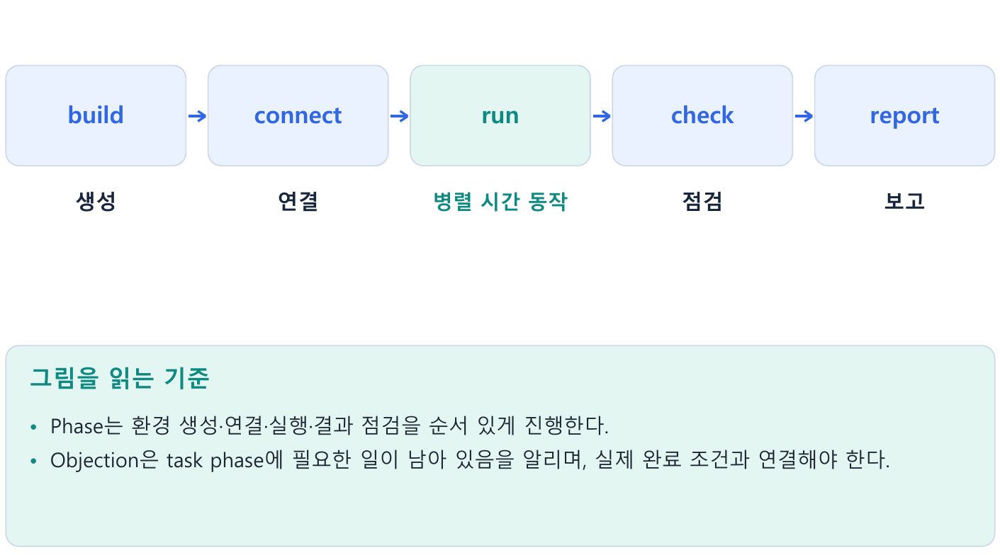
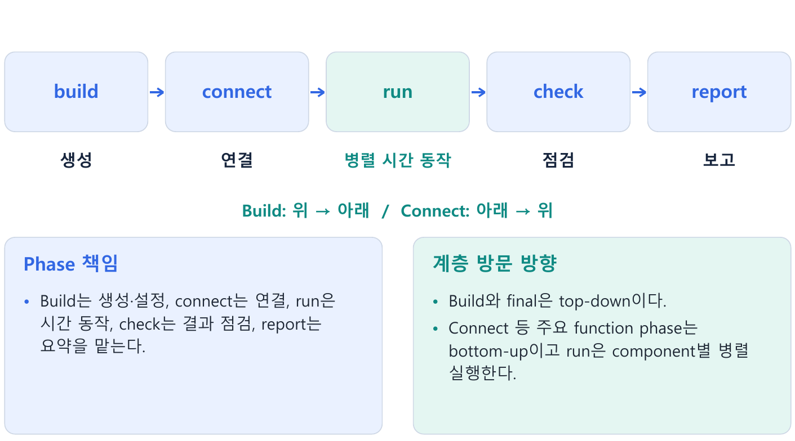
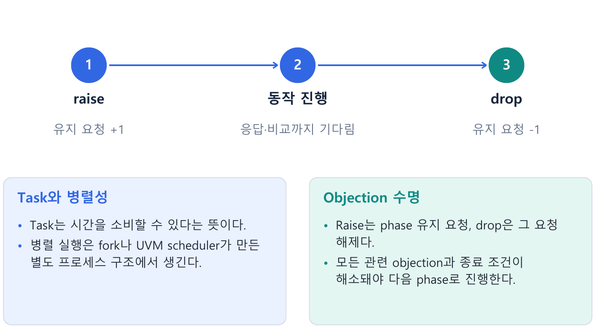
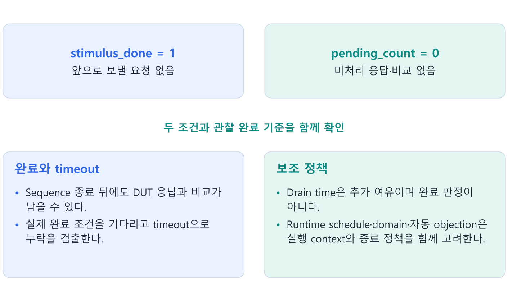
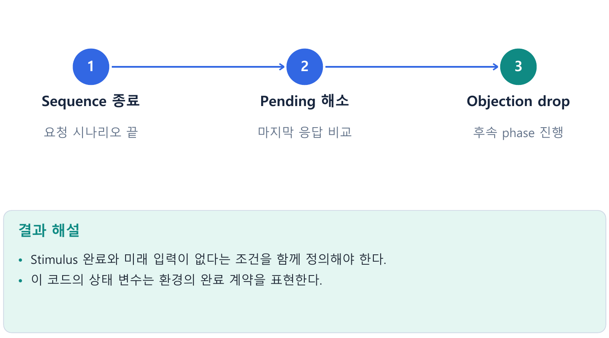

---
tags:
  - phase
  - objection
  - build
  - connect
  - run
  - timeout
cssclasses:
  - uvm-study-note
---

#phase #objection #build #connect #run #timeout

# **1. 소개**

- Phase는 환경 생성·연결·실행·결과 점검을 순서 있게 진행한다.
- Objection은 task phase에 필요한 일이 남아 있음을 알리며, 실제 완료 조건과 연결해야 한다.

# **2. 구조와 흐름**



# **3. 핵심 개념**

## **3.1. Phase가 해결하는 문제**

- 검증환경을 만들기 전에 연결하거나 연결이 끝나기 전에 pin 구동을 시작하면 null handle과 연결 누락 등이 생긴다.
- UVM scheduler는 component hierarchy를 따라 생성·연결·실행·검사·보고를 정해진 phase로 진행한다.
- 사용자는 해당 virtual phase method를 구현하며 일반적으로 직접 호출하지 않는다.

## **3.2. Common phase 순서와 책임**



| Phase | 형식 | hierarchy 방향 | 주요 책임 |
|---|---|---|---|
| build | function | 부모 → 자식 | 하위 component 생성, 설정 읽기 |
| connect | function | 자식 → 부모 | TLM port/export/imp 연결 |
| end_of_elaboration | function | 자식 → 부모 | 구조·설정·연결 최종 확인 |
| start_of_simulation | function | 자식 → 부모 | 실행 전 topology·설정 출력 |
| run | task | component마다 병렬 | stimulus, driver 구동, monitor 관찰 |
| extract | function | 자식 → 부모 | 실행 결과·통계 추출 |
| check | function | 자식 → 부모 | 미처리 비교 등 최종 검사 |
| report | function | 자식 → 부모 | 결과 보고 |
| final | function | 부모 → 자식 | 파일 닫기 등 마지막 정리 |

- 모든 component의 build가 끝나고 connect로 넘어간다.
- 같은 phase 안에서의 hierarchy 방문 방향과 phase 사이의 순서는 다른 기준이다.
- Test → env → agent → driver 구조라면 build는 이 순서로, connect는 반대로 방문한다.
- Sibling 간 순서를 testbench 동작 조건으로 의존하지 않는다.

- Final도 build처럼 top-down이다.
- Build에서 test가 먼저 factory override/config를 설정하고 자식이 나중에 create/get하는 흐름을 만들 수 있다.
- 부모 build에서 실제 생성 전에 override를 설정하는 순서까지 확인한다.

## **3.3. Function/task는 순차/병렬 구분이 아니다**

- Function은 simulation time을 소비할 수 없고, task는 delay나 clock event를 기다릴 수 있다.
- Task도 일반 호출이면 호출한 process에서 순차 실행된다.

```systemverilog
drive();   // 호출 후 10ns에 반환
monitor(); // 그 뒤 호출, 20ns 뒤 반환
// 전체 30ns
```

```systemverilog
fork
  drive();   // 0~10ns
  monitor(); // 0~20ns
join         // 전체 20ns
```

- Run phase가 병렬인 이유는 UVM scheduler가 각 component의 run_phase를 별도 process로 실행하기 때문이다.
- Task라는 keyword만으로 자동 병렬화하지 않는다.
- Logical concurrency와 CPU core별 실행 방식은 구분한다.

- Driver는 `@(posedge vif.clk)`처럼 실제 interface clock이나 `@(vif.drv_cb)`의 clocking event를 기다릴 수 있다.
- Pin timing 정책은 4장와 맞춘다.

## **3.4. Objection이 필요한 이유**



- Driver/monitor는 보통 forever loop다.
- 모든 run_phase의 반환을 기다리는 방식으로는 정상 종료할 수 없다.
- Objection은 phase에 아직 필요한 일이 있음을 알리는 수명 관리 요청이다.
- Task가 실행 중이거나 #100ns를 기다린다는 사실만으로 run phase가 유지되지는 않는다.

```systemverilog
task run_phase(uvm_phase phase);
  phase.raise_objection(this);
  #100ns;
  `uvm_info("TEST", "Done", UVM_LOW)
  phase.drop_objection(this);
endtask
```

- Raise와 drop 사이에 phase를 유지하도록 요청한다.
- 다른 objection과 연계된 종료 조건도 끝나면 종료할 수 있고, 해당 phase의 남은 process는 정리된다.
- Drop 호출이 즉시 simulator $finish와 같은 동작은 아니다.
- 후속 cleanup phase가 진행된다.
- Objection은 task phase에서 사용한다.

## **3.5. 종료 오류 세 가지**

| 오류 | 원인 | 결과 |
|---|---|---|
| Raise 없음 | 실행 중 task만 믿음 | 필요한 작업 전 조기 종료 가능 |
| Drop 누락 | 완료 요청을 내려놓지 않음 | phase 유지, timeout까지 대기 가능 |
| 너무 이른 drop | 요청 전송 완료를 전체 완료로 오해 | 마지막 출력/비교 유실 가능 |

- Objection은 count로 관리한다.
- 같은 source가 여러 번 raise했다면 올린 수만큼 drop해야 한다.
- Raise한 source와 drop source를 맞춘다.
- 진단용 UVM timeout은 오류를 발견하는 장치이며 정상 완료 조건을 대신하지 않는다.

## **3.6. 완료 조건과 wait/if**



- Stimulus 종료와 DUT 출력 관찰·scoreboard 비교 완료는 다를 수 있다.
- 더 들어올 요청이 없고 남은 처리가 끝났다는 조건을 함께 사용한다.

```systemverilog
phase.raise_objection(this);
send_requests(); // 예제용 task: 모든 요청 전송 후 반환한다고 가정
wait (stimulus_done && scoreboard.pending_count == 0);
phase.drop_objection(this);
```

- stimulus_done과 pending_count는 개념 예제용 상태다.
- 실제 환경에서는 monitor의 inflight 관찰, 예상·실제 대기열, latency 등까지 정의한다.
- Stimulus가 앞으로 더 올 수 있는데 queue가 순간 비었다고 완료로 판단하지 않는다.

- if는 그 시점에 한 번 확인한다.
- 조건이 거짓이라 drop을 건너뛰면 나중에 참이 돼도 자동 재실행되지 않는다.
- wait는 조건이 참이 될 때까지 대기하며 이미 참이면 즉시 통과한다.
- Function phase에는 시간 대기 wait를 넣지 않는다.

## **3.7. Test 관리와 component별 관리**

- Test에서 전체 시나리오 시작 전 raise하고 최종 검증 완료 후 drop하는 방식은 책임을 모아 이해하기 쉽다.
- 규칙상 각 component가 같은 phase에 objection을 올리고 자신의 완료 후 drop할 수도 있다.
- 모든 source의 objection이 해소돼야 한다.

```text
driver drop 100ns / monitor drop 130ns / scoreboard drop 135ns
→ 다른 지연·objection이 없다면 135ns 이후 종료 가능
```

- 분산 관리에는 component별 완료 통지와 기준이 필요하다.
- Driver의 더 받을 요청 없음, monitor의 마지막 관찰 완료, scoreboard의 미래 입력 없음과 비교 완료를 연결해야 한다.
- Monitor가 phase 종료 후 drop하려고 기다리면 자신의 objection이 종료를 막는 순환 대기가 된다.
- 단순한 영구 driver/monitor는 objection 없이 동작하고 test가 종료를 관리하는 형태가 흔하다.

## **3.8. Drain time과 고정 $finish**

- Drain time은 해당 object와 그 하위의 objection count가 모두 내려간 뒤 all_dropped/상위 전파 전에 두는 추가 대기 시간이다.
- 결과 검사가 완료됐다는 판정이 아니라 여유 시간이다.

```systemverilog
uvm_objection objection;
objection = phase.get_objection();
objection.set_drain_time(this, 20ns);
```

- 공개 API get_objection()으로 objection handle을 얻어 drain time을 설정한다.
- Drain 중 해당 계층에 새 objection이 올라가면 진행 중인 drain 종료 절차가 취소되고 이후 다시 평가한다.
- 계층별 drain time을 중복 지정하면 종료 여유가 단순 한 번의 delay와 달라질 수 있다.

- 마지막 drop=100ns, drain=20ns, 새로운 objection·추가 callback 지연 없음인 단순 예는 120ns 이후 종료할 수 있다.
- 마지막 출력이 130ns에 오면 보지 못한다.
- 완료 조건을 확인한 뒤 drop하고 필요한 보조 여유만 둔다.

- 고정 #delay 후 $finish는 실제 남은 일을 확인하지 않고 simulation을 강제로 끝낸다.
- Objection은 작업 완료 조건으로 시간을 결정하고 cleanup phase를 거쳐 종료한다.
- 본문의 고정 delay는 개념 확인 예이며 실제 검증 완료 기준으로 사용하지 않는다.

## **3.9. Hello World와 실행 계기**

- Module/program의 initial에서 run_test()를 호출하면 UVM이 test를 생성하고 phase를 진행한다.
- Object 생성만으로 sequence.body가 자동 실행되지는 않는다.
- Sequence 실행은 9장 start(sequencer)에서 다룬다.

- UVM report의 ID/severity/verbosity와 +UVM_TESTNAME, simulator별 library 옵션은 13장에서 확대한다.
- Library 연결과 실행 명령은 simulator에 맞춰 설정한다.

## **3.10. Runtime phase와 domain**

Common run_phase와 병행하는 기본 runtime schedule에는 다음 task phase들이 순서대로 있다.

```text
pre_reset → reset → post_reset
→ pre_configure → configure → post_configure
→ pre_main → main → post_main
→ pre_shutdown → shutdown → post_shutdown
```

- Runtime schedule 내부의 단계가 모두 한 번에 실행된다는 뜻이 아니다.
- 같은 phase의 component 동작은 병렬이고 schedule의 단계들은 순서를 따른다.
- Run과 runtime schedule은 병행하며 extract로 넘어가기 전 관련 종료 조건이 충족돼야 한다.
- 기본 실습은 run_phase를 중심으로 작성한다.

- Domain은 phase schedule을 묶어 서로 다른 block/agent의 동기화 범위를 관리한다.
- 별도 reset/config 진행이 필요한 환경에서 사용자 domain을 둘 수 있다.
- Phase jump는 schedule을 앞뒤로 이동할 수 있지만 이전 transaction, queue, monitor, reset state를 정리하도록 환경이 지원해야 한다.

## **3.11. Sequence의 자동 objection**

- UVM 1.2에서 set_automatic_phase_objection(1)은 sequence에 유효한 starting phase가 있을 때 실행 주변의 raise/drop을 자동 관리한다.
- 수동 start를 했다는 이유만으로 starting phase가 항상 자동 지정되는 것은 아니다.
- 필요하면 set_starting_phase(phase)로 설정한다.

- Forever sequence에 자동 objection을 켜면 정상 drop에 도달하지 못할 수 있다.
- 자동 관리도 sequence 종료 후 남은 DUT 응답을 자동으로 판정하지 않는다.
- UVM 1.1의 starting_phase 사용과 1.2의 get/set API를 구분하고, IEEE 1800.2 구현의 호환 옵션을 확인한다.
- 상세 예제는 9장에서 실행 흐름과 함께 확인한다.

## **3.12. Objection debug**

```text
+UVM_OBJECTION_TRACE
```

- 위 plusarg로 raise/drop의 source와 전파를 추적할 수 있다.
- display_objections()로 남은 source/count를 확인한다.
- Phase callback인 phase_started(), phase_ready_to_end(), phase_ended()와 objection callback은 종료 흐름을 관찰·확장하는 위치다.

# **4. 핵심 예제**

```systemverilog
phase.raise_objection(this);
seq.start(env.agent.sqr);
wait (stimulus_done && pending_count == 0);
phase.drop_objection(this);
// 응답 누락에 대비한 timeout을 병행한다.
```

- Stimulus 완료와 미래 입력이 없다는 조건을 함께 정의해야 한다.
- 이 코드의 상태 변수는 환경의 완료 계약을 표현한다.



# **5. 주의점**

- Objection 없이 실행 중인 task만으로 phase가 유지되지는 않는다.
- Drop 누락은 정상 종료를 막는다.
- Monitor가 phase 종료 후 drop을 기다리면 순환 대기가 생긴다.

# **6. 핵심 정리**

- **Phase 책임**: Build는 생성·설정, connect는 연결, run은 시간 동작, check는 결과 점검, report는 요약을 맡는다.
- **계층 방문 방향**: Build와 final은 top-down이다.  
  Connect 등 주요 function phase는 bottom-up이고 run은 component별 병렬 실행한다.
- **Task와 병렬성**: Task는 시간을 소비할 수 있다는 뜻이다.  
  병렬 실행은 fork나 UVM scheduler가 만든 별도 프로세스 구조에서 생긴다.
- **Objection 수명**: Raise는 phase 유지 요청, drop은 그 요청 해제다.  
  모든 관련 objection과 종료 조건이 해소돼야 다음 phase로 진행한다.
- **완료와 timeout**: Sequence 종료 뒤에도 DUT 응답과 비교가 남을 수 있다.  
  실제 완료 조건을 기다리고 timeout으로 누락을 검출한다.
- **보조 정책**: Drain time은 추가 여유이며 완료 판정이 아니다.  
  Runtime schedule·domain·자동 objection은 실행 context와 종료 정책을 함께 고려한다.

# **7. 확인 문제와 해설**

## **문제 1**

Task가 실행 중이면 objection 없이도 phase가 유지되는가?

**해설:** 그 사실만으로 유지되지 않는다.

## **문제 2**

Queue가 순간 비었다면 종료해도 되는가?

**해설:** 미래 요청·응답이 없는지 함께 확인해야 한다.

## **문제 3**

Drop은 즉시 $finish와 같은가?

- **해설:** 아니다.
- 관련 종료 조건 이후 cleanup phase가 진행된다.

# **8. 참고 자료**

- [UVM 1.2 Class Reference](https://verificationacademy.com/verification-methodology-reference/uvm/docs_1.2/html/)
- [UVM Common Phases](https://verificationacademy.com/verification-methodology-reference/uvm/docs_1.2/html/files/base/uvm_common_phases-svh.html)
- [UVM Runtime Phases](https://verificationacademy.com/verification-methodology-reference/uvm/docs_1.2/html/files/base/uvm_runtime_phases-svh.html)
- [UVM Objection](https://verificationacademy.com/verification-methodology-reference/uvm/docs_1.2/html/files/base/uvm_objection-svh.html)
- [UVM Phase](https://verificationacademy.com/verification-methodology-reference/uvm/docs_1.2/html/files/base/uvm_phase-svh.html)
- [UVM Sequence Base](https://verificationacademy.com/verification-methodology-reference/uvm/docs_1.2/html/files/seq/uvm_sequence_base-svh.html)

[목차](<UVM 기초 - 목차.md>)
