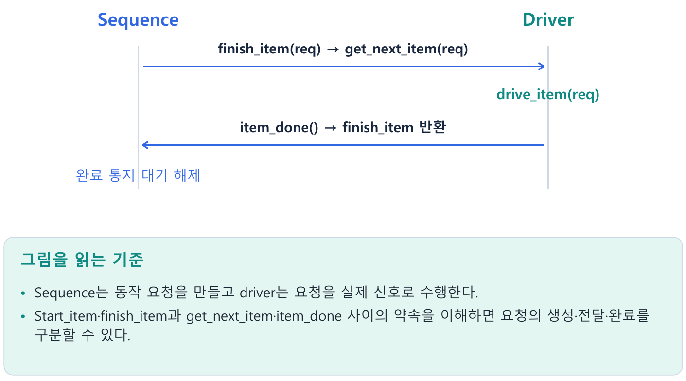
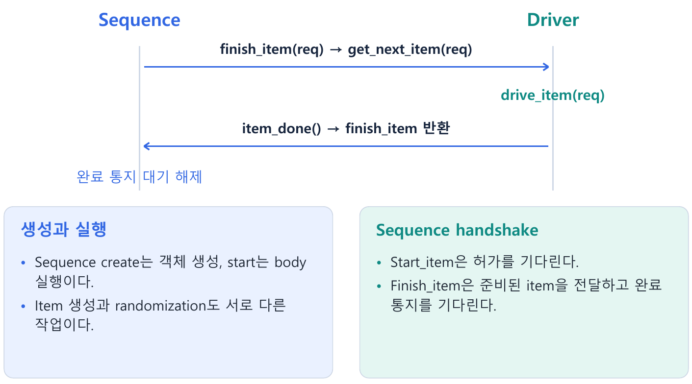
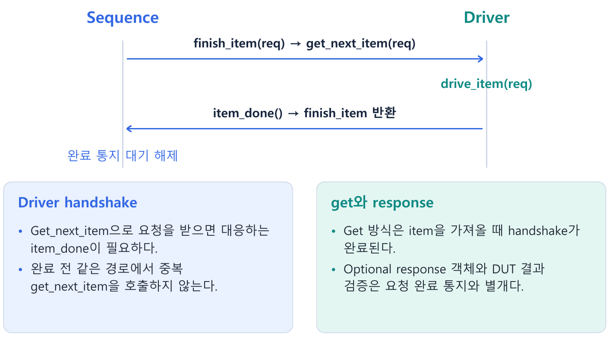
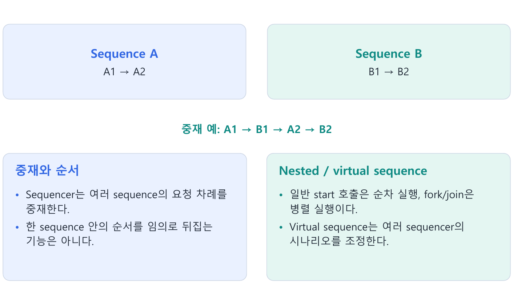
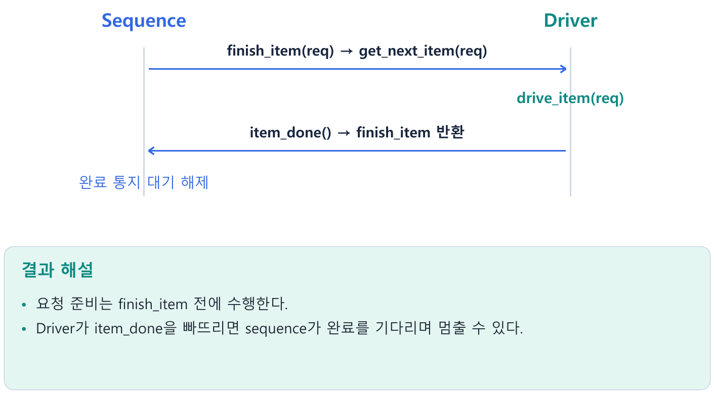

---
tags:
  - sequence
  - sequencer
  - driver
  - handshake
  - response
cssclasses:
  - uvm-study-note
---

#sequence #sequencer #driver #handshake #response

# **1. 소개**

- Sequence는 동작 요청을 만들고 driver는 요청을 실제 신호로 수행한다.
- Start_item·finish_item과 get_next_item·item_done 사이의 약속을 이해하면 요청의 생성·전달·완료를 구분할 수 있다.

# **2. 구조와 흐름**



# **3. 핵심 개념**

## **3.1. 네 구성 요소의 역할과 필요성**

- Sequence는 어떤 요청을 어떤 순서로 발생시킬지 정의하는 재사용 가능한 시나리오다.
- FIFO에서는 쓰기 세 번 뒤 읽기 세 번 같은 흐름을 표현한다.
- 입력 신호를 직접 구동하는 코드는 driver에 두어 시나리오와 protocol timing을 분리한다.

| 요소 | 계열과 역할 | 생성·실행 계기 |
|---|---|---|
| sequence item | `uvm_sequence_item` 상속, 요청 한 개의 데이터 | sequence 등이 생성하고 필드를 설정 |
| sequence | `uvm_sequence#(REQ, RSP)` 상속, 요청의 순서·제약·하위 시나리오 | object 생성 후 `start()`로 실행 |
| sequencer | `uvm_sequencer#(REQ, RSP)` 계열 component, 경쟁 요청 중재·전달 | 보통 agent의 build에서 생성 |
| driver | `uvm_driver#(REQ, RSP)` 계열 component, 요청을 pin 동작으로 변환 | build에서 생성, run_phase에서 수신·구동 |

- REQ/RSP는 요청·응답 타입 parameter다.
- `uvm_sequence`에는 이 타입의 `req`, `rsp` handle이 제공되지만 객체 생성까지 자동으로 된다고 생각하지 않는다.
- 아래 예제는 필요한 변수를 직접 선언하기도 한다.

## **3.2. 선언, 생성, 실행은 다르다**

```systemverilog
// test의 run_phase() 안: 환경과 클래스는 이미 정의됐다고 가정
fifo_write_seq seq;
phase.raise_objection(this);
seq = fifo_write_seq::type_id::create("seq");
seq.start(env.agent.sqr);
phase.drop_objection(this);
```

- 선언: handle 변수만 만든다.  
  초기값은 null이다.
- create: factory로 객체를 생성한다.  
  `body()`는 실행하지 않는다.
- start: 지정한 sequencer에서 sequence 실행 절차를 시작한다.  
  그 과정에서 사용자 `body()` task를 호출한다.
- 일반적인 직접 호출에서 start는 sequence 실행 종료까지 반환하지 않는다.  
  start가 sequence를 자동 randomize하지는 않는다.

- Sequence는 component의 phase callback처럼 생성 후 자동 실행되는 대상이 아니다.
- Object 계열이므로 생성과 실행을 따로 지정한다.
- `start()`의 sequencer 인자는 item 전달 대상이며 객체를 생성하는 주체라는 뜻이 아니다.

- item을 직접 보내지 않고 하위 sequence를 조율하는 virtual sequence 등에는 `start(null)`을 사용하는 구조도 있다.
- 따라서 모든 sequence 실행에 물리적 sequencer가 반드시 필요하다는 일반화는 피한다.

## **3.3. Item 한 개의 준비와 전달**



```systemverilog
virtual task body();
  fifo_item item;
  item = fifo_item::type_id::create("item");
  start_item(item);
  item.wr_en = 1;
  item.rd_en = 0;
  item.data = 8'hA5;
  finish_item(item);
endtask
```

- `start_item()`은 sequencer에 보낼 차례를 신청하고 grant를 기다린다.
- 반환 후 필드를 설정하거나 randomize한다.
- `finish_item()`은 준비된 item을 전달하고 handshake 완료를 기다린다.
- start_item이 요청을 보내거나 핀을 구동하는 것은 아니다.

- `start_item()` 반환과 `finish_item()` 호출 사이에는 시간 대기를 넣지 않는다.
- 필드 대입과 시간 소모 없는 randomize 등으로 요청을 준비한다.
- `#10`, `@(posedge clk)` 같은 구동 timing은 driver 책임으로 둔다.

- `item.data = 8'hA5`는 객체 필드 변경이다.
- 실제 DUT 핀은 driver가 interface를 통해 구동해야 바뀐다.

## **3.4. Sequence와 driver는 별도 process다**

```systemverilog
// driver의 run_phase() 안
forever begin
  seq_item_port.get_next_item(req);
  drive_one_item(req);
  seq_item_port.item_done();
end
```

`drive_one_item()`은 사용자가 작성할 예제용 구동 task이며 UVM 표준 API가 아니다.

```text
Sequence                          Driver
                                  get_next_item(req) 호출
                                  요청을 기다림
start_item(req): grant 대기
grant 후 필드 설정
finish_item(req): 요청 전달 ------> get_next_item(req) 반환
완료를 기다림                      drive_one_item(req)
                                  item_done()
finish_item(req) 반환 <------------ 완료 통지
다음 요청으로 진행
```

- 호출 순서와 반환 순서를 구분한다.
- Driver가 get_next_item을 먼저 호출해 기다릴 수 있다.
- finish_item이 끝난 뒤 요청을 받는 것이 아니라, finish_item 실행 중 전달·구동·완료 통지가 이루어진다.
- 연결은 11장에서 `driver.seq_item_port.connect(sequencer.seq_item_export)`로 설명한다.

## **3.5. 완료 통지의 의미**



- `item_done()`은 driver가 현재 요청에 대한 handshake 완료를 알리는 API다.
- DUT 결과의 정확성을 증명하지는 않는다.
- 완료 시점을 무엇으로 정할지 driver/protocol 설계에서 정의한다.

- FIFO 입력을 샘플링하는 clock edge까지 구동하는 계약이면, 값을 핀에 놓기만 하고 완료를 알리는 것은 이르다.
- FIFO full에서 쓰기 요청을 구동했지만 DUT가 저장을 거부했다고 해서 driver가 잘못된 것은 아니다.  
  요청 구동 완료와 DUT 수락은 구분한다.
- 설정 요청 접수와 DUT 내부 설정 적용이 다르면, 요청 종료 뒤 적용 완료 통지를 별도로 기다려야 할 수 있다.
- monitor와 scoreboard는 실제 관찰·기대 결과로 correctness를 확인한다.  
  Request를 보냈다는 사실만으로 검증 통과를 선언하지 않는다.

## **3.6. get_next_item/item_done과 get의 차이**

| 방식 | Handshake 완료 시점 | 주의점 |
|---|---|---|
| `get_next_item(req)` → 구동 → `item_done()` | driver가 item_done을 호출할 때 | 한 번 받을 때 한 번 완료 |
| `get(req)` → 구동 | get으로 요청을 가져가는 과정에서 완료 | 실제 구동 완료를 finish_item이 기다리지 않음 |

```systemverilog
seq_item_port.get(req);
drive_one_item(req);
// 이 요청에 item_done()을 추가하지 않는다.
```

- get 이후 실제 구동이 3클럭 걸려도 sequence의 finish_item이 그 3클럭을 기다린다는 보장은 없다.
- 실제 완료까지 알아야 하면 response 등의 별도 통지가 필요하다.
- get 방식으로 pipeline을 구성할 때는 요청 객체의 보관·재사용과 처리 완료 정책도 설계해야 한다.

## **3.7. Request와 response는 별개다**

```text
request:  sequence → sequencer → driver
response: sequence ← sequencer ← driver
```

- 인자 없는 `item_done()`은 완료만 알린다.
- 응답 객체가 필요하면 다음처럼 보낼 수 있다.
- 읽기 결과를 언제 수집하는지는 실제 protocol에 따라 정한다.

```systemverilog
rsp = fifo_item::type_id::create("rsp");
rsp.set_id_info(req);
rsp.data = read_data;
seq_item_port.item_done(rsp);
```

```systemverilog
// sequence
finish_item(req);
get_response(rsp);
```

- `set_id_info(req)`는 sequence/transaction 식별 정보를 복사해 응답을 알맞은 요청자에게 돌려보내도록 한다.
- 별도의 응답 전송 API도 있지만 이번 예제에서는 item_done(rsp)을 사용한다.

- Response는 필수가 아니다.
- 별도 결과가 필요 없는 쓰기는 item_done만 사용하고 get_response를 생략할 수 있다.
- 응답을 보내지 않았는데 get_response를 호출하면 해당 sequence는 응답 대기에 머문다.
- 반대로 응답을 계속 보내면서 소비하지 않으면 response queue 문제가 생길 수 있다.

## **3.8. Sequence와 item의 randomization**

```systemverilog
// sequence 클래스 내부
rand int unsigned count;
constraint c_count { count inside {[1:4]}; }

virtual task body();
  fifo_item item;
  repeat (count) begin
    item = fifo_item::type_id::create("item");
    start_item(item);
    if (!item.randomize() with { wr_en == 1; rd_en == 0; })
      `uvm_fatal("RAND", "item randomization 실패")
    finish_item(item);
  end
endtask
```

- `seq.randomize()`는 sequence의 count 같은 시나리오 설정을 결정한다.
- `item.randomize()`는 요청 한 개의 필드를 결정한다.
- 이 둘은 서로 다른 객체의 randomization이다.

- 항상 세 개를 보내려면 `seq.count = 3; seq.start(sqr);`로 직접 지정해도 된다.
- rand 변수에 직접 대입할 수 있으며 constraint는 randomize 호출 시 적용된다.
- 직접 start는 sequence randomization을 대신하지 않는다.

- `uvm_do(item)`의 핵심은 생성 → start_item → randomize → finish_item이다.
- 실제 매크로에는 추가 처리와 버전 차이가 있으므로 단순 예시를 실제 정의와 동일하다고 보지 않는다.
- Item용 흐름과 하위 sequence용 매크로 흐름도 구분한다.

## **3.9. randc와 객체 수명**

- randc의 비반복 상태는 같은 객체의 반복 randomization에서 유지된다.
- 매번 새 item을 생성하면 요청 사이의 비반복을 보장할 수 없다.
- 매크로가 randc를 없애는 것이 아니라 객체를 새로 만든다는 점이 이유다.

```systemverilog
// rand_obj.data가 randc이고 copy가 data를 복사한다고 가정
rand_obj = fifo_item::type_id::create("rand_obj");
repeat (10) begin
  req = fifo_item::type_id::create("req");
  start_item(req);
  if (!rand_obj.randomize())
    `uvm_fatal("RAND", "randomization 실패")
  req.copy(rand_obj);
  finish_item(req);
end
```

- 랜덤화용 객체 rand_obj는 유지하고, 전달용 req는 매번 새 객체로 만든다.
- 제약 없는 randc bit[3:0]이라면 16개 값을 한 순환 안에서 사용하고 다음 순환에서는 값이 다시 나온다.
- 무한히 중복되지 않는다는 뜻은 아니다.
- copy는 field macro 또는 do_copy 구현에 의해 필요한 필드를 복사하도록 작성되어 있어야 한다.

## **3.10. Arbitration은 한 sequence 내부 순서를 뒤집지 않는다**



- Sequence가 A 쓰기 → B 쓰기 → 읽기를 순차 작성하고 다른 sequence가 없다면 그대로 진행된다.
- 앞 finish_item이 끝나야 다음 start_item에 도달한다.

- 여러 sequence가 같은 sequencer에서 경쟁하면 다음 item의 차례를 중재한다.
- A와 B 사이에 다른 sequence의 item이 들어갈 수 있지만 같은 sequence의 B를 A보다 먼저 보내는 재배열 기능은 아니다.

| 순서·timing의 종류 | 담당 |
|---|---|
| 시나리오 내부 요청 순서 | sequence |
| 여러 sequence 사이 다음 요청 차례 | sequencer |
| 실제 clock에 맞춘 pin timing | driver |

Lock/grab, arbitration mode, priority의 자세한 구현은 추가 설계 항목이다.

## **3.11. Nested와 virtual sequence**

```systemverilog
// 부모 sequence body(): child 객체는 생성됐다고 가정
write_seq.start(m_sequencer, this);
read_seq.start(m_sequencer, this);
```

- m_sequencer는 현재 sequence의 sequencer 참조이고 this는 부모 sequence다.
- 일반 호출이므로 쓰기가 끝난 뒤 읽기가 시작된다.
- `fork ... join`으로 나누면 두 sequence가 병렬 실행되고 둘 다 종료돼야 join 다음 줄로 진행한다.

- Nested sequence는 다른 sequence를 하위 시나리오로 조합한다.
- Virtual sequence는 여러 sequencer의 하위 sequence를 조율하는 구조다.
- Virtual sequence는 object이며 virtual sequencer는 선택적으로 사용하는 component다.
- 두 용어를 혼동하지 않는다.

```systemverilog
// 서로 다른 sequencer를 사용하는 virtual sequence의 개념 예시
cfg_seq.start(cfg_sqr, this);
data_seq.start(data_sqr, this);
```

- Driver가 달라도 DUT 동작의 의존성이 있으면 순서가 필요하다.
- 설정 적용 전에 데이터가 들어가면 이전 모드로 처리될 수 있다.
- 위 코드는 cfg_seq 종료만 기다리므로 종료 계약이 설정 적용 완료를 포함하는지 확인한다.
- 독립 동작이나 동시 동작 검증에는 병렬 실행을 사용한다.

## **3.12. 명시적 실행과 default_sequence**

- 명시적 실행에서는 test 등이 sequence를 생성하고 start를 호출한다.
- 생성·시작 위치와 순서를 코드에서 직접 볼 수 있다.
- 실습 재개 때는 이 방식으로 시작한다.

```systemverilog
// test build_phase(): 실행 예약을 설정할 뿐 body를 실행하지 않음
uvm_config_db#(uvm_object_wrapper)::set(
  this, "env.agent.sqr.main_phase", "default_sequence",
  fifo_write_seq::type_id::get()
);
```

- Default sequence 방식에서는 지정 phase 시작 시 sequencer가 설정을 조회하고 sequence 생성·시작을 관리한다.
- 위의 wrapper는 객체 자체가 아닌 factory 타입 정보다.
- UVM 1.2에서는 default sequence randomization과 do_not_randomize 설정도 고려한다.
- 객체를 직접 지정하는 다른 방식의 상세 사용은 추가 설계 항목이다.

- Default sequence 설정만으로 phase 수명이 충분히 유지되는 것은 아니다.
- UVM 1.2 계열에서 `set_automatic_phase_objection(1)`은 유효한 starting phase가 있을 때 주변 objection을 관리한다.
- 수동 start에는 필요 시 set_starting_phase를 지정한다.
- Forever sequence에는 자동 objection을 무조건 켜지 않는다.
- 책의 암묵적 실행을 항상 더 재사용 가능한 유일한 방식으로 일반화하지 않는다.

## **3.13. 오류 찾기와 예방**

| 잘못된 코드·판단 | 결과·수정 |
|---|---|
| item_done 누락 | finish_item이 완료 대기에서 진행하지 못함 |
| get_next_item 두 번 후 item_done 한 번 | 첫 요청 완료 전 다시 수신하는 잘못된 handshake |
| 받은 item 없이 item_done 호출 | 완료할 outstanding 요청이 없음 |
| get 이후 item_done 추가 | get이 이미 handshake를 완료함 |
| 응답 없이 get_response 호출 | response 대기 |
| finish_item 다음에 item 필드 설정 | 이미 전달한 요청을 뒤늦게 변경 |
| sequence/test에서 DUT pin 직접 구동 | 시나리오와 구동 책임 혼합 |
| driver가 req를 무분별하게 수정 | 공유 객체와 요청 의도 훼손 가능, 필요한 결과는 response로 구분 |

# **4. 핵심 예제**

```systemverilog
// Sequence body
req = fifo_item::type_id::create("req");
start_item(req);
if (!req.randomize())
  `uvm_fatal("RAND", "Randomization failed")
finish_item(req);
// Driver run_phase 내부
seq_item_port.get_next_item(req);
drive_item(req);
seq_item_port.item_done();
```

- 요청 준비는 finish_item 전에 수행한다.
- Driver가 item_done을 빠뜨리면 sequence가 완료를 기다리며 멈출 수 있다.



# **5. 주의점**

- Finish_item 뒤 필드 변경은 이미 전달한 요청을 뒤늦게 바꾸는 것이다.
- Item_done은 모든 DUT 출력의 검증 완료를 뜻하지 않는다.
- Response를 기다리는 sequence에는 실제 response 전달 경로가 필요하다.

# **6. 핵심 정리**

- **생성과 실행**: Sequence create는 객체 생성, start는 body 실행이다.  
  Item 생성과 randomization도 서로 다른 작업이다.
- **Sequence handshake**: Start_item은 허가를 기다린다.  
  Finish_item은 준비된 item을 전달하고 완료 통지를 기다린다.
- **Driver handshake**: Get_next_item으로 요청을 받으면 대응하는 item_done이 필요하다.  
  완료 전 같은 경로에서 중복 get_next_item을 호출하지 않는다.
- **get와 response**: Get 방식은 item을 가져올 때 handshake가 완료된다.  
  Optional response 객체와 DUT 결과 검증은 요청 완료 통지와 별개다.
- **중재와 순서**: Sequencer는 여러 sequence의 요청 차례를 중재한다.  
  한 sequence 안의 순서를 임의로 뒤집는 기능은 아니다.
- **Nested / virtual sequence**: 일반 start 호출은 순차 실행, fork/join은 병렬 실행이다.  
  Virtual sequence는 여러 sequencer의 시나리오를 조정한다.

# **7. 확인 문제와 해설**

## **문제 1**

Sequence 객체를 만들기만 하면 body가 실행되는가?

- **해설:** 아니다.
- start가 필요하다.

## **문제 2**

Item_done이 빠지면 어떤 일이 생기는가?

**해설:** Finish_item의 완료 대기가 풀리지 않을 수 있다.

## **문제 3**

한 sequence의 A 다음 B를 sequencer가 B부터 보내는가?

- **해설:** 그런 재배열 기능은 아니다.
- 다른 sequence 요청이 끼어들 수는 있다.

# **8. 참고 자료**

- [UVM 1.2 Class Reference](https://verificationacademy.com/verification-methodology-reference/uvm/docs_1.2/html/)
- [UVM 1.2 Sequence Base Reference](https://verificationacademy.com/verification-methodology-reference/uvm/docs_1.2/html/files/seq/uvm_sequence_base-svh.html)
- [UVM 1.2 Sequencer Interface Reference](https://verificationacademy.com/verification-methodology-reference/uvm/docs_1.2/html/files/tlm1/uvm_sqr_ifs-svh.html)

[목차](<UVM 기초 - 목차.md>)
